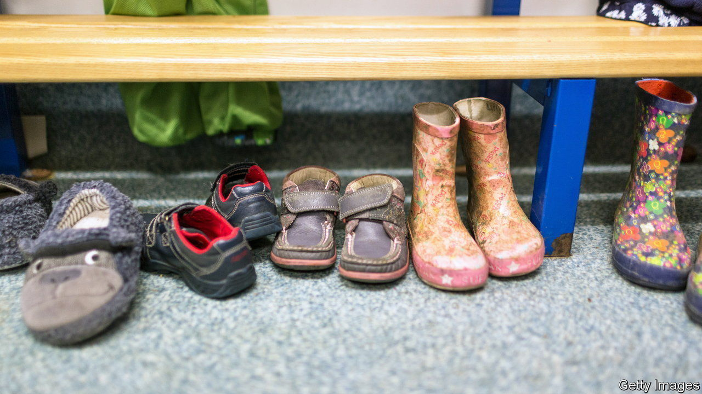

###### The lingering effects of covid-19

# Children’s centres in Britain are crammed again 

##### The crush is changing how they operate 

 

> Jun 5th 2023 

Her son was born in 2020, as covid-19 . So no health visitor came to check on him and she could not take him to play groups, where she might have noticed the profound differences between him and other children. “Because of covid, we didn’t know what’s normal and what is not,” she says. Now three, her son is waiting to be assessed for autism. In the meantime, she brings him to a children’s centre in Devon, where he plays with trained staff in a quiet environment. She is one of many parents resorting to institutions that once seemed on the way out.

The last Labour government created a network of more than 3,000 “Sure Start children’s centres”, which aimed to help children and their parents through the early years by offering play groups, child-raising courses and other advice. During the years of  after the financial crisis, local authorities shut many of them. Devon, despite being both old and Conservative-voting, took a different path. It kept the centres open, although it commissioned Action for Children, a charity, to run them; and, as in other counties, the centres were instructed to focus on the neediest children. They are now packed. 

In the year to March 31st, 3,229 children were referred to children’s centres in the county, often by doctors and health visitors but sometimes by their parents. That is 19% more than in 2019-20, the year that ended just as covid struck. It is also a hefty share of all young children: Devon has about 35,000 under-fives. Staff in the centres say they are seeing not only more children but more needy ones. “It’s not letting up,” says Jess Foy, who runs a children’s centre in Barnstaple. 

Children’s centres are crammed partly because other parts of the state are crumbling. Waiting lists to be evaluated for speech and language problems and autism have swelled, as have all . Just one child in 11 is assessed for autism within the recommended 13 weeks. One mother, who has brought her son to a children’s centre in south Devon, says he was evaluated 18 months after he was referred, “and that’s only because I rang them all the time.” While children await formal assessments, their parents seek help for their mysterious behavioural problems at children’s centres. 

It also seems likely that young children truly have more problems than they used to. Covid lockdowns deprived them of —babies hear language even on trips to the supermarket. Parents were less likely to notice their children’s problems, and had new ways to explain them away. When a toddler who grew up in lockdown reacts to strangers by screaming, is something really wrong with him, or has he simply grown fearful? By the time parents seek help, their children’s problems are serious. 

The rush of needy children and anxious parents has led to long waiting lists for the sessions and courses offered by the children’s centres. In Barnstaple, Action for Children is trying to work through its list quickly. It used to invite parents and their children for lengthy assessments and offer them a complete package of services. Now it carries out initial assessments in an hour and tries to get children and their parents into some kind of session as fast as possible. Parents seem to like this more relaxed approach: Ms Foy says the proportion taking up offers of help has risen. The hope is that more complex problems will reveal themselves in time. 

This is a backward step, though not a bad one. Labour’s Sure Start centres were open to everyone, although at first they were concentrated in poor districts. The idea was that some families needed almost no assistance, whereas some required lots, and the way to find out was to invite everyone to messy-play sessions. Children’s centres were then forced to become finicky about whom they helped. The crush might persuade them to become a little more like the casual, open-door institutions that they were originally designed to be. ■


