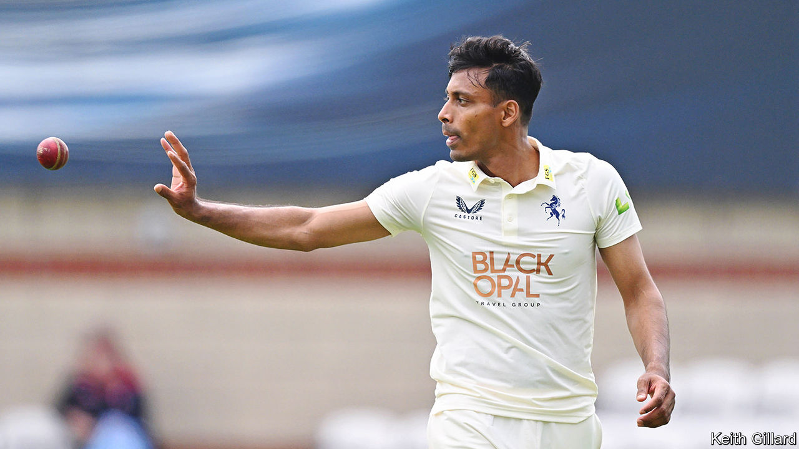

###### Dropped catches

# How grassroots schemes are helping England’s non-white cricketers 

##### And how the professional game is failing them 

 

> Jun 8th 2023 

ON THE FIELD, these are exciting times for English men’s cricket. In the winter the Test (five-day) team—playing in a high-risk, fast-scoring style nicknamed “Bazball” after their coach—trounced Pakistan, and the Twenty20 (short-form) side won the World Cup. Ireland have just been hammered in a one-off Test. An Ashes series, pitting Bazball against the old enemy, Australia, starts on June 16th.

Off the field, however, the domestic winter was bleak. A former captain of England’s under-19 team, Azeem Rafiq, had complained of racist bullying at his county club, Yorkshire. (He later quit cricket.) The England and Wales Cricket Board (ECB), the governing body, recommended that five of his ex-colleagues be fined for bringing the sport into disrepute, but the penalties are not enforceable. (The most prominent of those accused by Mr Rafiq, Michael Vaughan, an ex-captain of England, was cleared.) 

Given Mr Rafiq’s experience, evidence of low participation by ethnic minorities in professional cricket is no surprise. Tom Brown, an academic at Birmingham City University (BCU), finds that in 2018 cricketers of South Asian heritage made up 30% of recreational players and 20% of those in county pathways—above South Asians’ 8% of the population—but only 5% of pros. 

Chevy Green, a director of the African Caribbean Engagement Programme (ACE), a charity, reports that the number of black professionals has fallen by three-quarters in a generation. They are now just 1% of the total. Of the 30 men with central contracts to play for England in 2023, three are of South Asian heritage and only one is black.

Mr Brown sought to learn why Asian teenagers were failing to land county contracts. “We could almost guarantee that there were Asian players that were good enough,” he says. “We’ve messed up by failing to select them for reasons that have nothing to do with cricket.” He describes a “heavily subjective” selection process in which coaches, overwhelmingly white, made judgments of a player’s character in a way that “was not very culturally aware”. 

With Kabir Ali, a former England cricketer, Mr Brown created the South Asian Cricket Academy (SACA), a club funded by BCU for Asian cricketers in their 20s who had been through the county system but had not won contracts. The pair built a tailored training environment and arranged matches against county second teams to put their recruits in the shop window. It has been a remarkable success; in less than two years, seven members have signed professional deals with county clubs. 

One, Arafat Bhuiyan, a fast bowler born in Bangladesh, says coaches often mistake mannerisms common to Asian teenagers, such as avoiding eye-contact when spoken to by authority figures, for lack of engagement. Mr Bhuiyan had turned out for four county second teams but was never offered a contract—or even useful feedback. “I felt like I was accepted at SACA”, he says. After a winter there, he signed a season-long deal with Kent in May. On his debut he dismissed four Surrey batters, including three England internationals.

Meanwhile ACE, founded in 2020 by Ebony Rainford-Brent, a black former member of the national women’s team, runs academies in three cities and is expanding into three more. According to Mr Green, black participation has fallen because of fussy rules that make it hard for clubs to get funding. The schedules, locations and dress codes of county academies are barriers for those of limited means.

Since the Rafiq affair, the ECB has promised to make cricket more equitable. It has made a grant to ACE. But Mr Green is dismayed that opportunities have had to be created from the bottom up. “If you saw a decline in participation year on year and you failed to stop it, was that conscious or unconscious? That’s a question that cricket has to ask itself.”■


