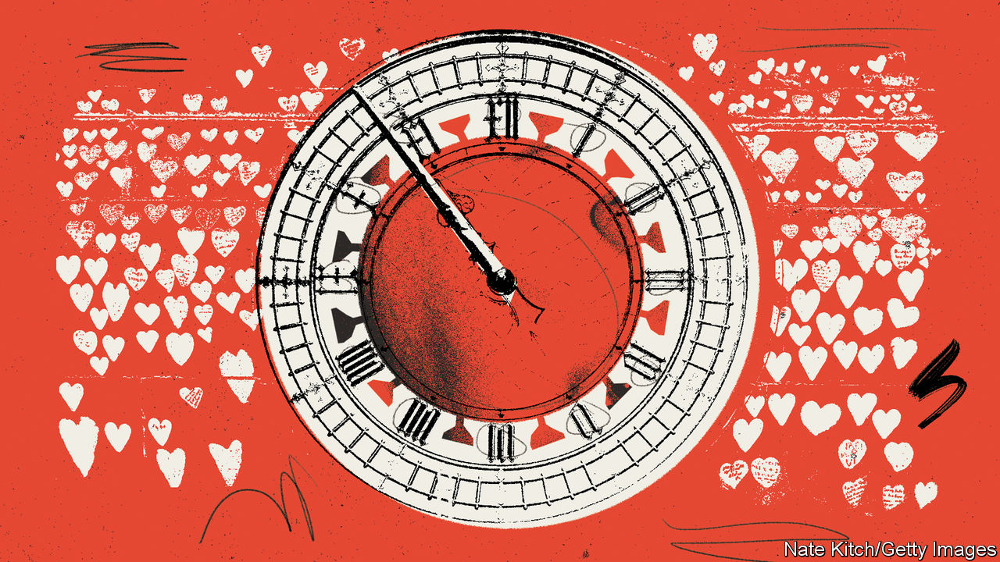

###### The state on trial

# The difficulties facing Britain’s covid-19 inquiry 

##### Establishing facts, consoling the bereaved, drawing lessons: all look daunting 

 

> Jun 8th 2023 

HUGO KEITH KC, the chief lawyer to Britain’s covid-19 inquiry, took a defensive turn. “We’ve proceeded at a remarkable pace,” he told a preliminary hearing on June 6th. “There is simply no justification for any complaint that the inquiry has been slow or dilatory.” Yes, commissions in other countries had already finished their reports. But they lacked legal powers to compel witnesses to appear and evidence to be produced. “They did not, of course, address these issues with anything like the same degree of scope and width.” That much is true. It will be the inquiry’s great virtue. And its great weakness.

Public inquiries into disasters and scandals have become a fixture of Britain’s uncodified constitution: 83 have been opened since 1990, eight of them since the covid inquiry was announced in May 2021. The west London office where it will be held last hosted hearings into the Grenfell Tower fire, in which 72 people died in 2017. 

Inquiries are not trials, but look rather like them. Written submissions are laid; witnesses cross-examined in public; verdicts weighed. Heather Hallett, the chair of the covid inquiry, is a retired judge. She is being assisted by an army of lawyers. In complexity, political sensitivity and the number of British victims, only the Chilcot inquiry into the Iraq war comes close. Whereas most inquiries deal with a single incident or organisation, this one will anatomise almost the entire British state, from the prime minister’s office downwards. Oral evidence in the first of a series of modules, covering the state’s pre-crisis resilience, begins on June 13th. The rest will unfold up to the summer of 2026, covering hospitals, vaccines, schools and more. 

The most sensational hearings will come this autumn, with Module 2: “Core UK Decision-making and Political Governance”. It will focus especially on the decisions of Boris Johnson, the then prime minister, and his inner circle between January 2020, soon after covid emerged in China, and March 2020, when they imposed the first lockdown. Requests for evidence have been sent to 450 politicians, officials and scientists. The 150 questions sent to Mr Johnson give a sense of the interrogation ahead: When did you first become aware of covid-19? Why did you skip five meetings on covid in January and February? Did you really suggest you should be injected with covid on television?

Inquiries seek to do three things: establish the facts; bring a sense of resolution to victims; and help to prevent a repeat. With covid, all these look extraordinarily hard. In establishing a factual narrative, the inquiry should benefit from more contemporaneous material than any of its predecessors. Lord Saville pieced together the events of Bloody Sunday, a massacre by British troops in Northern Ireland in 1972, from grainy images and interviews conducted years later. The Chilcot inquiry dealt with emails and memorandums. For covid, the government says it has identified 20m documents. The mother lode that Lady Hallett is seeking is the record of WhatsApp groups and Google Spaces on which Mr Johnson’s circle and the wider civil service ran the crisis. 

But obtaining the evidence has become a circus. Witness statements have been patchy and late, Mr Keith complained. The pursuit of electronic logs and minutes met silence and obfuscation. The inquiry is still in the dark as to what WhatsApp data is out there. Lady Hallett says she, not the government, should decide how evidence should be redacted, but on June 1st the Cabinet Office launched a judicial review to insist on its power of censorship. Mr Johnson—with much less to lose than Rishi Sunak, chancellor back then and prime minister now—has decided to bypass the government altogether by handing over a trove of his personal notebooks, unredacted. He is also willing to share an old phone, but it cannot yet be opened by the inquiry because of a risk to national security. 

A further challenge is understanding the epidemiological data and modelling, which remain disputed. Because so many experts were either assisting the government or criticising it, says Oliver Johnson of the University of Bristol, finding truly independent authorities will be hard. It is not so simple as to ask whether the government “followed the science”, he says.

As for victims and families, modern inquiries must retain their support without being taken over by them. Lady Hallett is struggling on both counts. She has sought to incorporate the relatives of the 226,000 estimated to have died, via an online consultation, Every Story Matters, and will show films of their testimony. A commemorative tapestry will be made. But Covid-19 Bereaved Families for Justice, which claims to speak for 6,000 relatives, has asked for its lawyers to cross-examine witnesses and for families to give testimony in person, and has claimed Lady Hallett will have to resign if the government doesn’t give up evidence. This fits a pattern of declining deference to inquiry chairs: at Grenfell, residents demanded Sir Martin Moore-Bick’s resignation when he was appointed, denouncing him as an establishment figure.

Will it produce useful lessons? Judges tend to be better at determining individual culpability than at analysing ecosystems. Long inquiries are unlikely to give an up-to-date account of how the state is performing: the government says it is now overhauling its civil-contingencies regime. Lady Hallett’s sweeping ambit—she wants to cover the effects of austerity, Brexit, bureaucratic group-think, class, gender and race—risks creating a buffet of conclusions, from which people can pick according to political taste. 

The central weakness of inquiries, argues Emma Norris of the Institute for Government, a think-tank, is that once they deliver their reports to Parliament and the government responds, there are no powers to compel anything more. But if there were, that might be troublesome, too. Some recommendations of the covid inquiry may be easy technocratic fixes, but others are likely to run into political choices about the capacity of the state. And if Lady Hallett concludes that Britain was led into a crisis by an inadequate, distracted prime minister, that isn’t a problem a judge can solve. ■


