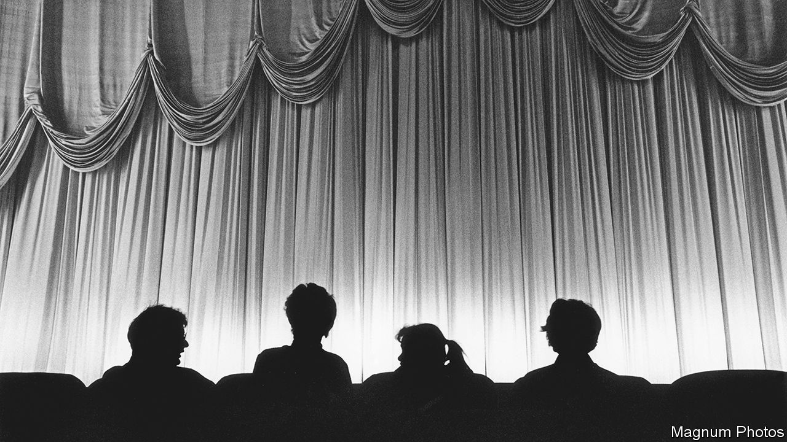

###### No intermission

# The fading charms of Britain’s historic cinemas 

##### And the unequal struggle against TV, covid and the multiplex 

 

> Jun 8th 2023 

For clevedon, North Somerset, the sinking of the  in 1912 is intertwined with an altogether happier event. Five days after the passenger liner went down in the north Atlantic, one of the world’s first “picture houses” opened in the seaside town with a matinée to raise cash for survivors. Aside from several months’ closure during the pandemic the Curzon, as it is now known, has been showing films ever since. Of the more than 1,500 cinemas that were built in Britain during the first four decades of the 20th century, it is one of only a handful still running. 

Many old cinemas were killed off by television. The survivors have seen film lovers lured away by multiplexes, with their larger, comfier seats. But the past couple of years have been brutal on cinemas of all kinds. Since they reopened after the pandemic (and some did not) rising costs have pushed up ticket prices. Many viewers, now attached to paid-for streaming services, remain disinclined to leave home. Business is picking up: the UK Cinema Association says that in 2022 ticket sales rose by 59%. But older cinemas, which tend to be small, often with only one screen, are finding it hard to survive. 

In May Odeon closed several old picture palaces including one in Magdalen Street, Oxford, which opened in 1924 (and thus just missed its centenary), and another in Ayr (1938) on Scotland’s south-west coast. Ten miles along the coast from Clevedon, in Weston-super-Mare, it shut a 1930s art deco cinema that boasted a rare, but once common, Compton pipe organ. 

Clevedon’s Curzon went bust in 1995. Since then it has been run by a charity. Its survival has been aided by its proximity to a prosperous city: Bristol, with its thriving creative industries, has provided both visitors and supporters, including the founders of Aardman, makers of Wallace and Gromit.

Its story illustrates three reasons why old cinemas can be worth saving when they are no longer viable businesses. The first is their architecture. The Curzon’s interior has ornamental tin-tile panelling and an elegant proscenium, exposed when a false ceiling put up in the 1970s was taken down in 2020. Though some cinema buildings are listed, their interiors are hidden or destroyed when they become gyms or cafes. The second is that cinemas in which history is celebrated, with old images in the lobby (Clevedon’s has a hulking old projector) arguably provide a richer experience than simply watching a movie on a big screen. 

Cinemas that function partly as museums are also repositories of social history. In recordings of Clevedonians from more than a decade ago in the Curzon’s online archive, an elderly woman recalls a “Mrs Cox” (a relative of the man who built the cinema) accompanying a silent Charlie Chaplin film on the piano. Others describe the enchantment of going to the flicks at a time when there was little other entertainment. “The films we used to see were delicious,” remembers one. “Ooh, Clark Gable.” ■


