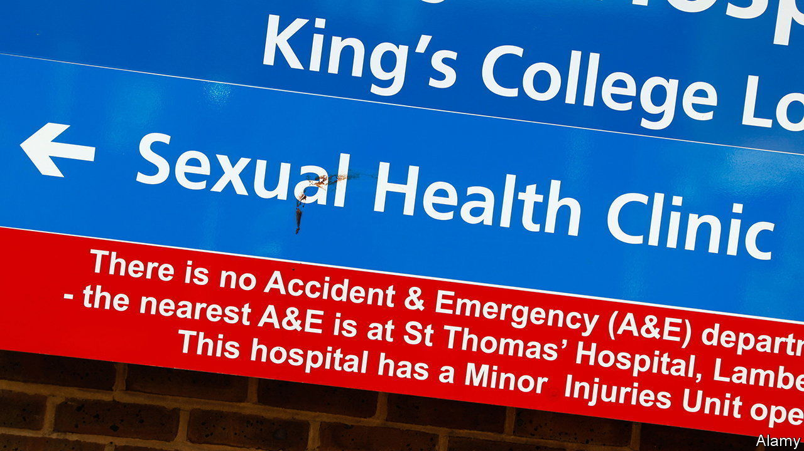
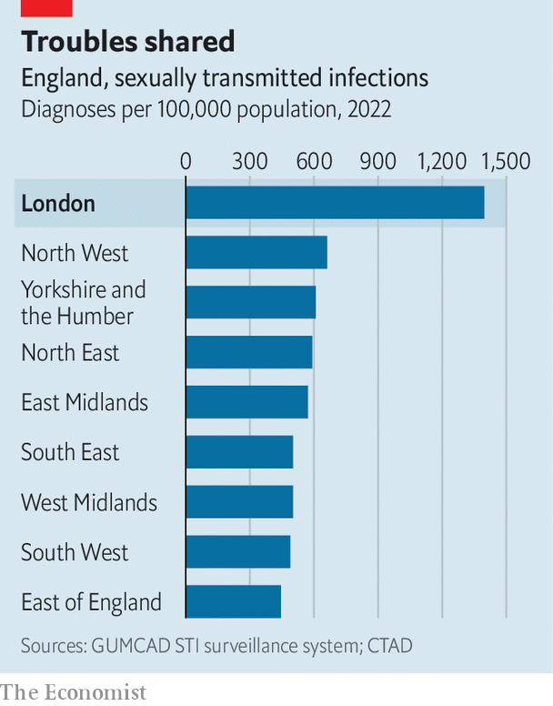

###### Clap for the NHS

# Why does London have so much sexually transmitted disease? 

##### People in the capital find it hard to talk about gonorrhoea 

 

> Jun 8th 2023 

As the country locked down for covid-19, Britons had fewer chances for casual unprotected sex. They also had fewer tests for sexually transmitted infections (STIs). Not surprisingly, diagnoses plummeted. Not any more. On June 6th the UK Health Security Agency reported that nearly 83,000 cases of gonorrhoea were diagnosed in England in 2022—the most since records began in 1918. Cases of syphilis were at their highest since 1948. London’s rate is more than twice that of any other region, making STIs a particularly metropolitan problem (see chart).

 


London’s special status is nothing new. In the 1500s Henrys VII and VIII shut down Southwark’s brothels, or “stew houses”, to try to stop the spread of syphilitic sores. A study in 2020 estimated that in the 1770s a staggering one in five Londoners was likely to have had “the pox” by the age of 35, against 8% of people in the provincial city of Chester and less than 1% in rural areas. Given that gonorrhoea is around four times as infectious, a majority of Londoners may have had an STI, marvels Simon Szreter of the University of Cambridge, the paper’s lead author. 

Thanks to antibiotics, among other things, STI rates today are a fraction of what the Georgians endured. But London is still a relative hotbed. As in the 18th century it has a young, fast-growing population with large social networks to spread STIs. Rates are no longer highest among squaddies and scullery maids but in other marginalised groups (eg, in the Afro-Caribbean community). A more modern metric is that London is England’s gayest region. Though under 4% of its people identify as gay, lesbian or bisexual, where sexual orientation is known, men who have sex with other men account for half of its new STIs. 

Such figures are in part a sign of liberation. HIV is no longer the death sentence it was for many in the 1980s. Pre-exposure prophylaxis (PrEP), a pill taken daily, can almost completely ward it off. According to Preventx, a testing firm, rates of gonorrhoea and chlamydia among men who take PrEP are nearly double those among men who do not, perhaps in part because they feel it is safe not to use condoms. Dating apps (notably Grindr) have made both sex and drugs easier to find. Surveys suggest that around one in five gay or bisexual men in London have sex while on drugs like crystal meth, which can reduce inhibitions and increase sex drive. “You can have a ridiculous amount of sexual partners, upwards of 20 in a weekend,” says Ian, who spent many years having “chemsex”. 

The fun is not without risk. Gonorrhoea is becoming increasingly resistant to antibiotics. As well as STIs, “chemsex” carries a greater risk of sexual assault, drug addiction and death. “We probably have more young men dying of chemsex than we do dying of AIDS,” says Dr Anatole Menon-Johansson of Brook, a sexual-health charity.

Georgian Londoners were loth to admit that sex outside wedlock spread STIs. Today it is fear of stigmatisation that can hold up the aiming of health messages at gay men—as in a monkeypox outbreak in 2022. When men who have sex with men get 84% of new syphilis cases and 72% of gonorrhoea cases, such reluctance is counter-productive. The figures should be “a wake-up call to improve sexual-health education targeted at gay and bisexual men,” says Peter Tatchell, a gay-rights activist. “Blame won’t solve the problem; education will.”■


