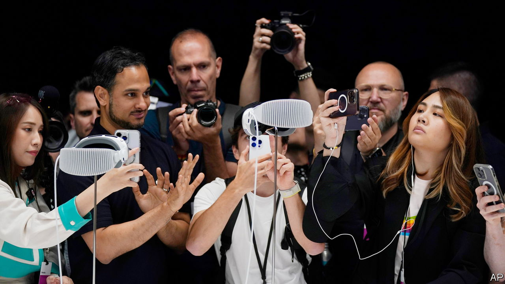
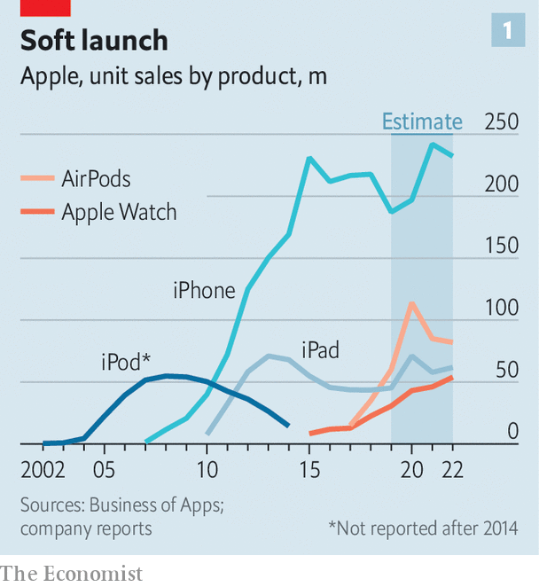
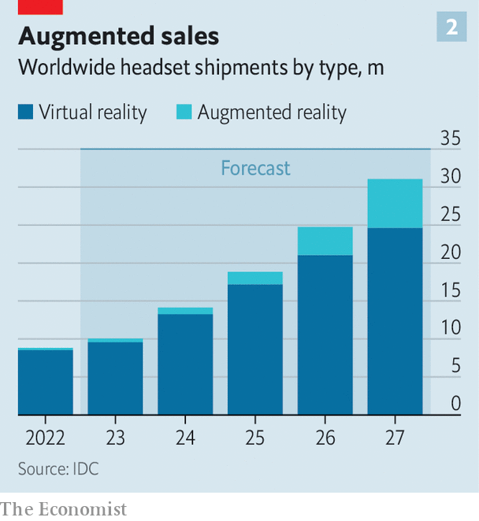

###### Reality check

# Apple’s Vision Pro is a technical marvel. Will anyone buy it? 

##### Few will fork out for the gadget. But Apple is preparing the ground for something bigger 

 

> Jun 6th 2023 

“CERTAIN PRODUCTS…shift the way we look at technology,” said Tim Cook, Apple’s boss, as he unveiled the tech giant’s latest gadget on June 5th. The Vision Pro, a headset for  (VR and AR in the lingo), whose development has been rumoured for years, will be available early next year. With more than 5,000 patents, Apple dubbed the sleek glass goggles “the most ambitious product we’ve ever created”.

It may also turn out to be one of their lowest-selling. The company had reportedly hoped to shift some 3m units in the first year. But expectations have been scaled back; some analysts now expect Apple to ship fewer than 200,000 units in 12 months, an order of magnitude less than any other big product launch. The Vision Pro’s first iteration may be a commercial flop. Yet it is also the first step on the way to something that Apple hopes will be much bigger.

The tech, which Apple has yet to let the public get its hands on, looks impressive. Unlike other headsets, which tend to require hand-held controllers, the Vision Pro is controlled by hand gestures, voice commands and eye movements. It tracks eyes like a mouse, and recognises irises in lieu of a password. It is a “pass-through” device, which uses front-mounted cameras to show the user a video view of the world around them. And to make them appear more normal to others, it projects a video image of their eyes onto the front of the glass. (An Apple ad shows a man making his children breakfast while wearing it, something you would struggle to do with most headsets.)

The chief reason for the projected low sales is the price. At $3,499, the device is more than three times as expensive as Meta’s rival VR and AR headset, the Quest Pro, and more than ten times as expensive as the Quest 2, the social-media firm’s widely used VR device. Even at this price, Apple’s gadget has had to make some technical compromises. It has a clunky external battery, connected to the headset by a cable, which lasts only two hours. And though Apple’s designers have done their best to make it as sleek as possible, it is still an awkward thing to strap to your face.

Such challenges have forced many competitors to rethink their involvement in virtual and augmented realities. Meta seems to be scaling back its enthusiasm, following investors’ complaints about its spending and, reportedly, weak sales of the Quest Pro despite a steep price cut since its launch in October. Microsoft, a software giant, has put on hold the idea of making another HoloLens, an AR device that is mainly used by corporate clients. Snap, another social-media firm, seems in no hurry to bring out a new version of its AR Spectacles. Tencent, a Chinese digital titan, abandoned its VR hardware plans in February.

 


It isn’t unusual for new products to take time to take off. Apple’s past hits mostly took several years before they really caught on (see chart 1). Sales of the Apple Watch were low until people decided that its key use was for monitoring their health. The iPhone didn’t really take off until its fourth generation, in 2010, by which time the App Store was populated with thousands of apps that made people realise what the phone could do. Discovering more use cases for the iPhone also helped to justify its price. The device was considered ludicrously expensive when it launched at up to $599; these days a top model costs $1,599, a price people are willing to pay because it can do so much. Perhaps Apple can normalise paying thousands of dollars for a pair of glasses in the same way.

Still, the Vision Pro is launching at a particularly early stage. Rather than a true consumer product, it is more like an “expensive developer kit”, says one maker of AR components. Releasing a developer-oriented product at this stage is a “new frontier” for Apple, says George Jijiashvili of Omdia, a firm of analysts. 

There are two reasons for it wanting to get the product out early. One is competitive pressure, chiefly from Meta, which despite retrenching a little has been on a hiring and acquiring spree in its aim to make the “metaverse” into reality. As well as hoovering up talent, Meta has been recruiting users. Already about 10% of Americans use a VR headset at least once a month, according to Insider Intelligence, a data firm. Most of those sets are made by Meta, which has been flogging its Quest 2 at a loss to build up a critical mass of users. This autumn it will release the Quest 3, a pass-through device which will be far less capable than Apple’s but, at $499, a more realistic prospect for most consumers.

 


The second reason Apple wants to get its product out is because it already has its eye on what comes next. Tech types have long speculated that it will eventually be possible to have a pair of AR glasses as thin and unobtrusive as a pair of sun shades, at which point headsets will stop being clunky things for nerds and start becoming something that normal people might wear all day. Such devices might even replace the smartphone as the next big tech platform. “I don’t think there’s a doubt in anyone’s mind that AR is the future,” says Jitesh Ubrani of IDC, another data company. Apple’s presentation characterised the Vision Pro as “the start of an entirely new platform”.

Glasses half full

The strategy is not without risk. Apple has a reputation for releasing perfect, polished products. Releasing a $3,499 device with a two-hour battery life could amount to what Steve Jobs, Mr Cook’s late predecessor, used to characterise as a “brand withdrawal”.

It is also not yet clear what people will do with their devices. So far VR headsets have been used mostly for : nearly 90% of VR content spending last year was on games, estimates Omdia. Meta’s Quest Pro has failed to excite professionals with its promise of in-person video conferencing and the like. Apple’s Vision Pro presentation, though characteristically slick, had nothing resembling a “killer app”. There are some exciting features, such as the ability to take 3D photos and videos, turning the device into a “nostalgia generator”, says Mr Ubrani. But most of Apple’s suggested uses for the Vision Pro seem to involve treating it as a sort of giant virtual desktop, using floating windows of Zoom chats or Excel spreadsheets, or watching a film on a giant virtual screen. None of this is anywhere near as innovative as the technology itself.

Still, Apple enjoys big advantages over its rivals. It has a , with 2bn devices in circulation. The Vision Pro presentation showed how the headset synchronises with Apple’s other gadgets: users can do FaceTime video calls with friends on their iPhones or project a MacBook laptop screen into the headset just by looking at it. Apps for the iPhone and iPad will be compatible with the Vision Pro, meaning there will be hundreds of thousands of apps available at launch—albeit ones not optimised for the device.

Apple’s strategy is also straightforward: make the best headset and charge consumers a lot of money for it, and, presumably, also charge developers a slice of their app earnings, as happens in the App Store. Although the firm seems focused on the eventual goal of AR, that is quite different from the  that Mark Zuckerberg, Meta’s boss, has talked so much about.

Apple also has a trusted brand among consumers. In a survey in 2021, three times as many people said they would buy a headset from Apple as from the second-placed company, Google. Meta came sixth. It has leverage with developers, too. It will have apps from Microsoft, as well as Zoom and Webex, and a partnership with Unity. Bob Iger, Disney’s chief executive and a former friend of Jobs, made a surprise cameo in the presentation to praise Apple’s “revolutionary platform” and show off how the headset might allow audiences to watch a “Star Wars” movie before being transported in virtual reality to the planet of Tatooine, or watch 3D replays of a basketball match in VR on Disney’s ESPN sports network. Having Mickey Mouse, or even the Disneyland castle, appear in the sitting room—“Bring[ing] Disney to our fans in ways that were previously impossible”, as Mr Iger put it—is the sort of thing that might excite people more than virtual conferencing.

Few people are likely to cough up for the Vision Pro, at least initially. But Mr Cook, who compared it to the launch of the Mac and the iPhone, said it was the “beginning of a journey”. It may yet be that the journey leads somewhere profitable. As Mr Ubrani puts it, “When Apple enters a market, it completely changes the trajectory of the market.” ■

