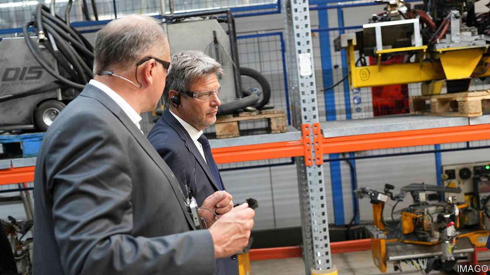

###### Angst

# German bosses are depressed 

##### And dissatisfied with the government 

 

> Jun 8th 2023 

“We are at a dangerous point,” worries Arndt Kirchhoff, boss of the employers’ association in North Rhine-Westphalia and one of three brothers who run Kirchhoff, a maker of car components. Germany recently slipped into a technical recession. Many companies are investing abroad rather than at home. Chinese consumers are importing less after the lifting of pandemic restrictions than German manufacturers had been hoping. And Ukraine’s counter-offensive against Russian invaders is injecting uncertainty into Germany’s backyard. 

 


In May an index of business confidence from the Ifo Institute, a think-tank, fell for the first time in seven months (see chart). On June 5th manufacturers’ gloomy mood became darker still when the vDMA, the main lobby group for machinery-makers, announced that orders for engineering companies fell by 20% last month, year on year. A small contraction in GDP (German output fell by 0.3% in the first quarter) can have a big effect on orders for makers of machinery. Yet the fall in orders also “reflects the recent deterioration of the mood of the economy”, laments Olaf Wortmann of the vDMA. Having promised a new “German speed” in business and economic matters, the governing coalition of Social Democrats, Greens and Free Democrats is delivering what to disillusioned German bosses looks increasingly like a crawl. 

Employers’ most pressing worries are, according to a recent survey of industrial firms, the prices of raw material and energy (both of which remain high); availability of skilled labour (which is in short supply); and rising wages (which push up costs further). And don’t even get bosses started on red tape. Bureaucratic approvals still take too long. A finicky new law requires companies with more than 3,000 staff in Germany to monitor whether their suppliers around the world meet human-rights and environmental standards. It has taken ten years to build the wind farm that Robert Habeck, the economy minister, inaugurated in Bad Berleburg, North Rhine-Westphalia, on June 6th. “We have to speed up approval processes,” Mr Habeck conceded during the inauguration. He insisted that Germany will manage to double its windpower capacity by 2030. But this would, by his own admission, require tripling the pace of wind-farm development.

German firms are increasingly reluctant to make the effort to invest and expand. Their country ranks a dismal 18th out of 21 industrialised countries as a place for family companies to do business, according to the ZEW Mannheim, an economic-research institute (America, Canada and Sweden are the top three). “We have been on the wrong path for the last 20 years,” laments Natalie Mekelburger, chief executive of Coroplast, a leading maker of adhesive tape. The state’s  intervention in business is “indirectly destroying entrepreneurial forces”, says Ms Mekelburger, who accuses the Greens in particular of a “planned-economy approach”.

Almost one-third of German medium-sized  firms are thinking about transferring production and jobs abroad; one in six is already doing it. BioNTech, a pioneering biotechnology company that helped develop a covid-19 vaccine, is building its cancer-research centre in Britain. Viessmann, a manufacturer of heating equipment, is selling its core heat-pump business to America’s Carrier. “We are running the danger of creeping deindustrialisation,” warns Nikolas Stihl, head of the supervisory board of Stihl, a leading maker of chainsaws. 

Mr Stihl’s firm is not planning to move production somewhere else. But he hopes that BioNTech’s and Viessmann’s decisions will serve as a wake-up call for the government. Neither move would have happened, he says, if Germany were as business-friendly as it used to be. ■


