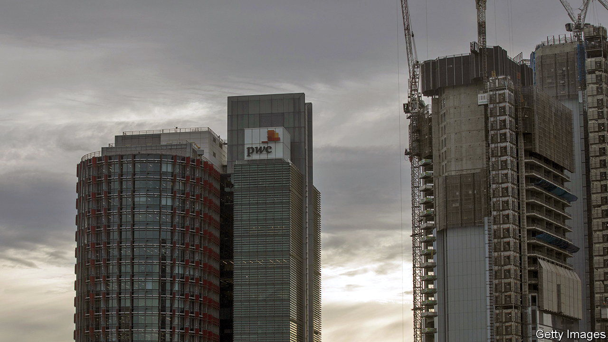

###### Aussie rule-bending

# PwC has disgraced itself down under 

##### The firm’s employees helped multinationals dodge taxes in Australia 

 

> Jun 8th 2023 

ANTHONY ALBANESE, Australia’s prime minister, has called it “completely unacceptable”. Jim Chalmers, his treasurer, is “furious”. The object of their ire is PwC. The professional-services giant is in hot water over allegations that, after helping the government design a new system to make foreign multinational firms pay more tax, it used its inside knowledge to help global clients circumvent those same measures.

The scandal centres on Peter-John Collins, a former PwC partner who counselled the government on the tax rules between 2013 and 2015 and then leaked details of the work to at least 53 fellow partners in Australia and abroad. The Australian Tax Office, suspicious of the speed with which multinationals adapted, raised the matter in 2018 with the Australian Federal Police, and in 2020 with the Tax Practitioners Board (TPB), an accreditation body.

In January it was revealed that the TPB had at the end of last year banned Mr Collins from tax work for two years over the incident. Since then the affair has escalated into a reputational nightmare for PwC. On May 8th its Australian boss stepped down. On May 31st Australia’s central bank said it would exclude the firm from future contracts until it had rebuilt trust. On June 2nd AustralianSuper, the country’s largest pension fund, took similar steps; the Australian Retirement Trust, the second-biggest, followed suit on June 6th. Many departments of Australia’s federal government, PwC’s biggest client in the country, will be reviewing their ties.

PwC’s Australian operation has apologised over the incident, which it has called “unacceptable”. It has launched its own investigation and is “ring-fencing” its business with the federal government to minimise potential conflicts of interest. That may not be enough to quell the rage. On June 7th Australia’s senate began hearings for an inquiry into the government’s relationship with the consulting industry. Its findings will be published in September.

The saga also reignites awkward questions about the “multidisciplinary” model adopted by PwC and its rivals, Deloitte, EY and KPMG, which brings together auditing, management consulting and tax advice under one roof. Audit, not tax, has been the scandal magnet in recent years. Earlier this year EY was censured in Germany for its failure to spot cooked books at Wirecard, a German fintech darling that collapsed in 2020. Deloitte and KPMG have both run into trouble in Britain over audit flubs.

Those reputation-denting snafus have bolstered the case for those who, like the global boss of EY, argue for splitting audit from the rest of the firms’ businesses. That would allow the advisers to escape independence rules that prevent them from serving audit clients on other matters. This latest saga shows that the tax business, which represents around one-fifth of the combined revenues of the “big four”, can also be a liability, as PwC’s audit and consulting businesses are discovering. 

It is not the first time tax has caused a stink. In 2005 KPMG narrowly escaped criminal prosecution in America over its alleged promotion of illegal tax shelters to clients, instead settling with a hefty $456m fine. A conviction would have barred the firm from auditing public companies, which may have been fatal. PwC’s nightmare in Australia deals another blow to the multidisciplinary model of the big four. ■


