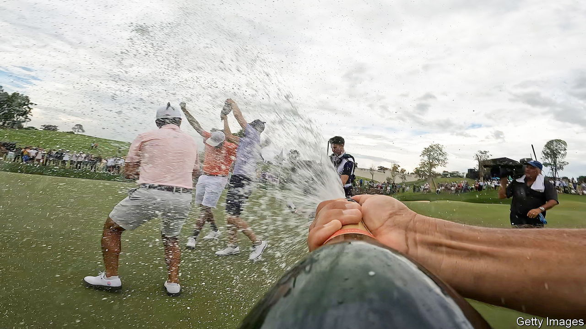

###### Golf and the Gulf

# The PGA agrees to team up with its golfing arch-enemy 

##### Saudi Arabia buys membership of golf’s most exclusive club 

 

> Jun 7th 2023 

Many a business deal is sealed on the golf course. So it was on June 6th, when America’s PGA Tour and Europe’s DP World Tour, the biggest organising bodies in men’s golf, said they had agreed to merge with LIV Golf, a Saudi Arabian upstart. The merger, which will reportedly see LIV’s backers invest around $3bn in the combined entity, ends a costly split in the game and gives the Saudis membership of one of the most august clubs in sport.

LIV Golf teed off last June, financed by Saudi Arabia’s $650bn sovereign-wealth fund. It brought made-for-TV razzmatazz to a normally genteel game. Shorter tournaments feature teams with names like Crushers. Polite applause gave way to whooping. Star players were paid a fortune to take part, despite misgivings that the Saudis were “scary motherfuckers”, in the words of Phil Mickelson, one who took the money. To hang on to talent, the old tours wielded a carrot and a nine-iron. They increased prize money (if not quite to Saudi levels), banned defectors to LIV and highlighted Saudi Arabia’s human-rights record. The PGA and LIV have sued and counter-sued one another for interfering with the other’s business. 

The deal kills those suits (and the prospect of Saudi officials having to appear in an American court). Players who signed up to LIV can expect to be welcomed back to the PGA. Those who had steered clear of the Saudis, for ethical reasons or to avoid upsetting their sponsors, may feel hard done by. 

The established tours face accusations of hypocrisy. But the deal protects them from competition with LIV. Saudi Arabia, meanwhile, adds another sporting trophy to its cabinet, which already boasts football stars like Cristiano Ronaldo (tempted to its domestic league in January) and an annual Formula One Grand Prix. Sport diversifies its economy, keeps restless young Saudis entertained and distracts foreigners from the regime’s unsavouriness. The princes who run the sovereign fund probably find it more congenial than hydrocarbons, too.

Golf fans will get to see more big stars, and probably more of the snappy, team-based contests. Jay Monahan, the PGA’s boss, hailed the tie-up as “transformational”. Other sports may wonder where the oil money will flow next. ■


