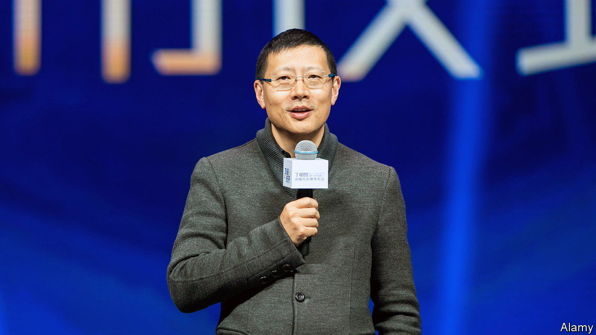
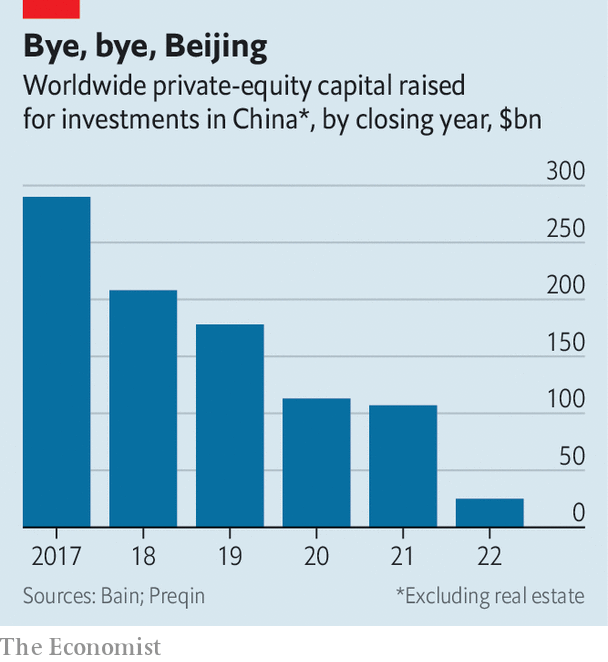

###### Sequoia leaves China

# Why Sequoia Capital is sawing off its Chinese branch 

##### China is becoming too hot to handle, even for a giant of venture investing 

 

> Jun 8th 2023 

NEIL SHEN has god-like status in the Chinese private-equity industry. The lead dealmaker at Sequoia China placed big, early bets on some of the country’s most successful technology companies, such as Meituan, a delivery super-app, and Pinduoduo, an e-commerce giant. Now Mr Shen’s investment firm is planning to go it alone, dropping the Sequoia name and eventually severing all connections with its Silicon Valley parent. 

On June 6th Sequoia Capital, a 51-year-old stalwart of the venture-capital industry, announced it would split into separate American, Chinese and Indian businesses. Sequoia China has operated with a high degree of autonomy for a while, with Mr Shen calling most of the shots. So has Sequoia’s Indian and South-East Asian business, led by Shailendra Singh. By March 2024 the entities will no longer share investors or returns, as they have done for years. The Chinese branch will be known as HongShan, the mandarin word for redwood. Sequoia says the split is part of a “local-first” approach designed for a world where it has become “increasingly complex to run a decentralised global investment business”. 

Many of Mr Shen’s investments were indeed made for a globalised, connected world. He was an investor in Didi Global, a Chinese ride-hailing company whose listing in New York was hobbled by China’s government in 2021. He hoped to make American social media work in his home country by investing in the Chinese arm of LinkedIn, a networking platform for professionals—before growing censorship and onerous rules forced LinkedIn to give up almost completely on the country. 

Meanwhile in America, where bashing China is just about the only thing that Democrats and Republicans can agree on, Sequoia and other investors face mounting political pressure to quit China. Montana has just banned TikTok, a short-video app in whose Chinese parent, ByteDance, both Sequoia Capital and Sequoia China have stakes. DJI, a big Chinese dronemaker part-owned by Sequoia China, is on an American investment blacklist.

Investors and bankers in China have seized on Sequoia’s decision as a sign that the country is losing important business connections with the rest of the world. The environment for foreign businesses has indeed turned dark. Raids by Chinese authorities on several Western consulting firms have put multinationals on edge. So has the glum outlook for the economy, which has been boosted less than expected by its reopening after hard pandemic-era lockdowns. Imports and exports both slumped by more than forecast in May. A two-year government campaign against China’s digital giants, though now supposedly over, has left deep scars. The Communist Party is taking ever larger stakes in promising technology companies. 

 


Fraught geopolitics and heavy-handed domestic politics are taking a toll on investments in Chinese private assets. Funds that focus on such bets raised just $25bn last year worldwide, down by 77% from the year before, according to Bain, a consultancy (see chart). Greater China’s share of fundraising relative to the rest of Asia has fallen to a 15-year low. Deal value for private equity in China tumbled by more than half last year, more than anywhere else in the region. Sequoia is unlikely to be the last to step away. ■


