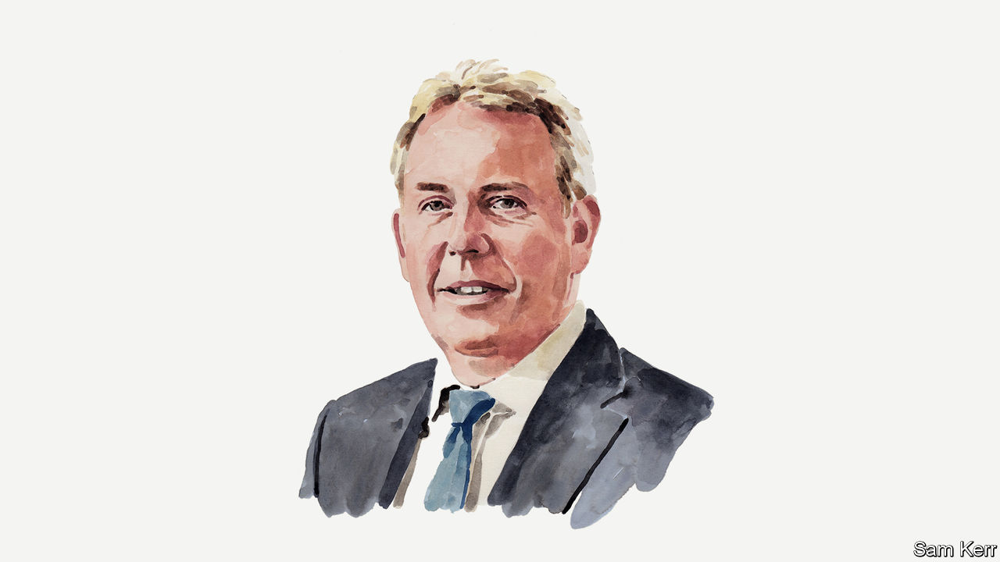

###### Anglo-American ties

# Kim Darroch on the “special relationship” between America and Britain 

##### It’s real, but right now it lacks warmth, says Britain’s former ambassador to Washington 

 

> Jun 7th 2023 

RISHI SUNAK is in Washington this week. The centrepiece is the British prime minister’s meeting with President Joe Biden in the Oval Office. But he will also meet other senior politicians and business leaders, and attend a game of the local Major League baseball team, the Washington Nationals. It had been rumoured that Mr Sunak would throw the ceremonial first pitch, but it now appears he will not have the honour. That may, in fact, come as a relief: celebrity pitching is fraught with risk, as Barack Obama discovered in 2010, when he threw so high and wide that those in the crowd who weren’t laughing jeered. 

More seriously, the run-up to Mr Sunak’s visit has seen another round of British soul-searching about the state of the “special relationship”. Not so in the American press: there is some curiosity about yet another new British prime-ministerial face, but to stateside scribblers it is largely just another visit, another leader kissing the ring of the leader of the free world. 

This is not to dismiss some aspects of the relationship that are genuinely special. The two countries’ defence and intelligence establishments are extraordinarily close, and work together whoever is in Downing Street and the White House. But if I had to sum up in a single adjective how the British eternally feel about the special relationship, it would be “anxious”. For the Americans, the word would be “unsentimental”. In Washington we get an audience when we are contributing, whether ideas or leverage or boots on the ground. When we are bound up with our domestic troubles, the American response will often be polite but essentially disengaged. When we cross America, the reaction can be brutal.

Indeed, the history of the special relationship contains as many troughs as peaks. In 1956 Dwight Eisenhower condemned the Suez invasion by Britain, France and Israel and forced a withdrawal, reportedly telling his aides that “those who began this operation should be left to boil in their own oil.” Harold Wilson and Lyndon Johnson had a famously poor relationship, in part because of Wilson’s refusal to contribute British troops to America’s war in Vietnam; Johnson once privately described Wilson as “a little creep”. 

Their respective successors, Edward Heath and Richard Nixon, were similarly distant, with Nixon convinced that Heath was prioritising British negotiations to join the European Communities (as the EU was then known) over relations with America. Nixon became so frustrated that he once said to Henry Kissinger: “No special relations…They’ll have the relations with the French.” 

Some 20 years later John Major refused for weeks to take a telephone call from Bill Clinton because of the president’s decision to allow Gerry Adams, a Northern Irish republican politician, a visa to visit America. And even the peaks had hollows: Ronald Reagan’s decision to invade Grenada, a Commonwealth country, blindsided Margaret Thatcher, and Tony Blair failed to persuade George Bush to follow British advice on how to manage the aftermath of the Iraq war.

On the atmospherics, Mr Sunak ought now to be comfortable with Mr Biden. They have met several times. And the prime minister is almost an American: he worked in that country’s financial sector and (however much he would like less-well-heeled British voters to forget this) owns property in California. 

As for policy, he has two achievements which should merit some respect from across the table. On Ukraine, Britain has provided the most military support of any European state—albeit only about a tenth of what America has given. It has also been first mover on some of the more controversial Ukrainian requests, notably tanks. And with the “Windsor framework”, Mr Sunak has got as complete a solution as is currently possible to the problems surrounding the Northern Ireland Protocol—an issue that Mr Biden, with his Irish roots, was watching closely.

So they shouldn’t need to spend any time on Brexit issues—though Mr Biden, like every Democrat I’ve ever met, will continue to think that Brexit has damaged both Britain and the EU. It has also complicated the Americans’ diplomatic playbook: the harsh reality for Britain is that it is much less useful to America as a channel through which to track and try to influence EU policymaking than it was before Brexit.

The Russia/Ukraine discussion, doubtless focused on the Ukrainian counter-offensive that began this week, should be positive and productive. The two leaders will indulge in mutual congratulation on AUKUS, a security pact between America, Britain and Australia, which will add another dimension to the defence relationship. On China, while a comparison of a recent speech by Britain’s foreign secretary with recent pronouncements from the Biden administration would suggest some divergence, I suspect views in reality are closer. The Americans share British objectives on China: both want to challenge its behaviour in its neighbourhood, its support for Russia and its unfair trade practices and theft of intellectual property, while looking for a way to work with it on climate change. 

Away from geopolitics, Mr Sunak is keen to interest Mr Biden in his ideas about new international structures to regulate artificial intelligence. As sound and rational as these ideas may be, however, they are likely to be swamped should America decide to work something out with the EU.

For all the inevitable smiles and pats on the back this week, there doesn’t look to be much real warmth in the Anglo-American relationship at the moment. Mr Sunak took some political risks to deliver the Windsor framework, but there didn’t seem much appreciation from across the Atlantic. Rather the contrary: in a recent speech Mr Biden said that his visit to Ireland in April was to ensure “the Brits didn’t screw around” in following up the Windsor deal. It’s as if there has been no real reset in relations from the Johnson era and the Truss moment to the age of Sunak. Perhaps the shadow of Brexit is even longer than I thought.■


