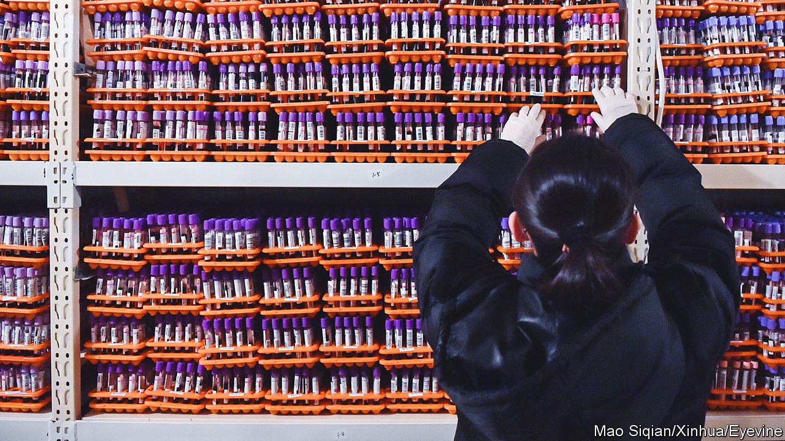

###### Precious bodily fluids

# China’s guarding of genetic data is a drag on scientific research 

##### The Chinese public stands to lose most from the regulations 

 

> Jun 8th 2023 

A TEAM OF Chinese-led scientists made international headlines in May with newly published research that showed a surprising result. The Ice Age humans who crossed what is now the Bering Strait and populated North America had origins not only in Siberia, as previously known, but also in coastal China. The work of the team, which included Italian researchers, involved the collection and analysis of 100,000 genetic samples covering modern populations from nearly all of Eurasia, and more than 15,000 ancient samples.

It is the kind of painstaking collaborative work that pushes the boundaries of knowledge. But it is also the kind of work that has become increasingly hard to do in China, or in co-operation with Chinese scientists. In recent years the country has, for the most part, tightened its regulations on the sharing of “human genetic resources” (hgr) with foreign entities. 

China’s rules, updated on June 1st, cover not only organs, tissue and bodily fluids but also data based on such material. Permission must be obtained through a byzantine application process before any export abroad or any sharing with foreign-controlled entities within China. 

Dr Yu-Chun Li, the lead author of the study on Ice Age migration, says the required approvals did not take long and the rules did not impede her team’s research. But many other scientists, Chinese and foreign, say they are having a harder time.

The regulatory regime imposes a heavy burden on multinational pharmaceutical firms and stifles international collaboration on biomedical research. Foreign companies conducting clinical trials in China have had to recruit dedicated hgr compliance teams in order to keep from running afoul of the rules. Violations can lead to both administrative and criminal punishment. “It creates this chilling effect,” says a person in the drug industry.

There have been no publicised cases of criminal penalties since the earliest regulations were introduced in 1998. But numerous entities have been disciplined, ranging from AstraZeneca, a global pharmaceutical giant, to Huashan Hospital in Shanghai, one of China’s most prestigious. 

Many governments regulate the collection and use of genetic data and material, mainly out of concern for standards of informed consent and patient privacy. “But China takes it to the extreme. They view it as a very valuable resource,” says Lester Ross of WilmerHale, a law firm.

The updates do loosen restrictions in some areas. Katherine Wang of Ropes &amp; Gray, another law firm, sees the simplification of review and approval procedures as a positive development. Clinical information, medical imaging and metabolic data, previously regulated as HGR data, now fall outside the government’s definition. The state has also clarified its definition of a “foreign entity”, which had been vague.

But some of those affected by the rules are disappointed that the science ministry remains in charge of enforcing them. Many expected the updates to shift responsibility to the national health authority, which, it was hoped, would be more sensitive to the needs of researchers. The new rules also strengthen the link between the HGR regime and national-security laws. 

Rao Yi of Peking University believes the impulse to restrict the sharing of genetic resources arose decades ago among people who did not understand the science and believed genetic material could be used to design bioweapons targeted at Chinese people. But it is the Chinese public that stands to lose from the dearth of Chinese samples made available to scientists elsewhere. Nearly 90% of the data used for worldwide genetic research comes from sources in the West, notes Mr Rao, meaning most studies focus on disease-associated mutations in those populations.

For years Xi Jinping, China’s leader, has made reference to what he calls “the red gene”. This metaphorical bit of revolutionary dna, he has said, can be passed from generation to generation and “penetrate into the blood” of the Chinese masses. When it comes to the real-world genetic material of China’s people, his government seems to hold similarly strong views about where it may or may not be passed. ■


