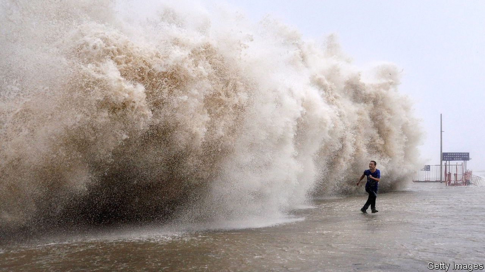
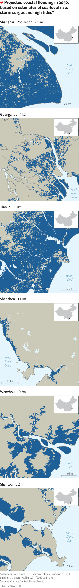

###### The threat of rising sea levels

# China’s new Great Wall 

##### The country is building barriers to protect millions of people from rising seas 

 

> Jun 5th 2023 

CHINA’s Communist party likes to think it is good at . A glance along the country’s coastline might suggest that it is. More than 40 years ago Deng Xiaoping, the late paramount leader, started letting coastal cities dabble in free-market policies and attract foreign investment. Now the gleaming skyscrapers and bustling ports of Guangzhou, Shenzhen and Shanghai are at the heart of global supply chains. Locals’ wealth has increased a hundredfold. Immigrants from poorer inland areas have flocked to cities by the sea.

Yet, although Deng knew that the sea could bring wealth to coastal cities, he and his successors appear  for the fact that, within a century,  could bring serious problems. This represents a greater threat to China than to most countries. By 2100 43m-57m Chinese people could find themselves living below the high-tide line, with an additional 60m threatened by annual coastal floods, according to projections by scientists at Climate Central, an American ngo. By 2050 some 32trn yuan ($4.5trn) of gdp (about 10% of China’s predicted total) could be vulnerable to coastal flooding in a “plausible worst-case” scenario where greenhouse-gas emissions stay high, according to a report by scientists from Britain’s Committee on Climate Change and China’s Expert Panel on Climate Change.

Different areas of sea around the world warm up and expand at different rates, so sea levels rise faster in some places than others. China is unfortunate in this regard. According to a sobering report released in April by China’s Ministry of Natural Resources, the country’s coastal sea levels have been rising by an average of 4mm per year since 1993, compared with a global average rise of 3.4mm. In 2022 sea levels on China’s coasts rose 10mm. 

China’s position in the western Pacific also exposes its southern and eastern coasts to about a dozen typhoons a year. These are set to get more severe as the oceans warm. Higher sea levels will only amplify the storm surges experienced when the typhoons come ashore. 

Development since Deng’s reforms has made things worse. Half of China’s coastal wetlands and mangrove forests—natural shields against floods—have been destroyed. Cities have pumped unsustainable amounts of groundwater out of the earth and built heavy skyscrapers. The resultant subsidence has caused the land in some cities to sink towards the sea even faster than the sea rises. Parts of Shenzhen are falling by 74mm a year. Tianjin, in the north, faces a similar challenge. 

Rising seas are already causing problems. Parts of China’s coast have retreated by dozens of metres, damaging buildings and infrastructure. Seawater is seeping into farmland, its salt spoiling crops and threatening drinking water. 

The biggest danger is flooding. Here, China’s record is mixed. The number of people dying from floods has fallen, thanks to better emergency warnings and faster evacuation. But the economic damage from floods is increasing, and few people are well prepared. 

Last year floods in the coastal provinces of Guangdong, Guangxi and Fujian caused $5bn of damage, of which just 6% was insured, according to Munich Re, an insurance company. When rescue efforts are botched, officials resort to cover-ups. In 2021, after rainfall devastated the central city of Zhengzhou, foreign media covering the floods were harassed and the scale of the damage hidden. 

 


China’s government has rejected some international estimates of sea-level rise, like that of Climate Central. It has also, unhelpfully, warned environmental ngos away from studying its coasts, citing security concerns. In 2021 one group trying to monitor marine pollution was accused of collecting data for foreign spies. 

But some parts of the central government are demanding action. The report from April said coastal cities should include sea-level-rise projections in urban planning and prepare for the possible impact. Important economic regions, it said, should set out migration blueprints based on worst-case scenarios. 

It is not clear how worried officials on the coasts are about such risks. Some of the most reckless sorts of development have slowed. Now better protected, wetlands and mangrove forests are growing again in some areas. Land reclamations, which added over 7,500 sq km of low-lying coastal land between 1985 and 2010, are approved less often. Groundwater is better managed.

Coastal land, though, is China’s most valuable. Officials would prefer to continue building on it. Giant construction projects are ongoing all along the coastline. In Shantou, a port city on the south coast known for its fierce typhoons, a 22,000-seat stadium was recently completed beside the sea. It is surrounded by construction sites which will become industrial parks and residential buildings.

Officials are betting on sea walls to protect such assets. China has thousands of kilometres of them. Smaller cities are supposed to have walls resilient to one-in-100-year floods—those which historically had a 1% chance of occurring in a given year. Big cities are supposed to have one-in-200-year flood protection. Shanghai is unusual in building one-in-1,000-year protection for its central districts. In the Netherlands, for comparison, planners demand one-in-10,000-year standards for coastal cities. 

But around half of the sea walls in China are shoddy, according to a government report. Even those that do meet official standards may not last long. A report in 2019 by the UN’s Intergovernmental Panel on Climate Change predicted that one-in-100-year floods could occur every year by 2050, owing to sea-level rise. 

This all means that massive sea-wall construction can be expected in the coming decades, says Scott Moore of the University of Pennsylvania. Some 430km is under construction already. But a new Great Wall on the sea will have downsides. Upgrading sea walls will become more expensive, as costs rise sharply with height. And the risk of failure increases as sea-level rise accelerates. Higher sea walls create illusions of safety that lead to more construction. “You may be setting yourself up for failure and…setting people up for real danger later on,” says Mr Moore. 

More ambitious engineering works are another option, says Sun Laixiang of the University of Maryland. He has suggested that Shanghai build a tidal barrier across the Huangpu river, similar to the Thames barrier in London. Officials have been discussing the idea for decades. But the Thames barrier was undertaken only after disastrous floods. Mr Sun worries that China might not act until catastrophe strikes. “If we do not take action, if we wait, we may feel great regret,” he says.

In Shantou people know all about the dangers of the sea. In 1969 over 500 soldiers and university students drowned when a dyke collapsed during a storm. They were trying to protect farmland which had been reclaimed from the water. Cigarettes and alcohol are still left as gifts for the dead at a shrine to their memory. 

Flood defences failed again in 2013, killing ten people. Earlier this year the city government admitted in a report that its defences were incomplete. Locals do not seem worried, though. Many view sea-level rise as a distant danger. Houses, they say, can just be built higher to leave space for storm waters. One shop-owner recalled how quickly the local economy recovered after the last big floods. She said she was confident that the government had a plan.

It is not hard to see where this confidence comes from. Shantou’s gdp per person has grown by 430% in the past two decades. Photos in a local museum show before-and-after images of the city since the launch of Deng Xiaoping’s reforms. Swathes of wetland and muddy fields morph into high-rise blocks and factories. The exhibition uses an apt Chinese idiom to describe these great changes: “The blue sea turned into mulberry fields.” The danger is that few seem to believe that this process could be reversed. ■


