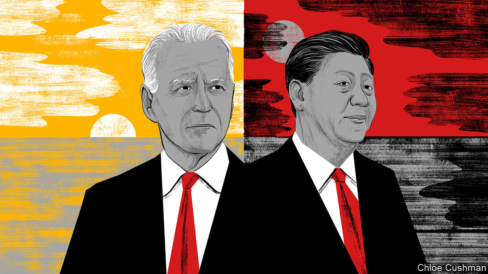

###### Chaguan

# The end of Western naivety about China 

##### A new China debate pits optimists against fatalists 

 

> Jun 8th 2023 

Among Western democratic governments, this is a moment of unhappy clarity about China. Their bleak consensus follows years of naivety and wilful self-delusion about the nature of Xi Jinping’s regime. A changed mood—one of shared, durable gloom—was on display at the latest Stockholm China Forum. This is a gathering of American and European officials, scholars and business types that Chaguan has attended, on and off, since 2008 (Chinese diplomats and scholars attend some sessions). 

The war in Ukraine hung over the latest forum, jointly hosted by Sweden’s foreign ministry and the German Marshall Fund, a think-tank. There was no happy talk about China being an ideal peace-broker, as some European leaders had suggested in the early months of the conflict. Instead, participants talked of Chinese envoys touring European capitals to recommend that Ukraine lay down its arms and sue for peace, while casting Vladimir Putin as a ruler acting in self-defence. One speaker called China’s “collusion” with Russia an “electroshock” for Western governments. China is expected to play a role in the conflict’s end-game and in post-war reconstruction, not least because Ukraine’s government wants Mr Xi at the table. But there was shared horror in Stockholm at any notion of China helping to design a future security architecture for Europe. That distrust is born of hearing Chinese officials blaming the NATO defence alliance for war in Ukraine, and promoting a world order in which individual countries seek security via shifting, values-free calculations of their interests.

There is transatlantic convergence, too, about the need to de-risk commercial ties with China. That is an ugly term for an idea with usefully broad appeal. American, European and other Western governments and businesses want to avoid excessive dependencies on Chinese suppliers of critical commodities and products, and to ensure that exchanges with China are consistent with their “interests, values and security concerns”, to quote Sweden’s prime minister, Ulf Kristersson, in on-the-record remarks that opened the forum. 

Chinese officials, backed by some foreign business bosses, accuse Western governments of planning wholesale economic decoupling, a ruinously disruptive and costly outcome. In truth, talk of decoupling is a straw man. On each shore of the Atlantic, insiders say, there is agreement that perhaps two-thirds of trade with China involves no strategic implications, and should be encouraged. At the same time, governments are aligned on the need to scrutinise a few sectors and deals much more closely. Europeans are warier than Americans about export controls to stop China building advanced weapons or tools of repression with Western technologies. But most Western capitals are in lockstep on the need for new, defensive tools against Chinese economic coercion. 

Foreign businessmen and officials share notes about Mr Xi’s ever-sterner emphasis on security. A new counter-espionage law could make it perilous to collect soil samples to check for toxic residues before building an expensive new factory in China, the forum heard, or dangerous to obtain data about weather patterns in the Taiwan Strait before investing in a coastal wind farm.

Western governments face shared challenges to their domestic politics as China becomes dominant in such sectors as electric vehicles. While China has every right to compete in industries of the future, the forum was invited to contemplate the politics of a world in which millions of car-plant workers blame Chinese imports, backed by vast state subsidies, for taking their jobs. German car companies, which once made huge profits in China, now face a fight to survive in that country’s market, a speaker reported. 

Yet if the West is now united in anxiety about China, a different divide could be heard in this gathering of transatlantic officials and scholars. Under President Joe Biden, America leads a camp of optimists which hopes that with enough political will, economic resources, military might and diplomatic skill, the West can out-compete China. A second camp is much more fatalistic. 

The groupings have fuzzy boundaries. Some European countries, such as France, share the Biden administration’s faith in industrial policies to protect manufacturing jobs. But France’s president, Emmanuel Macron, is called “deeply pessimistic” about geopolitics by those who have briefed him about China. Though Mr Macron does not dispute dark assessments of Mr Xi’s regime, he has little confidence that America can be relied on as a security partner, especially after its presidential election in 2024. That fatalism helps to explain why Mr Macron delighted his Chinese hosts earlier this year by suggesting, in an interview with  on his plane home, that Europe should beware of being dragged by America into clashes in Asia, including over Taiwan.

Other countries fret about rising protectionism, and worry about Mr Biden unleashing subsidy contests that leave all players worse off. But some of the same governments argue that the war in Ukraine has proved, once again, that America is the West’s indispensable security partner. In return for American support in Europe, they urge the EU to see security and political interests in the fate of Taiwan and the Indo-Pacific.

Divide and rule

Chinese leaders detect the confidence gap, and try to widen it. A Chinese speaker at this month’s Shangri-La Dialogue, an Asian security forum, told Europeans the “best thing” they could offer Asia was to stay away and “do nothing”. A similar logic underpins the growing risks taken by Chinese warships and fighter jets, as they intercept American and allied naval vessels and planes in international skies and seas near China. The aim is not to win friends, but to make America’s partners take fright so that they urge Mr Biden to back down. Mr Xi’s assertive words and deeds leave ever less room for Western naivety. But if foreign credulity is replaced with despair, China will take that for a win. ■


