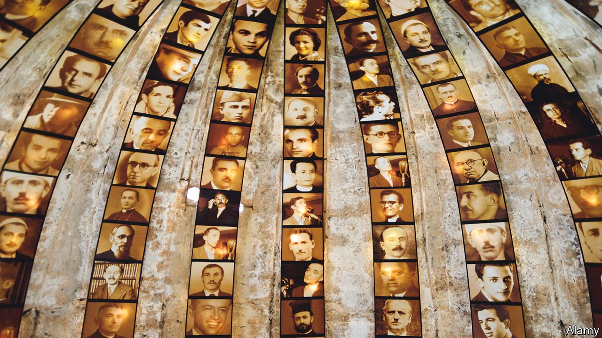

###### Memory and forgetting

# A museum in Albania aims to commemorate a painful past 

##### And so illuminate the post-communist present 

 

> Jun 8th 2023 

Down you go, deep into one of the biggest hideaway bunkers of what was once the nastiest communist regime in eastern Europe. Now restored as a museum known as Bunk’Art 2, the underground labyrinth was completed only in 1986—a year after the death of Enver Hoxha, who became  in 1944, modelling himself on  and often matching him in his paranoia, purges and terror.

Carved out beneath the interior ministry in Tirana, Albania’s capital, the bunker is a spooky, claustrophobic warren of dimly lit corridors, leading to around 20 poky chambers and a larger parquet-floored, wood-panelled cabinet room. Here the dictator could preside over his government in case of a nuclear strike on what was then the most isolated country in the world. Albanians often refer to their homeland in those days as the North Korea of Europe.

Each room is emblazoned with captions laying out the horrifying statistics of repression under Hoxha, sometimes with videos of survivors describing torture and imprisonment. In a country of around 1.2m people in 1944, when the Germans were chased out and Hoxha’s communists took over, between 25,000 and 34,000 are thought to have been jailed for political reasons (their offences could be extraordinarily trivial). Some reckon at least 5,000 were executed: no one is sure of the true figure. Thousands were sent to labour camps or “internal exile” in remote villages where you could be banished for ever. Trying to, an almost impossible quest that many undertook in vain, could merit 20 years behind bars. 

The purges and executions persisted in waves right up to Hoxha’s death in 1985—and hit the ruling class as much as the immiserated proletariat. His closest comrade and long-serving deputy, Mehmet Shehu, himself a mass-murderer, shot himself in murky circumstances in 1981. As was the custom, Shehu’s entire family was jailed or banished; his eldest son also died by suicide. All but one of Hoxha’s interior ministers came to a sticky end. He even executed his own brother-in-law, who had protected him when he was in hiding as a young revolutionary. 

The aim of Bunk’Art is to persuade more Albanians to remember the past and delve into it more deeply—so as not to repeat it. According to the museum’s creator, Carlo Bollino, an Italian media entrepreneur on friendly terms with the present government, a lack of knowledge has “prevented the wound of communism from healing”. This, he thinks, is why “even today it is difficult to speak calmly about what happened in the communist period.” 

Mr Bollino laments the fact that many young Albanians “know little or nothing about the history of the dictatorship and are not even interested in learning about it”. His concern is echoed by Margo Rejmer, the editor of a powerful anthology of interviews and memories. Called “Mud Sweeter than Honey”, it illustrates the Kafkaesque craziness of the old system, as well as its cruelty. “Many people would like to talk about the past,” Ms Rejmer writes. “But few are willing to listen. There’s a widespread belief that everything has already been said.” The book was published in 2018 to acclaim in Poland, her own country, but is unavailable in Albanian. At Bunk’Art, meanwhile, most visitors are foreign.

Fatos Lubonja, an outspoken ex-prisoner, is sceptical about the museum, noting that it memorialises the paranoia of the rulers, while the camps to which the oppressed were sent to rot are unmarked. He served 17 years in them after his private diaries and poetry were confiscated as his father, then head of Hoxha’s radio and television service, was being purged. “It’s not a real place of suffering,” he says of Bunk’Art. People should be shown the “real gulag” where Albanians were tortured or worked to death. Mr Lubonja is offended that one of the two most hellish camps has been converted into a standard prison, while the other, at which copper was mined, has been bought by a Turkish company.

A big reason for the blanking of history is that it poisons . The ruling Socialist Party, led by Edi Rama, the prime minister, was born out of the old communist party. It entirely rejects the defunct ideology and has refashioned itself as a centre-left, social-democratic outfit that keenly embraces capitalism. Mr Rama himself laments the tendency of politicians to treat their opponents as enemies, in the style and language of the past. “We don’t yet understand how to live together with people who think differently and are treated as the enemy,” he sighs. 

The families of those persecuted under Hoxha tend to support the Democratic Party, Albania’s main opposition, which makes much of the Socialists’ origins. But many Socialist politicians can also cite forebears who suffered under the tyrant, including members of the nomenklatura who fell foul of him. “Both [main] parties have the old communist mentality,” says Besar Likmeta of the Balkan Investigative Research Network, the region’s most independent journalistic outlet. “They’re just Communist A and Communist B.” 

Mr Lubonja scolds them both for “manipulating” the past. “We have failed to create a culture of empathy,” he says. Places like Bunk’Art are only a start. ■


