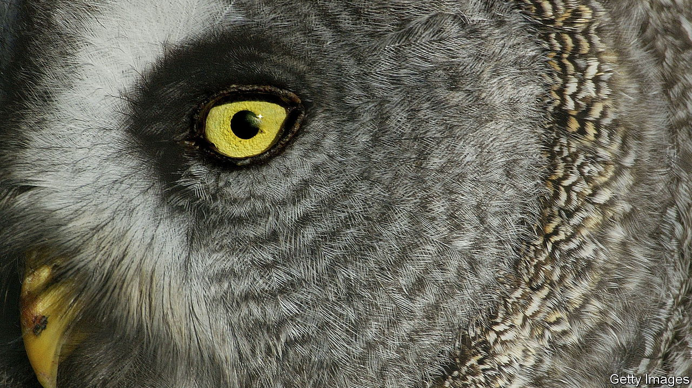

###### Avian adventures

# A raptor’s mystique inspires “What an Owl Knows” 

##### They know rather a lot, reveals the book’s author, Jennifer Ackerman 

 

> Jun 7th 2023 

By Jennifer Ackerman. 

With a face as round as the first letter of its name and a stance as upright as the last—along with human-like features and a haunting cry—the owl has a mystical, mythical perch in the imagination. Difficult to spot because of their mostly nocturnal habits, and sporting cryptic plumage that helps them melt into landscapes, owls, writes Jennifer Ackerman, are the most enigmatic of birds.

Ms Ackerman is a natural-history writer who specialises in the avian world. InWhat an Owl Knows” she offers an absorbing ear-tuft-to-tail appreciation of the raptor that Mary Oliver, a poet, called a “god of plunge and blood”. Owls, it seems, know a lot. Ms Ackerman draws on recent research to explain what and how.

To begin with, she stresses, there is no generic owl, but rather a diversity of some 260 species found on every continent bar Antarctica. They stretch from the fire-hydrant-sized Blakiston’s Fish Owl to the Elf Owl, which could fit in your palm. Most, but not all, are nocturnal. All hunt with brutal precision using beaks and talons to snatch prey ranging from mice to small deer. No holds are barred: the Northern Saw-whet sometimes beheads victims and stashes them to eat later. Owls, moreover, don’t necessarily give a hoot. The Barred Owl launches a blood-curdling scream; the Barn Owl, “a nasal snore”; the Sooty Owl, a whistle like a falling bomb. 

Among their “superpowers”, as Ms Ackerman admiringly calls them, is the ability to fly almost silently, unlike noisy flappers such as hawks. Serrations on the leading edges of their wings dampen turbulence and a coating of velvety fibres muffles sound. Their vision is attuned to nocturnal hunting—their sensitivity to light is 100 times greater than a pigeon’s—but, a researcher explains, they “basically see their world through their ears”. The flat disc of the Great Grey’s face (pictured) acts as a satellite dish that captures noise and directs it to the ears; using sound alone, it can seize a vole faintly scratching deep under snow.

With their unnerving stare and eerie ways, it is small wonder that owls provoke superstition—and flights of fancy, as in the owl who sails with the pussycat in ’s poem. In myths, stories and art, “owls speak of wisdom and luck, of misfortune and malevolence”, the author writes. They were associated with Athena, Greek goddess of wisdom. In Belize they are the bearers of bad luck; in China they bring the good kind. Hedwig, the Snowy Owl who is courier and companion to , precipitated such a rush for pet owls in Britain that a sanctuary was created for birds dumped by foolish owners. J.K. Rowling was prompted to say publicly that owning an owl “belongs in fiction”.

Hedwig aside, owls conjure magic just by appearing. On finding one, “my heart always skipped a beat,” a field scientist tells Ms Ackerman. For her part, she says the birds changed the way she views landscapes, enabling her, for example, to see  not as debris, but as owl nurseries. In a survey of cultural attitudes, a woman in southern Brazil was asked why owls are valued. “Because”, she replied, “they enchant the environment.” ■


