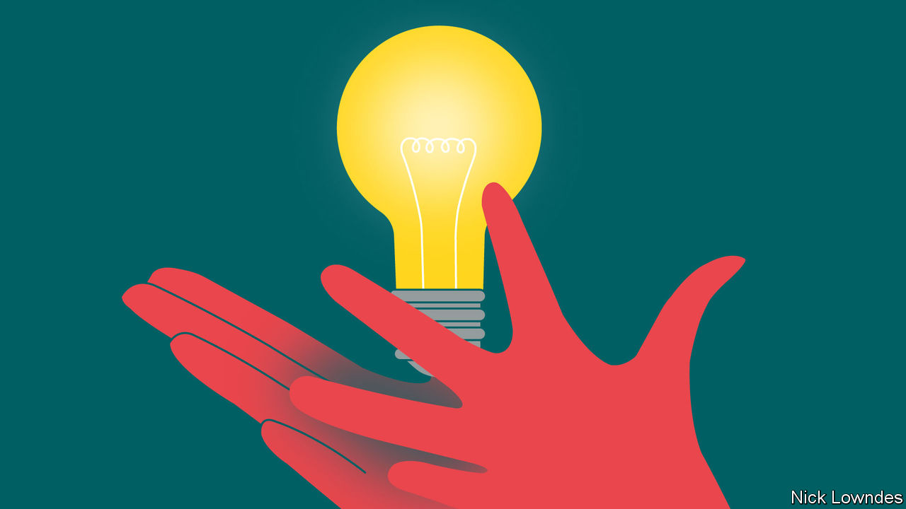

###### Johnson

# Gestures are a subtle and vital form of communication 

##### Susan Goldin-Meadow explains why and how in “Thinking With Your Hands” 

 

> Jun 8th 2023 

“TIE AN ITALIAN’S hands behind his back,” runs an old joke, “and he’ll be speechless.” The gag rests on a national stereotype: Italians are voluble and emotional, and  supposedly goes to prove it.

Susan Goldin-Meadow of the University of Chicago has a rather different view. Emotions come out in lots of ways: facial expressions, posture, tone of voice and so on. But people are doing something different when they use gestures with speech, which she sums up in the title of her new book, “Thinking With Your Hands”. It is a masterly tour through a lifetime’s research.

Virtually everyone gestures, not just Italians. Experimental subjects, told after a research session that they were being watched for gestures, apologise for not having made any—but were doing so the entire time. Conference interpreters gesture in their little booths, though no one is looking. People born blind gesture when they speak, including to each other. A woman born without arms but with “” describes how she uses her phantom arms when she talks—but not when she walks. All this suggests that cognition is, to some extent, “embodied”; thinking is not all done in your head.

The gesture under discussion here is mostly the “co-speech” kind. It is much more abstract than mime (in which exaggerated acting tells a story). Nor are these “emblematic” gestures like a thumbs-up or a finger over the lips for “Silence!” Like words, those are fixed within cultures (but vary between them). Instead, gestures that accompany speech are a second channel of information. Subjects watch a film in which a cat runs but are told to lie and say it jumped. They do so in words—while their hands make a running motion. People who say they believe in sexual equality but gesture with their hands lower when talking about women are not indicating women’s shorter stature; they can be shown to have biases of which they may be unaware. 

Gesture is also not . Sign languages have clearly defined words and grammar, and differ from place to place just as spoken ones do. Professor Goldin-Meadow spends a lot of time on homesign—systems of signs typically developed by deaf children in hearing families who are not exposed to (and so never learn) a conventional sign language. Such children are essentially inventing rough but rich languages out of nothing, with features such as fixed word order and hierarchical grammatical structures much like those in fully fledged languages. Such homesign systems far outstrip their parents’ gestures; a parent’s raised finger meaning “Wait” may be adopted by a child to connote events in the future.

Returning to conventional gesture, the author keeps her focus on child development. Some students who fail at a tricky mathematics problem may gesture in a way that indicates they are on the verge of getting it; they should be taught differently from the ones whose gestures suggest that they are entirely at sea. Children who still use only one word at a time may combine a word and a gesture; this successfully predicts that two-word phrases (“Give ball”) are just around the corner. And those taught to move their hands about when discussing a moral quandary with several perspectives soon start to see the problem from different points of view. 

All this is rounded out in a final section offering practical advice. Teachers are encouraged both to use gestures themselves and to observe those their students make. Parents are taught to fill in the word a child is most likely to be missing when they gesture (“That’s a dog”) rather than adding information (“That’s a fluffy one”). Children with language delays caused by brain injuries at or around birth, but who nonetheless gesture as much as their peers, are likely to catch up verbally by the age of about 30 months. Those who gesture less are more likely to need intensive early intervention. Children with Down’s syndrome may express themselves better when taught to use a mix of gesture and speech rather than speech alone. Psychotherapists can be trained to look out for gestures hinting that patients are thinking something they are not yet ready to say.

In , Lady Diana is warned that her hands may betray her real emotions, which could be dangerous; they are tied together so she can learn to speak without gesticulating. No one who reads this book could ever again think that gesturing shows only a lack of control. It is about thinking and communication, and is a sophisticated aid to both. ■


