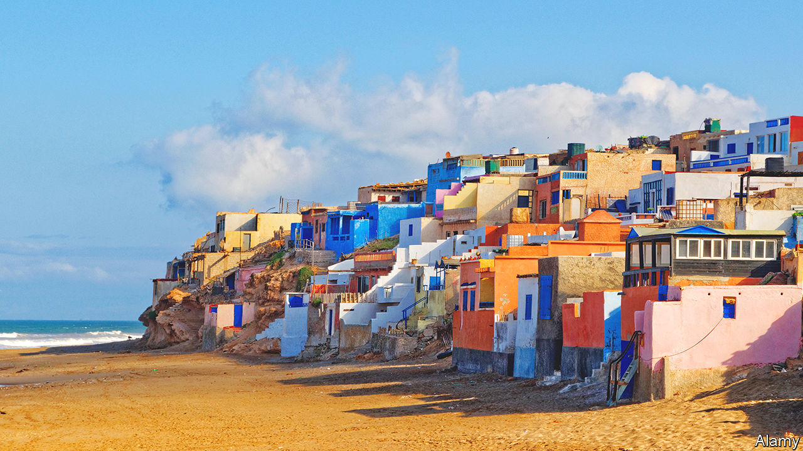

###### Post-colonial fiction

# Leïla Slimani’s new novel ranges from France to Morocco 

##### “Watch Us Dance” is a tale of rebellion and repression, love and its betrayal 

 

> Jun 8th 2023 

By Leïla Slimani. Translated by Sam Taylor. 

STUDIOUS and shy, Aïcha leaves the mandarin and olive groves of her parents’ farm in Morocco for medical school under the “ashen skies” of eastern France. There, on the cusp of the student , she finds friendship as well as prejudice. “We don’t do this kind of hair usually,” the  in Strasbourg says when Aïcha has her hair straightened so as to look like Françoise Hardy, a French star. 

Leïla Slimani’s new novel, the second in a planned trilogy, really takes off when Aïcha goes home to Morocco after four years of study. “Watch Us Dance” picks up the tale of Amine and Mathilde Belhaj, Aïcha’s parents, whose Franco-Moroccan love story featured in Ms Slimani’s previous work, “”. Now, Amine’s farm has prospered. Mathilde, lonely and tired of his infidelity, is fixated on the construction of a swimming pool. She rents Limoges porcelain tableware and invites smart friends to celebrate, then urges them to eat with their hands, “Moroccan-style”.

This collision of cultures and expectations, as well as the hidden family dramas that unfold, make this novel one of Ms Slimani’s most ambitious yet. In France, skirts are short and hopes are high. Aïcha flies back to Morocco dressed in knee-high brown leather boots and an orange vinyl jacket. She feels a fool. Home brings both comfort and hostility. She leaves for the Moroccan coast to join a friend, encounter Marxism and, at last, fall in love herself. 

Ms Slimani is best known in the English-speaking world for  (published in America as “The Perfect Nanny”), her chilling thriller about a live-in childminder who murders her Parisian charges. “Watch Us Dance” roams far wider in both geography and historical context—interlinking the paradoxes of post-colonial Morocco with those of  France. 

In the Belhajs’ local town, “Nobody had learned the new Arabic street names.” It seemed that “colonisation had never been anything more than a misunderstanding, a faux pas that the French now repented and the Moroccans pretended to forget.” Aïcha’s brother, Selim, ends up in an alternative colony on the coast, where the owner of the Hippie Café would “unfurl his prayer mat in a corner…while the hippies toasted the sexual revolution”.

Translated into English by Sam Taylor, this is a story about rebellion and repression, belonging and appearance, love and its betrayal. It is infused with a raw earthiness. The skin of villagers “smelled of cumin and charcoal”. A “gigantic metal claw” tears into the ground to build Mathilde’s pool. Amine contemplates the soil of his farm, and his relatives who lie buried beneath it. In the end, as at the beginning, this is a novel rooted in the land: stolen, returned and forsaken by a younger generation that is seduced by a different world. ■


