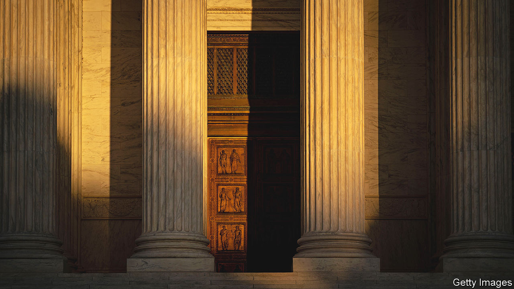

###### Runaway justice

# Two alarming books on the power of America’s Supreme Court 

##### But the criticisms in “The Supermajority” and “The Shadow Docket” are different 

 

> Jun 8th 2023 

By Michael Waldman. 

By Stephen Vladeck.

The Supreme Court of the United States did not start out as the powerful, at times imperious, institution of today. Under the Articles of Confederation of 1777, there were no federal courts at all. The third branch added by the constitution in 1789 was, at first, something of a third wheel. The justices met in the basement of the Capitol when the government moved to the District of Columbia in 1800. Congress paid the Supreme Court little courtesy, sending justices to “ride circuit” over the summer and even cancelling their term from April 1802 to February 1803.

Later that year, however, John Marshall, the fourth chief justice, boldly seized the power of judicial review—the ability to strike down laws that violate the constitution. A century and a quarter later, the tenth chief, William Howard Taft, insisted on liberating the justices from Congress’s lair and installing them in a spectacular home of their own across the road. 

The emboldened jurists now calling the shots in Taft’s “marble palace”—the bronze front doors of which stand 17 feet (five metres) high and weigh six and a half tons apiece—are the cast of two new books. “The Supermajority” by Michael Waldman, head of the Brennan Centre for Justice at New York University, analyses the seismic effects of rulings made last year. “The Shadow Docket” by Stephen Vladeck, a law professor at the University of Texas, is the first book to pull back the curtain on the less visible (but increasingly influential) way the court is twisting the constitution in the shadows. Both authors aim to alarm.

Mr Waldman’s focus is on the court’s 6-3 conservative majority. Republican appointees have dominated the court since 1970, but in recapping three decisions of June 2022, “The Supermajority” shows that the rightward lean has gone full tilt.  abandoned rulings that for half a century provided a . Justice Samuel Alito’s approach in his majority opinion preserves “in amber 19th-century social norms”, says Mr Waldman.

He also lambasts the supermajority for its extreme interpretation of the right to . In , Justice Clarence Thomas ignored “overwhelming evidence throughout history” that “prohibitions on carrying concealed weapons were just fine”. And by striking down a plan to restrict greenhouse-gas emissions in , the court “hobbled” the government’s ability to .

Casting aside precedents and revolutionising the law on contentious questions may be brazen, Mr Waldman notes, but it has happened before. In three other periods, the court “divided America”: the infamous  of 1857 paved the way for civil war; rulings in the early 20th century blocked worker reforms, including (for some time) the New Deal; and the liberal Warren Court of the 1950s and 1960s triggered a conservative backlash.

These historical sections in the book are thin; its analysis of the Warren Court, in particular, could be sharper. Mr Waldman writes that this period, with its expansion of rights in America, was the court’s “greatest era”—yet he also criticises its justices for “making up rights to fit their political predilections”. Somewhat implausibly, he implies that conservatives might have been less upset if decisions on contraception, abortion and criminal justice had been couched in less “groovy” and “psychedelic” terms. 

The history that Mr Vladeck recounts is more nuanced, as well as being attuned to the argument of his book: that the court has damaged its legitimacy in abusing its “shadow”, or emergency, docket. “Most of what the court does is behind the scenes,” he explains, and “shrouded in obscurity”.

The term “shadow docket” dates  but the concept—any decision made without oral argument and, typically, with scant explanation and few justices disclosing how they voted—is as old as the Supreme Court. Until 2017 shadow-docket affairs were “almost entirely uncontroversial”. That changed when Donald Trump’s administration stretched the concept of “emergency” by regularly running to the justices. Across the four previous presidential terms, solicitors-general filed just eight emergency applications. Mr Trump’s officials filed 41. The court was mostly obliging, granting at least part of his wishes—such as to divert funds to his , ban travellers from Muslim countries and execute federal prisoners—28 times.

The dark side

Mr Vladeck offers a fascinating chronicle of the shadow docket’s rise. He traces it to 1890, when the court gained more discretion over its regular docket and “inaugurated the practice of offering no explanation” when it declined to hear a case. The next step was a surge in last-minute execution appeals (a “death clerk” had to be nominated to handle the applications). A prototype of Mr Vladeck’s critique came in 1984 when Justice William Brennan dissented from a 5-4 decision to reinstate an execution. He called it “an indefensible—and unexplained—rush to judgment” that was “insensitive, if not ghoulish”.

The author’s skill as a law professor shines in thorough, clear explanations of how the court has run roughshod over its own jurisprudence in shadow-docket cases involving abortion, religious liberty and election law. He highlights the silent but “stunningly impactful” role Justice  played in her first weeks on the job. She added a fifth vote in favour of religious objections to pandemic public-health measures which, four months earlier, had been rejected by the left-leaning justices and Chief Justice John Roberts.

Whereas Mr Waldman’s case rests on substantive disagreements with the justices, Mr Vladeck’s is more even-handed. He praises an order he disagreed with for being “by the book” in terms of procedure, and faults another he liked for failing to include a reasoned explanation. He also notes recent signs of wiser use of the shadow docket as some justices respond to outside criticism (not least, though he takes no credit, from Mr Vladeck himself).

Reining in the court will be tricky. Mr Waldman’s insistence that left-leaning Americans “must fall out of love with the Supreme Court” is odd, as three-quarters of Democrats already hate it. He is cheered by signs of a backlash to but does not show how this sentiment might lead to judicial , one of his proposed reforms (the justices themselves could anyway strike those down, as he acknowledges). In shining a light on a tenebrous corner of the court’s work, Mr Vladeck’s agenda looks more modest. But the illumination in “The Shadow Docket” could help bring more principle, accountability and “procedural regularity” to the justices’ work—and help stop a controversial institution going completely off the rails. ■


