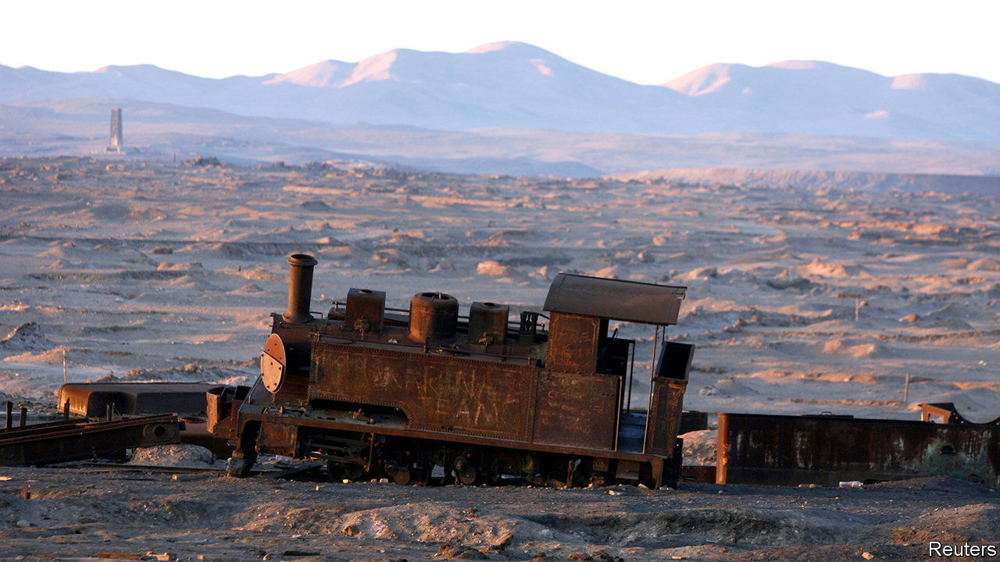

###### Things fall apart

# “Amongst the Ruins” explores the collapse of civilisations 

##### The causes, says John Darlington, include natural disasters, wars and economic reversals 

 

> Jun 8th 2023 

 By John Darlington.

“THIS, I MUST confess, seems owing to nothing but to the Fate of Things,” Daniel Defoe wrote glumly in 1724 of the decline of Dunwich. The town in Suffolk had once been the largest port on the East Anglian coast; in the 11th century its estimated population of 3,000 put it in the top fifth of recorded English settlements. A natural harbour at the mouth of the River Dunwich allowed trade with Europe. Wine came from Gascony, stone from Caen. 

But its position was precarious. In 1086 the  noted the loss of half the town’s farmland to the sea. In 1328 a storm washed away most of the houses. The harbour silted up; the river itself rerouted north. Today the population is 200.

Dunwich features in “Amongst the Ruins”, a survey of civilisational and communal collapse by John Darlington. The town’s shoreline, composed of sand and gravel, led to difficulties, but the real problems were shifting  and —the same processes, writes Mr Darlington, which “separated the United Kingdom from continental Europe during the last Ice Age”. In his telling, nature always wins. It is just a question of when.

His book offers 17 case studies of destruction, organised into five themes: climate change, natural hazards, human disaster, war and the economy. They range from Neolithic Northern Ireland to Route 66 in America. The choices are eclectic, if also a touch parochial: four are in Britain, three more have been British colonies.

The causes of disaster overlap. People and companies continue to build in areas of extreme , for example, because economic and political concerns seem to outweigh the risks. Port Royal was the main British settlement in the Caribbean, a foothold off the coasts of Spanish-controlled Central and South America. Now in eastern Turkey, Ani was the capital of medieval Armenia, straddling the Silk Road at a meeting point of empires.

Some thought Port Royal lay on a moral faultline, too. It was “the very Sodom of the Universe”; in 1690 a fifth of its buildings were given over to brothels, gaming houses and taverns. By contrast, Ani was “the city of 1,001 churches”. It took a single earthquake in 1692 to destroy Port Royal. Bigger and more robust, Ani was hit by three major quakes between 1132 and 1605, but was sunk by a Mongol invasion and new trade routes, among other woes.

Humans follow opportunities and natural resources. Humberstone, a mining town in the Atacama desert in Chile, was founded in the 19th century to feed the global market for nitrate in fertilisers and gunpowder. It was ruined by the invention in Germany of a commercial process to make ammonia out of atmospheric nitrogen. Chile’s market share fell from 80% in the 1890s to 15% by 1950.

Perhaps the most basic resource is water. At its peak, the Sumerian city-state of Girsu irrigated some 3,000 square kilometres of land. A vast system of canals and dykes brought abundant water from the Tigris and the Euphrates—but also salts from the mountains, which in time wrecked the soil. Girsu’s success caused its failure.

Mr Darlington, an archaeologist at the World Monuments Fund, is as interested in the conservation of cultural heritage—what societies preserve, how and why—as in the reasons for collapse. He questions the obsession with preserving the past. Change and loss are inevitable, he says; conservation is the careful management of those cycles, not a denial of them. “Letting go”, he writes, should probably be “the default option”. It is a provocative observation that he might have explored further.

Contemplating Dunwich, Defoe concluded that it was a —a reminder of earthly mortality and transience. “Towns and Cities Die, as well as we,” he wrote. Readers of this thoughtful book may disagree. Societies are fallible, but also resilient; often they adapt and move on. The ruins themselves may matter less than what emerges from them. ■


