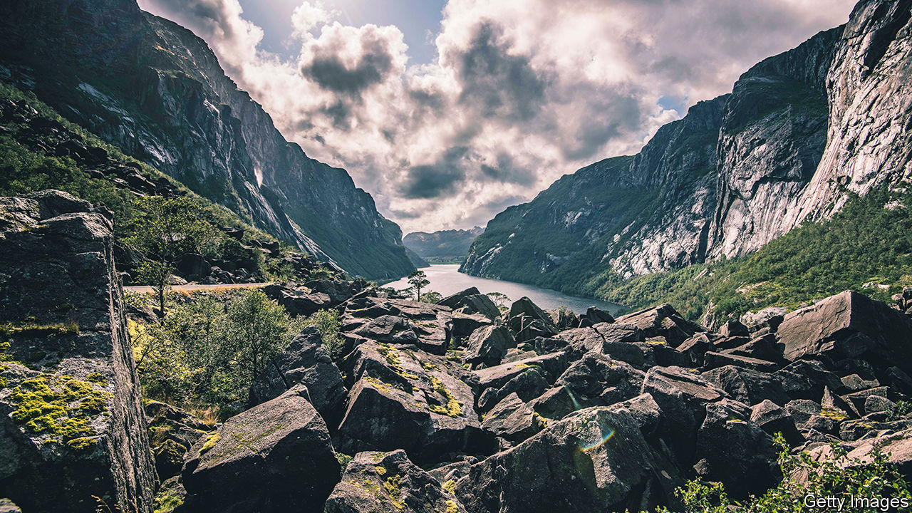

###### Fjords and forges

# A huge Norwegian phosphate rock find is a boon for Europe 

##### The West wants to rely less on China for strategic minerals like vanadium 

 

> Jun 8th 2023 

NORSE LEGEND has it that the dwarves Brokkr and Eitri forged Mjolnir, Thor’s hammer, after Loki bet they could not match the skill of the Sons of Ivaldi, who had made Odin’s spear. Nowadays metallurgical rivalry in Europe’s far north is just as intense. Until recently the world’s largest known deposits of ultra-pure phosphate rock were on Russia’s Kola peninsula. Russia also has rich reserves of vanadium and titanium. But last month Norge Mining, an Anglo-Norwegian company, announced it had found massive deposits of all three in south-western Norway: at least 70bn tonnes. 

The company says that could supply current global annual demand for more than 50 years, a big deal now that countries are jockeying over strategic minerals. Titanium is used to build aeroplanes (including fighter jets). Vanadium is needed for improved steel and for the giant high-tech liquid batteries used by power companies. Phosphates are used in fertiliser and to obtain phosphorus for computer chips and solar panels. For all of these minerals, Europe and America depend on worryingly unreliable suppliers. Airbus buys half its titanium from a Russian manufacturer. Boeing’s Japanese titanium suppliers import ore from Africa, where it may be under Chinese control. China, Russia, South Africa and Brazil dominate vanadium production; America imports nearly all of the ore it uses. Phosphates and phosphorus are newly relevant as Europe and America worry about food security and try to relaunch their chip and solar industries.

Michael Wurmser, Norge Mining’s co-CEO, says the company’s new mines will be greener than current ones. Phosphate rock in Africa is sedimentary and contains many pollutants; that in Norway and the Kola peninsula is igneous and much purer. Norge Mining plans to capture the carbon emitted by its operations and store it. Getting environmental permits will be a chore, but the mine is a high priority for Norway’s government, as well as for Europe and America: its minerals fall under the EU’s Critical Raw Materials Act and an American strategic-minerals scheme. 

Sweden recently discovered rare-earth metals in its far north. Such finds will help the West in its ever-sharper rivalry with Russia and China. The stakes are almost as high as they were for Loki: having lost the bet, he was obliged to give the two dwarves his head. As usual, though, he talked his way out of it. ■


