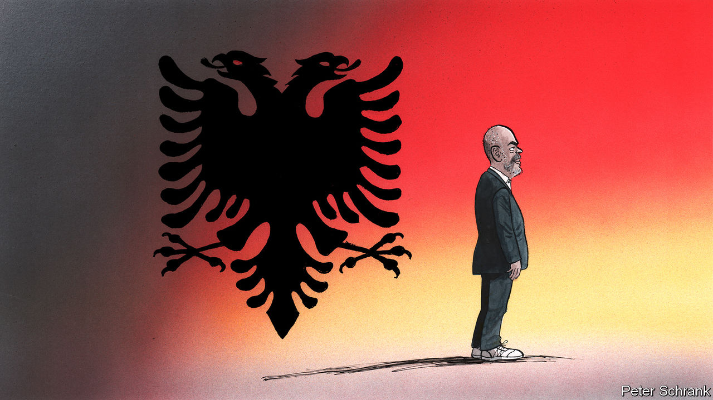

###### Charlemagne

# Albania is no longer a bad Balkan joke 

##### It is led by Edi Rama, a former basketballer-cum-modern artist 

 

> Jun 8th 2023 

Long THE most benighted and quarrelsome part of Europe, the Balkans may have a new leading light. Most unusually he is the prime minister of Albania, a strapping 58-year-old former basketballer cum modern artist, Edi Rama. Last month his Socialist Party trounced the tattered ragbag of opposition groups to win all but a handful of the country’s 61 mayoralties and councils. So he is likely to win the next general election, due in 2025, his fourth victory in a row, and thus to rule until 2029 what was once the region’s most miserable outpost. In power since 2013, Mr Rama is already the longest-serving current head of a Balkan government. In 2000 he emerged as a dynamic and colourful mayor of Albania’s capital, Tirana. Since 2005 he has headed his party. Now he can claim to be a Balkan star, even a calming influence in a still fragile region: witness the, where the Serb minority has been railing against the ethnic Albanian majority. Mr Rama refuses to gee up his cousins, and urges the West to handle Serbia’s president, Aleksandar Vucic, sensitively.

Sprawled out in his office after flying back from talks with Manchester City Football Club about creating a network of coaching academies in the Balkans, he cuts an imposing figure in a T-shirt, slacks and gleaming white sneakers. He is six foot seven inches tall, shaven-headed, with a trim white beard, speckled moustache and watchful, baleful eyes: you might not want to bump into him in a dark alley at midnight. Fluent in an array of languages, he is patently cosmopolitan, despite an upbringing in what was one of the world’s most isolated, vicious and paranoid countries, often described by today’s Albanians as “the North Korea of Europe” before communism collapsed in 1991. 

“Italy was our America,” he muses. “TV, Italian football, the pope, music. But even getting TV wasn’t easy.” He recalls draping his room with sheets and carpets so that no one could hear him and his pals playing illicit recordings of the Beatles. He says he remembers his shock and delight when he could read Kafka, Proust and Dostoevsky, listen to Ravel, Debussy and Stravinsky, and see Cézanne, Van Gogh and Picasso. His critics note that he was a child of the communist ; his father was a leading official sculptor, who may have moulded the features of Stalin. Mr Rama is also accused of indulging a cult of personality. A Western observer calls him “brilliant, visionary, eccentric, egomaniacal…with a strong sense of his legacy in history”.

He is not shy about listing his achievements—or at least post-communist Albania’s. Tirana is unrecognisable from what it was three decades ago: a grim, grey, totalitarian, sub-Soviet, Ruritanian village. Then, the entire country had around 6,000 cars: it was illegal to own one. Now it has more than 700,000. Though Mr Rama’s party descends from the one run for 44 years by the mass-murderous Enver Hoxha until his death in 1985, it has been utterly revamped into a pro-market, social-democratic outfit. Its critics accuse it of entrenching corruption under an oligarchical elite that dominates the media and has let inequality widen. 

Mr Rama shrugs off such claims. He says he models his party on Britain’s New Labour. Tony Blair, his lawyer wife Cherie, and his long-time spin doctor, Alastair Campbell, all still visit to lend advice. “We’re not very ideological,” says Mr Rama. “For us there’s no right or left solution: it’s not a heresy to have a right solution that works.” Margaret Thatcher, he avers, was “a great leader” who enacted painful reforms to modernise Britain, without which New Labour could not have succeeded in her wake. 

Mr Rama’s confidence encompasses the region. The entire Balkans, he notes, even traditionally , is united behind Ukraine. A member of Nato since 2009 and since 2010 part of the Schengen group that grants visa-free travel within Europe for up to three months, Albania has no serious tussles with its neighbours, he adds. “This is unique in our history.” 

As for actually joining the EU, he wisely refuses to dangle any dates, while accepting the club’s entry requirements as a motor for Albania’s own reforms. Mr Rama recognises that a clutch of countries in the club, led by France, are wary of letting the Balkan bunch in. Every Western diplomat’s mantra in Tirana is that Albania is “heading in the right direction” but that “there is still a very long way to go”, especially with regard to cleaning up the courts and creating a proper rule of law, an issue to which the EU and America devote much attention and money. A scheme to vet the country’s entire body of judges and prosecutors has led to the dismissal of an astonishing two-thirds of them. What happens to those that are weeded out? “Oh, they become lawyers and accountants,” says a local civil-society campaigner. 

Endemic corruption is still the biggest blot on today’s Albania. Both main parties are deemed responsible, in the eyes of most Albanians. The most charitable view of a diplomat, in assessing Mr Rama’s failure to expunge it, is that “in order to push on with development, you just have to play the game of patronage”.

Please don’t go away

The other big issue that bugs Mr Rama is emigration. The population has shrunk by at least a quarter since communism ended, to around 2.9m today. Albanians are still leaving in droves. Mr Rama is understandably prickly when asked about the common view in the West that too many Albanians, including those arriving illegally in Britain by boat, are involved in crime.

But his more serious lament is the enduring lack of civility in his country’s politics. All sides invariably denounce the other as gangsters, crooks, even killers, which in some cases is true. This, he concedes, goes back to the ghastly Hoxha era, when the mildest dissent often meant banishment, prison or even . If Albania is ever to become a liberal democracy, this, Mr Rama admits, must change. If it did happen, it would be his greatest legacy. It may need another generation. ■


