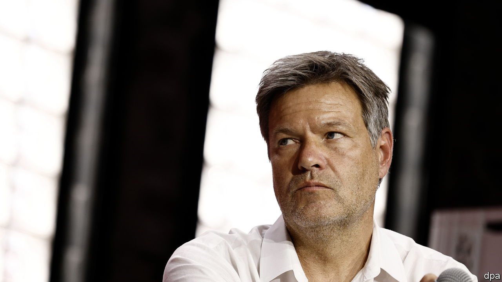

###### Green fades to brown

# Costly climate rules are turning Germans away from the Greens 

##### The enviros are now less popular than the far-right Alternative für Deutschland 

 

> Jun 8th 2023 

“Green is getting too Brown,” moaned the graffiti in Germany’s capital late last year. The scribblers were hard-line environmentalists. Their gripe was that the Greens, one of three parties in Germany’s ruling Ampel or “traffic light” coalition, were going soft. By agreeing to crank up coal power to replace lost imports of Russian gas, and to delay by six months the long-planned shutdown of Germany’s last three nuclear plants, the Greens had bent so far right they were shading into a colour that Germans link not just with grubbiness but with fascism.

Six months later much of the German public is also upset with the Greens, albeit for the opposite reason. Instead of the Greens doing too little for the environment, many now think they do too much. No one calls them fascists, but even their partners in government, the bigger Social Democrats (SPD) and smaller, liberal Free Democrats (FDP), seem to find them too bossy. Sniping between Robert Habeck (pictured), the carefully tousled Green deputy chancellor in charge of the economy and environment, and Christian Lindner, the Porsche-driving liberal finance minister, looks increasingly like an inter-elite culture war between advocates for climate responsibility and for personal freedom.

 


The grumpy German public does not seem to like either camp. Polls show diminishing enthusiasm for the Greens, with the percentage of Germans saying they would vote for them falling in the past year from the low 20s to the mid-teens. But they also show that the shift has benefited neither the centre-left SPD of chancellor Olaf Scholz nor the FDP, nor even the conservative Christian Democrats. Instead, since June support for the far-right Alternative für Deutschland (AfD) has doubled, to 19%. The immigrant-bashing, Russia-friendly and climate-change-denying fringe party, which marked its 10th anniversary in February, now shares second place in the polls with the SPD, which in May celebrated its 160th year. 

Polling by Forsa, a research group, shows that more than a third of the AfD’s new backers used to vote for one of the Ampel trio. The far-right party’s recent slogans suggest why. “Roll back mad climate laws!”, declares a party poster. “Stop the !” screams its website, describing a bill, intended by Mr Habeck to accelerate adoption of energy-saving (but high-cost) heat pumps to replace household boilers, as a “heating hammer”. 

The proposed home-heating law, which would ban new gas and oil boilers and subsidise installation of heat pumps, has become less a hammer than a lead weight for the government. Opinion polls suggest that barely a fifth of voters favour the ban. But the problem is not just resistance to a measure that householders fear would saddle them with fat bills and bureaucratic bother. A big majority of Germans also thought that the Greens’ insistence on closing nuclear plants in April was stupid at a time of high energy prices and vulnerable supplies. Most also dislike new EU rules that will end production of cars with combustion engines by 2035, though Germany has won some exceptions. And nearly everyone is fed up with radical climate activists who have held up traffic across Germany by gluing themselves to autobahns and junctions. 

Such protests seem more effective at tainting the Greens by association than at raising climate awareness. They have also, indirectly, helped the AfD: tellingly, two-thirds of its current supporters, according to a recent survey, say they would vote for the far-right group not because they share its views, but out of “disappointment with other parties”. This does not, however, mean the AfD is now considered a normal party like any other. In another poll, 57% of Germans said they cannot imagine ever voting for them. ■


