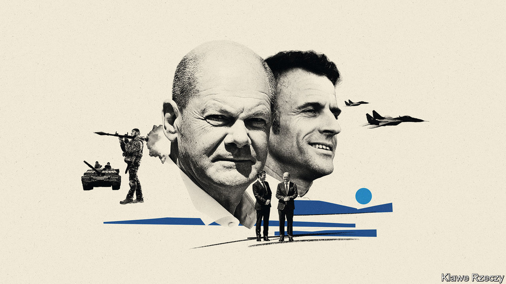

###### France and Germany

# Russia’s war on Ukraine is changing Europe 

##### It is prompting a big shift in France and Germany 

 

> Jun 7th 2023 


The contours of a new Europe are beginning to emerge, thanks to Russia’s brutal war on Ukraine. On the eastern and northern fringe, Finland and Sweden are . The European Union has granted Ukraine and Moldova “candidate status” for  of the 27-country club. Deep shifts are also taking place at Europe’s historic core. After a tricky spell, the leaders of France and Germany are trying to work out what all this means for their own countries, and their ability to overcome differences between them.

At least symbolically, a Franco-German reset is now under way. On June 6th Olaf Scholz hosted , France’s president, in Potsdam, where the German chancellor lives. The pair strolled around the pretty town together, and dined for nearly three hours. It is part of an effort to put behind them a period of mutual irritation. Things reached a low point last autumn, when France cancelled a joint cabinet meeting. That has now taken place. And the Germans have invited Mr Macron for a full state visit in July, the first one laid on for a French president in 23 years.

Each country is facing a challenge to its underlying tenets. For Germany, the war has upended the foundations of its , based on cheap Russian energy and exports to China. The country has weaned itself off Russian gas. For decades uneasy about the notion of muscular power, Germany has also become a generous military supplier to Ukraine. It is spending an extra €100bn ($107bn) on rearming. It may  for the (“historic turning-point”) to take effect; but Germany is changing.

For France, the shift is less visible, but no less profound. It is less about the country’s economic model, which is not as export-dependent as Germany’s. Nor, thanks to nuclear power, was it as reliant on Russian gas. Rather, France is rethinking European borders, alliances and security. Traditionally unenthusiastic about expanding the EU, France used to treat central and eastern European countries as juniors. In 2003 Jacques Chirac, then president, dismissed the support of aspiring EU member countries from eastern Europe for America’s invasion of Iraq (which France opposed), declaring that they had “missed an opportunity to shut up”. As recently as 2019 France vetoed opening EU membership talks with Albania and North Macedonia. 

Russia’s war has hastened a structural shift. One element is fresh French support for EU expansion. On a trip to Kyiv last June, Mr Macron backed Ukraine and Moldova for EU candidate status. France has lifted its veto on Albania’s and North Macedonia’s membership bids. On May 31st in a speech in Slovakia, Mr Macron declared, to much surprise, that EU enlargement should take place “as fast as possible”. “The question for us is not whether we should enlarge,” he said, “but how we should do it.” In a nod to Chirac, Mr Macron confessed to the largely central and eastern European audience there: “We have sometimes missed an opportunity to listen.”

Such statements have helped reassure those who feared Mr Macron’s idea of a wider European Political Community was also a ploy to stall EU expansion. Designed to bring together 44 EU and neighbouring countries twice-yearly, this confab  on June 1st in Moldova—just 20km (13 miles) from the Ukrainian border. With Ukraine’s president, Volodymyr Zelensky, present, the summit was a show of unity for his war-battered country as well as a boost for the host, Moldova. France now sees EU borders extending farther to the east. Russian territorial revisionism, recently wrote Alexandre Adam, a former Europe adviser to Mr Macron, has made enlargement a “geopolitical necessity…there is no longer a stable grey zone possible between the Union and Russia.” 

The second French shift concerns security. Mr Macron wants Europe to do more to defend itself and to rely less on America, especially ahead of elections there in 2024. Fellow Europeans still fear that such talk will undermine America’s commitment to European security. The continent’s new geopolitics, however, seem to be making France more hawkish. In Bratislava Mr Macron called for Ukraine to be given a “path to NATO membership” at the alliance’s summit in Vilnius in July. This is quite a turnaround for a leader who in 2019  that NATO was undergoing “brain death”, and who remains uneasy about its playing any role outside Europe.

There are now serious conversations taking place in France about how to give Ukraine robust and credible security guarantees. On June 19th defence ministers will meet in Paris to discuss European air defences and “deep-strike” capability. Mr Macron has even offered to hold a dialogue on the French nuclear deterrent.

As Germany and France each work out how to shape and adapt to a new Europe, their discussions will be fraught with difficulties. One taciturn and cautious, the other grandiose and risk-taking, the two leaders struggle to read each other. The pair are now aligned on enlargement, but there are tough discussions going on over new rules for the EU’s internal workings, a prelude to further enlargement. Differences over nuclear energy, defence procurement and fiscal rules remain. Germany, like America, remains cautious about Ukraine and NATO. It is exasperated by Mr Macron’s periodic outspokenness. France is frustrated by the confusion and slowness of Mr Scholz’s governing coalition. 

Russia’s war on Ukraine has taught Europeans that their continent’s organisation, in any guise, is far broader than the link between Paris and Berlin. These days Germany spends less time than it did fretting about France. France is keener than before to reach out to other countries within the EU. Still, little gets done in the bloc unless France and Germany can agree. As a rule, they differ on most issues, but share the will to overcome those differences. Their ability to do so will be crucial to defining the shape of this new Europe. ■

