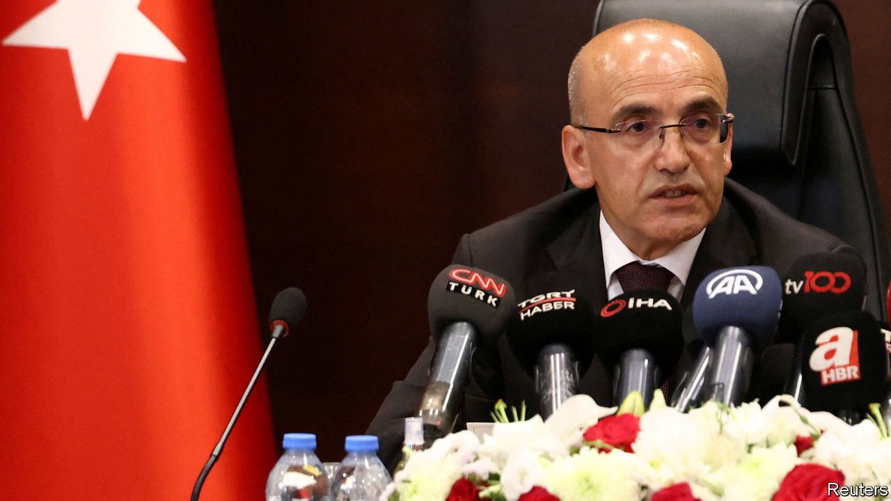
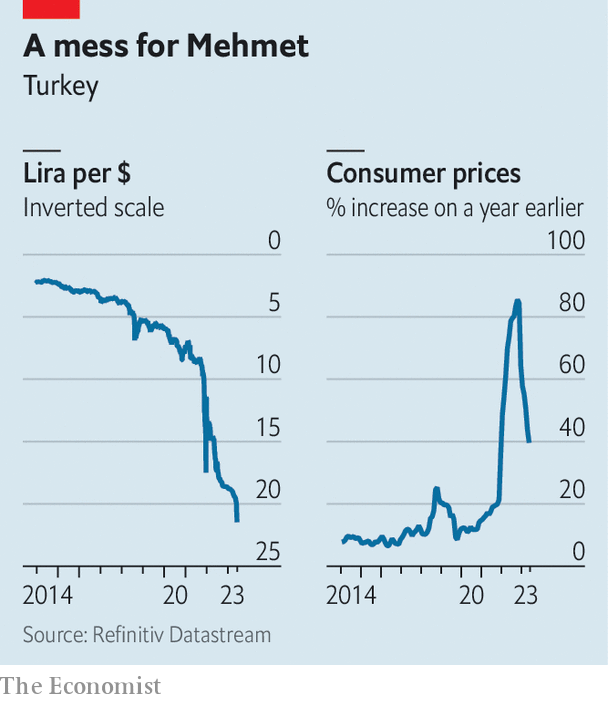

###### Exit Erdoganomics?

# Turkey’s President Erdogan shifts towards sane economics 

##### A new cabinet offers hope of a policy U-turn 

 

> Jun 4th 2023 


IN THE 16th century, as inflation gripped the Ottoman empire, Sultan Murad III appeased his troops, who complained of being paid in debased silver coins, by handing them his treasurer and a senior adviser. It was probably the sultan who had ordered the debasing, but the officials made convenient scapegoats. Both were put to the sword. 

The team that ran Turkey’s economy over the past few years has been spared a similarly gruesome fate. But they too have been sacrificed to appease investors and Turkish consumers facing the worst inflation in a generation. On June 9th, a day after the lira plunged by 7% against the dollar, Turkey’s newly re-elected president, Recep Tayyip Erdogan, replaced his central-bank governor, Sahap Kavcioglu, with Hafize Gaye Erkan, a former Goldman Sachs banker. Days earlier Mr Erdogan had appointed Mehmet Simsek (pictured), a voice of economic orthodoxy, as his new treasury and finance minister.

 


The blame for Turkey’s economic woes lies with Mr Erdogan, who holds to an  that making borrowing cheaper lowers consumer prices. Turkey’s benchmark interest rate has dropped by more than ten percentage points in under two years. This has sustained economic growth, which reached an annual rate of 4% in the first quarter of this year. But it caused the currency to plunge and inflation to skyrocket to 86% last year, before slowing to 40% in May.

“Turkey has no choice left but to return to a rational basis” for policymaking, Mr Simsek said on June 4th, a day after his appointment. Such words are music to the ears of foreign investors. Raising rates and rolling back capital controls would help tame inflation and restore some confidence in the management of the economy. But whether Mr Simsek’s appointment leads to a policy U-turn remains to be seen.

Turkey has been here before. In 2009 Mr Simsek became Mr Erdogan’s economy and finance minister and later his deputy prime minister, presiding over a period of record growth. But he eventually lost the president’s ear. In 2018 Mr Erdogan entrusted economic policy to his son-in-law, Berat Albayrak. Loyalists and snake-oil salesmen have replaced technocrats. Mr Erdogan has in effect turned the central bank into an arm of his government, and has repeatedly sworn to keep rates low.

The cabinet shake-up has gone some way towards calming markets. Spreads on Turkish five-year credit default swaps, a measure of the risk of a sovereign debt crisis, exceeded 700 basis points in May; they have now dropped below 500. But the lira’s slump has accelerated. The currency lost 10% against the dollar in the three days after Mr Simsek’s appointment and continued to sink after Mrs Erkan’s. Under Mr Kavcioglu, who now becomes head of the country’s banking authority, the central bank went to shocking lengths to prop up the lira in order to help Mr Erdogan win re-election. It kept the exchange rate under control only by selling tens of billions of dollars in foreign reserves since the start of the year. In late May net foreign reserves fell below zero for the first time in two decades. 

The central bank seems to have stopped intervening, or run out of money to do so. But such was the scale of its interventions that the lira remains overvalued. Analysts expect it to lose up to 20% more by the end of the year. This may cause another surge in inflation. It could also set off a bomb buried in the country’s budget. Under a scheme devised in late 2021, Turks have some $110bn in lira deposits insured against shocks in the exchange rate. In a fresh currency crisis Turkey’s treasury may have to compensate such depositors to the tune of billions of dollars. The budget is already strained by election handouts and by reconstruction in Turkey’s south, where earthquakes killed more than 50,000 people earlier this year. 

Things will become clearer by June 22nd, when the bank, now headed by its first ever female governor, will set new interest rates. A big increase then would show that Mr Erdogan has changed course. “The markets have given him the benefit of the doubt, but now it’s time for action,” says Cagri Kutman of KNG Securities. That could persuade foreign investors who have shunned Turkey for years to return. But local elections are due next March. Rational policy may give way to Mr Erdogan’s political need to generate growth. Erdoganomics seems to be in retreat, but it may be only a tactical and temporary one. ■

