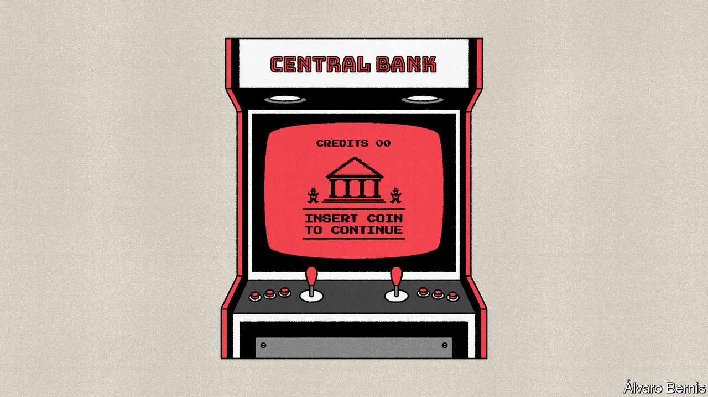

###### Free exchange

# A flawed argument for central-bank digital currencies 

##### Europe’s policymakers are wrong: the economy does not need a digital replacement for cash 

 

> Jun 8th 2023 

To their critics central-bank digital currencies (CBDCs) are a fad—a solution in search of a problem. To their supporters CBDCs are a necessary response to a digitising world. Central bankers everywhere are studying the idea. Recently several have signed up to an argument in their favour: that CBDCs will be needed to anchor the value of money in a cashless financial system. It is a notion that could prompt governments to rebuild their banking and payment systems. But does it withstand scrutiny?

The logic has recently been set out by the Bank of England, whose public consultation concerning CBDCs closes on June 30th. It goes as follows. People have the confidence to hold bank deposits (money issued by the private sector) in part because they know that they can at any time withdraw it as notes and coins (money that is issued directly by the state). But physical cash is declining in both use and usefulness. You cannot spend it on the internet; a growing number of shops insist on digital payment. Deprived of their convertibility into publicly issued money that is useful, bank deposits might lose their competitive advantage over emerging competitors that are similarly removed from public money, such as stablecoins or even foreign digital currencies.

In Britain, the Treasury and Bank of England therefore judge a retail CBDC to be probably necessary “to anchor the value and robustness of all monies circulating in the UK”, as Sir Jon Cunliffe, a deputy governor at the bank, has put it. A similar judgment has been reached in Frankfurt, where the European Central Bank must ensure “the money we issue maintains its role as a monetary anchor”, according to Fabio Panetta of the bank’s governing council.

Yet the argument that CBDCs will be needed to anchor the value of money is unconvincing. It is also failing to catch on in America, where the Federal Reserve is unenthused by the idea. “Physical currency can effectively disappear, and everything still works,” Chris Waller of the Fed has argued. David Andolfatto of the University of Miami agrees. The absence of physical money would be of “no consequence whatsoever”, he says. 

The evidence that physical cash underpins confidence in banks is flimsy. Depositors in most rich countries are able to take comfort from deposit insurance, which pays out up to a certain limit if banks fail; the knowledge that central banks will lend freely in emergencies; and the ability to transfer funds to other banks. A paper cited in the Bank of England’s consultation, by Hanna Armelius of Sweden’s central bank and two co-authors, notes that with such measures in place “neither cash nor a CBDC seems fundamental to the monetary [system]”, although the authors speculate that CBDCs could support “a sense of control” among depositors who distrust banks.

Would such depositors trust a CBDC, however? The Bank of England’s draft proposal is for a “platform” CBDC, in which the digital currency is held in digital wallets offered by the private sector. For most consumers such a CBDC would be “absolutely indistinguishable from ordinary retail deposits”, says George Selgin of the Cato Institute, an American think-tank. The unique feature of the CBDC wallet—that it would be fully backed by public money—is something many people already mistakenly think is true of bank deposits. Whether held in wallets or not, it seems optimistic to think that CBDCs would reinforce confidence in banks among particularly mistrustful customers, given the many conspiracy theories circulating about the plans.

The paranoid will continue to crave cold, hard cash. Fortunately notes and coins might continue to reassure them even as their use in transactions declines. “All the central bank needs to do is promise to provide the currency if requested,” according to Mr Waller. “Eliminating currency is a policy choice…not an economic outcome.” It is true that physical cash has less utility as it becomes more difficult to spend. But it maintains its status as “legal tender”, meaning, in most contexts, that creditors must accept it as a means of repaying debts. The rule protects the function of cash as a store of value even as it becomes less useful for payments. 

As for the threat from stablecoins, it is hard to see why creating CBDCs would be the simplest way to prevent monetary fragmentation. Stablecoins pegged to domestic currencies are a lot like bank deposits and could be regulated as such to ensure a 1:1 exchange rate between private and public monies. Central bankers talk of CBDCs acting as a “bridging asset” between different digital coins. Yet digital state-issued money that can be used to settle transactions involving multiple banks already exists in the form of the deposits, called reserves, that they hold at central banks. It would be more straightforward to expand this system than to build a retail CBDC, says Mr Andolfatto.

Common cents

Economists have long argued that the power of governments to choose the currency in which they levy taxes creates some demand for that currency, in whatever form the state prefers. “A prince who should enact that a certain proportion of his taxes should be paid in a paper money of a certain kind might thereby give a certain value to this paper money,” wrote Adam Smith in “The Wealth of Nations”. Unless the Treasury is about to start accepting crypto assets as tax payment, in other words, the Bank of England probably need not worry about losing its grip. The widespread use of a stablecoin backed by sterling-denominated assets would in any case leave the bank in control of interest rates, which would flow through the stablecoin’s balance-sheet much as they flow through those of banks at present.

Over the years plenty of people have argued that the monetary system could not function well without certain anchors, such as to gold or the dollar, only to be proved wrong. The idea that the system needs government-issued money to be in widespread use is likely to suffer the same fate. ■


