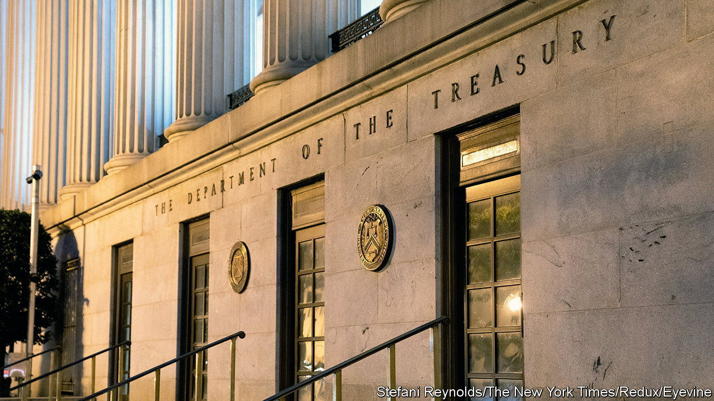
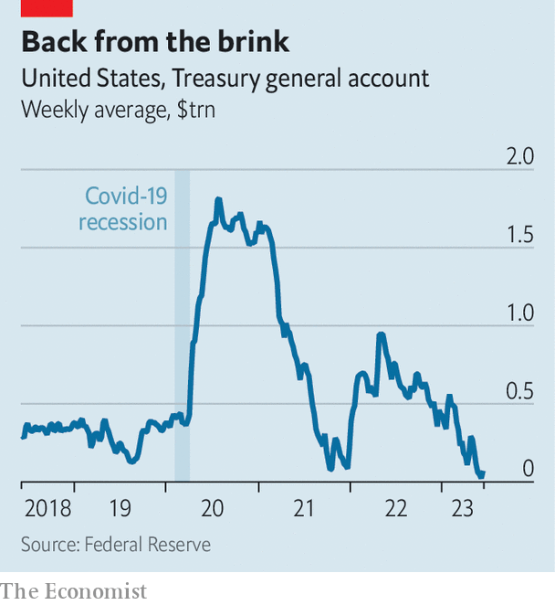

###### Nasty hangover

# After debt-ceiling negotiations, America faces a debt deluge 

##### Its coffers depleted, the Treasury will flood the market with bills 

 

> Jun 8th 2023 

Having flirted with madness, Congress decided to avert a sovereign default and allow the government to resume borrowing. But although the debt-ceiling negotiations are over, their aftershocks will ripple through financial markets for months to come. In order to stave off disaster, the Treasury spent much of the past six months running down its cash holdings, eventually reaching the point where it had almost nothing left. Now it must scramble to replenish its cash, creating a potential hazard for the economy.

The Treasury general account—the government’s main account at the Federal Reserve, used for official payments—fell to just $23bn at the start of June, far less than the amount of net spending on a typical day. Normally the Treasury tries to maintain a balance of at least $500bn, enough to cover about a week of cash outflows. Thus its task is to rebuild buffers by selling bills and bonds (it will mostly rely on bills, because it is easier to raise cash quickly via short-term debt sales). At the same time, it will have to sell even more paper to finance the government’s deficit. The result will be a surge in issuance. Mark Cabana of Bank of America forecasts that the Treasury will issue more than $1trn in bills over the next three months, roughly five times its total in an average summer.

 


The concern is where the money will come from and, in particular, if debt sales will drain liquidity from other asset markets. There are two main possible sources of cash, and each poses risks. The first is money-market funds, which are flush at the moment, with more than $5trn invested in them. In principle, these funds could hoover up the bulk of the new bills by simply paring the cash they place at the Federal Reserve via its reverse-repurchase (repo) facility. For that to happen, though, the Treasury may have to offer higher coupon rates than the 5.05% yield on reverse repos. Higher yields, in turn, could translate into higher funding costs for already strained regional banks—an unattractive prospect.

The second option is less attractive still. Firms, pension funds and other investors may wind up being the biggest buyers of bills, which would mean moving money out of deposits into Treasuries, reducing the level of bank reserves in the financial system. Banks are sitting on excess reserves of about $3trn; it would not take much for these to fall to $2.5trn, a level seen by many as indicating reserve scarcity (going by the rule of thumb that banks should maintain reserves at about 10% of gdp). Such a development would raise uncomfortable questions about banking stability and could force lenders to offer higher deposit rates to recover reserves.

A brief encounter with reserve scarcity would not necessarily spell disaster. The Fed could provide liquidity support if required. And to the extent that money-market funds buy up more bills, pressure on bank reserves would be reduced. Either way, however, the flood of Treasury issuance will almost certainly add to market anxiety and volatility, increasing the risk that something, somewhere breaks. It is one more thing to dislike about America’s perennial debt-ceiling convulsions. ■


