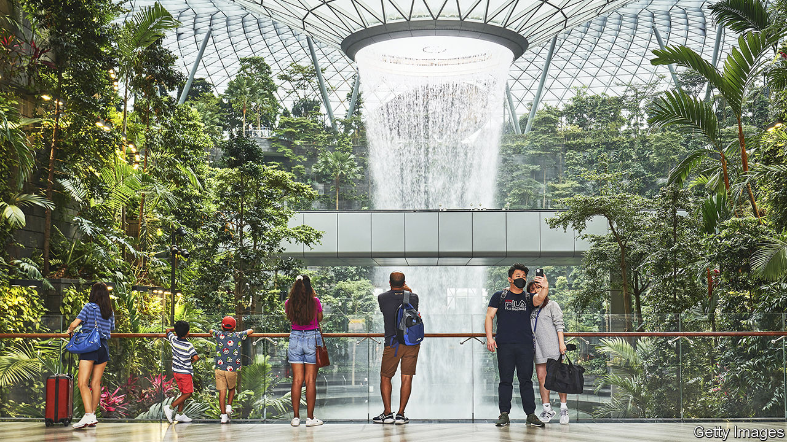

###### Forged in fire

# Amoral cities are flourishing in a turbulent geopolitical era 

##### Our index ranks economic performance over the past three years 

 

> Jun 8th 2023 

Singapore’s immaculate Changi airport is the perfect place to witness a shift in the balance of power between global cities. Since the city-state’s final covid-19 border restrictions were lifted last year, it has welcomed crowds of bankers, consultants and lawyers, fresh off a four-hour flight from Hong Kong or Shanghai, and often arriving without a return ticket. Singapore’s neutrality is pivotal in a region where the rupture between America and China feels especially immediate.

In most cities the twin blows of covid and geopolitical tension have proved more of a problem. In order to assess which are thriving in this new era,  has compiled a rough-and-ready index. It scrutinises a sample of ten locations, looking at changes in four measures—population, economic growth, office vacancies and house prices—over the past three years. We rank each city by how it has performed on the measures to create an overall score.

Miami claims top spot thanks to strong economic growth and an extremely perky property market: real house prices leapt by 39.5% from 2019 to 2022. Singapore is next, benefiting from gdp growth of 6.9%, and only a small rise in office vacancies. Dubai, meanwhile, has seen its population jump by 5.8%. It is also the only city in the index where office vacancies have dropped. At the other end of the table is San Francisco, where the population has fallen by 8.3%.


What explains this contrasting performance? Covid plays a part. Cities in bits of the world that did not go overboard with restrictions, such as Dubai and Miami, benefited—sometimes at the expense of those that did, like San Francisco. International overnight visits to Singapore may have been three-quarters lower at the end of 2022 than before covid, according to Oxford Economics, a consultancy, but life was pretty good when compared with its rivals, Hong Kong and Shanghai, where tough restrictions on movement lasted longer. Indeed, thanks to falling rents, Hong Kong has lost its top spot in a ranking by hsbc, a bank, of the world’s most expensive cities.

Singapore has also sucked up firms and workers fleeing Xi Jinping’s authoritarianism. Much like Dubai in the Middle East, it serves as a place where anyone can do business with anyone. Dubai and Singapore share other advantages as well. Both offer year-round warm weather (important when people can work remotely) and lenient regulation (helpful for those annoyed with Western red tape). Singapore has thrown tax breaks at family offices, helping lift their number to 1,500 in 2022, from 50 in 2018. Dubai has introduced social reforms, decriminalising alcohol and the cohabitation of unmarried couples. 

Local leaders can make a difference. Miami has worked hard to attract financial business, with firms such as Blackstone and Citadel setting up shop recently. By contrast, San Francisco has lots going against it: a victim of the tech bust, it is expensive and sometimes dangerous, with high taxes and increasingly bad public services. Businesses are walking away, especially those based downtown, with Anthropologie, Office Depot and Whole Foods all closing stores in recent weeks. Johannesburg, which aspires to be the commercial capital of South Africa, if not the whole continent, suffers from deteriorating power and water infrastructure, as well as increasingly unstable politics: the city has had six mayors in the past two years. Locals with means are rushing to “semigrate” to better-run Cape Town.

One problem faced by all cities in the index, bar Dubai, is what to do with surplus office space. Vacancies represent a multibillion-dollar fiasco for owners of commercial property, and leave city budgets exposed. In February San Francisco proposed annual tax breaks of up to $1m for new office-based companies. Meanwhile, cities including New York, Paris and Singapore hope to convert offices to much-needed housing. The success of such schemes will determine the cities’ economic health, and their position in next year’s rankings. ■


