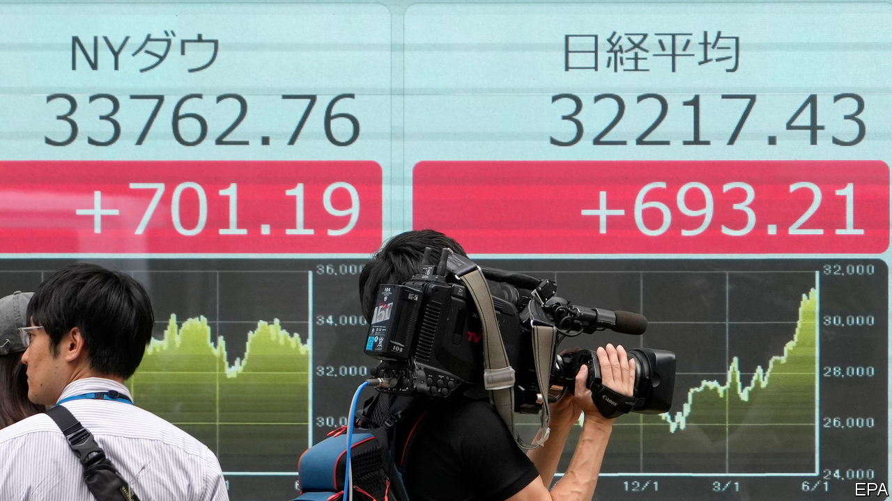
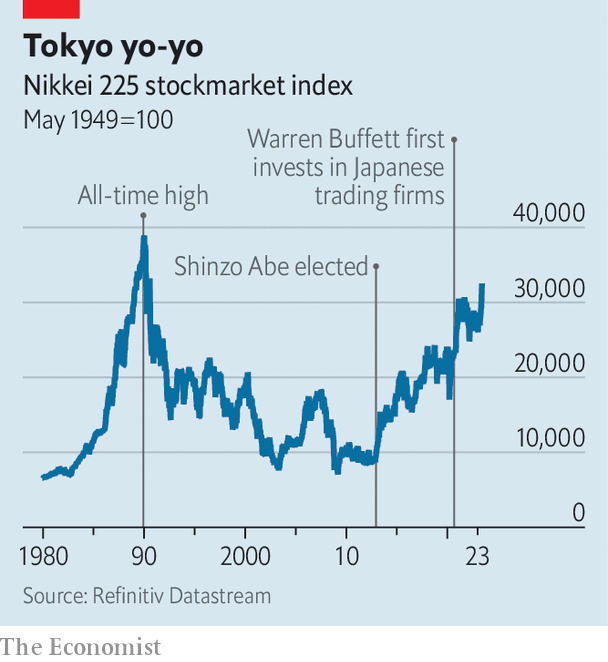

###### Growth problems

# Japan’s stockmarket rally may disappoint investors 

##### Governance has improved; growth is still missing 

 

> Jun 8th 2023 

The last time Japan’s Nikkei 225 stock index was as high as it is today, the Soviet Union was collapsing, the internet was in its infancy and Emperor Akihito had just ascended to the Chrysanthemum throne. Japanese stocks are now only a fifth short of their all-time high, which was set in December 1989—at the absolute zenith of Japan’s bubble-era exuberance (see chart).

 


A wave of interest in the country’s stocks, which have risen by 24% so far this year, may yet propel the market further. The cheap yen has padded the bottom line of firms that make money abroad. Optimism about corporate-governance reforms, and interest from Warren Buffett, an American investor, have provided a boost. A dearth of compelling options in other parts of the world also helps. So far this year, foreign investors have bought ¥3.8trn ($27bn) more in Japanese stocks than they have sold, the most since 2013. 

Beneficiaries include Japan’s cheaply priced value stocks, such as the five  (general trading companies) that Mr Buffett has bought stakes in. The share prices of these firms have comfortably beaten the market this year, rising by between 28% and 45%. Shareholder activism at cheaply valued firms, once anathema in stuffy Japanese boardrooms, hit a new record this year, as measured by shareholder proposals at annual general meetings.

But experienced investors know that the land of the rising sun has had more than its fair share of false dawns. The Nikkei 225 rose by over 40% between the end of 1999 and a peak in March 2000, after which the dotcom bubble burst. It rose by over 50% between the end of 2004 and mid-2007, before the global financial crisis. It more than doubled in the couple of years after Shinzo Abe was elected prime minister in 2012, promising to lift growth. 

The Abe rally was not just larger in size than the present one; it also saw more foreign participation. In 2013 overseas buyers snapped up ¥16trn of Japanese stocks, four times the amount they have purchased this year. Even though the quality of Japanese governance has improved markedly in the past decade, foreign investors have sold practically all the shares they accumulated during that burst of optimism. This is because the growth Abe promised has mostly failed to materialise. Revenues per share on the msci Japan index are, in dollar terms, still below the levels they reached before the global financial crisis, and are marginally worse than on the humdrum stockmarkets of Britain and the euro zone. 

Some analysts foresee better economic conditions. Udith Sikand of Gavekal Research, a consultancy, argues that the return of inflation to Japan—prices excluding fresh food and fuel rose by 4.1% in the year to April—heralds the beginning of a virtuous cycle, which will lift wages and consumer spending. However if such a cycle is coming, the evidence so far is thin. Wages have risen by just 1% in nominal terms over the past year, meaning workers are enduring real-terms pay cuts. 

The improved profitability and returns that result from shareholder-friendly governance have helped lift the Japanese stockmarket. Improved valuations would lift it higher still. Yet solid economic growth is practically a precondition for sustaining a prolonged rally—meaning another generation of investors in Japan may soon have their fingers burned. ■


