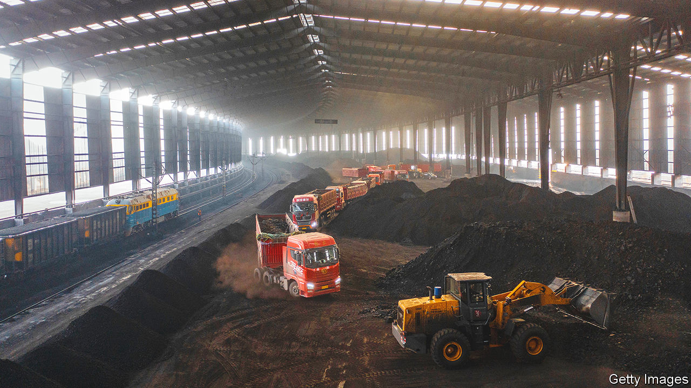
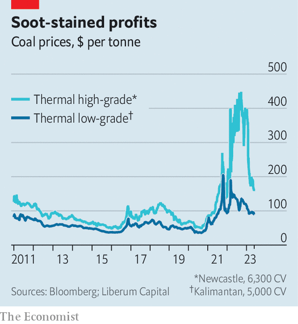
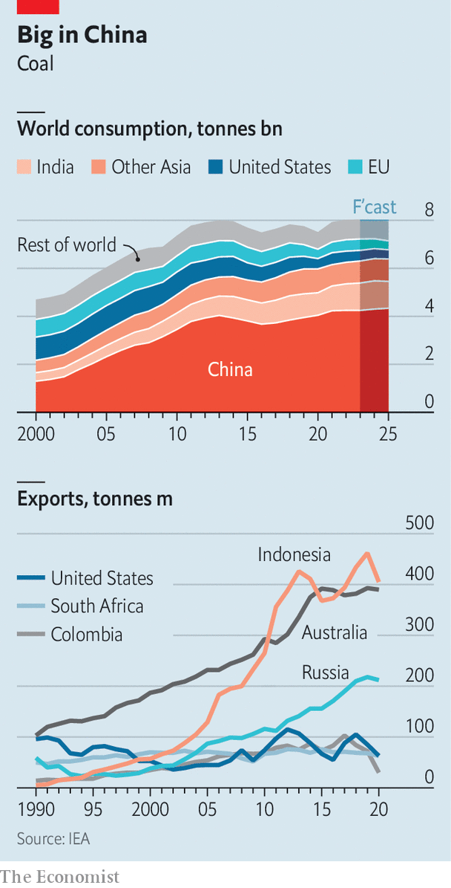
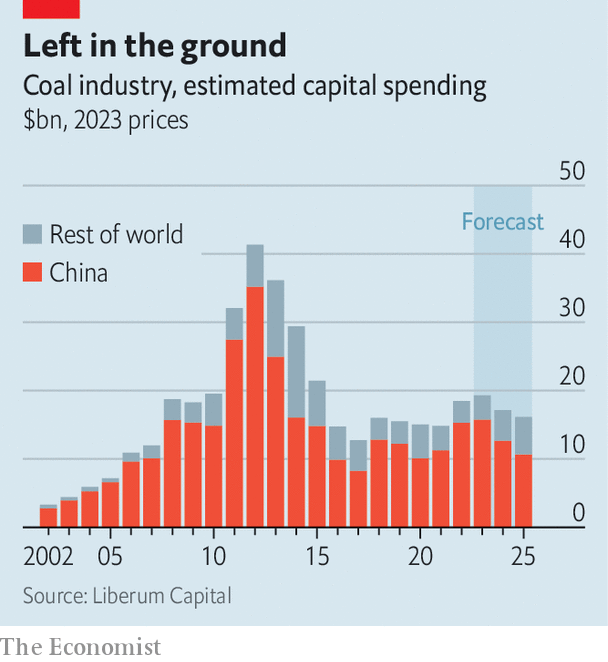

###### Ember alert

# Who is keeping coal alive? 

##### The financiers saving the world’s dirtiest fuel from extinction 

 

> Jun 4th 2023 

Mountains of coal are piled beneath azure skies at the port of Newcastle, Australia. Giant shovels chip away at them, scooping the fuel onto conveyor belts, which whizz it to cargo ships that can be as long as three football pitches. The harbour’s terminals handle 200m tonnes of the stuff a year, making Newcastle the world’s biggest coal port. Throughput is roaring back after floods hurt supply last year. Aaron Johansen, who oversees ncig, the newest, uber-automated terminal, expects it to stay near all-time highs for at least seven years. Rich Asian countries, such as Japan and South Korea, are hungry for the premium coal that passes through the terminal. So, increasingly, are developing ones like Malaysia and Vietnam.

Halfway across the world the mood music is rather different. In recent weeks activists have made use of quotes from great writers, including Shakespeare (“Don’t shuffle off this mortal coil”) and the Spice Girls (“Stop right now”), to disrupt annual general meetings of European banks and energy firms, as part of a call for an end to coal extraction. A broader chorus worries that the fuel is the biggest source of greenhouse gases, making up more than 40% of energy-related carbon emissions in 2022. The un says output must fall by 11% a year to keep warming less than 1.5°C above pre-industrial levels. The International Energy Agency (iea), an official forecaster, argues against opening new mines and expanding existing ones. Climate wonks think that 80% of reserves must remain unburnt. 

This is mainly meant to happen by starving the supply chain of funding. More than 200 of the world’s largest financiers, including 87 banks, have announced policies restricting investments in coal-mining or coal-fired power plants. Lenders representing 41% of global banking assets have signed up to the Net-Zero Banking Alliance, pledging to align portfolios with net-zero emissions by 2050. At the cop26 summit in 2021, the un predicted that this campaign would “”. As recently as 2020 the iea believed consumption had peaked a decade ago.

Yet King Coal looks brawnier than ever. In 2022 demand for it surpassed 8bn tonnes for the first time. This article will look at who is greasing the wheels of the once doomed trade. We find that the market is lively, well-funded and profitable. More striking still, the motley crew bankrolling it will probably allow trade to endure well into the 2030s, lining survivors’ pockets to the detriment of the planet.

 


It is tempting to see 2022 as exceptional. Russia cut piped gas to Europe, and Europe  from Russia. The bloc turned to liquefied natural gas (lng) destined for Asia and thermal coal from Colombia, South Africa and distant Australia. Meanwhile, Asian countries reliant on Russia’s premium coal also diversified. Prices for top grades jumped. Europe’s poorer neighbours, priced out of the gas market, gorged on lower-grade stuff. 

Now the storm has abated. After a mild winter European utility firms retain good stocks of gas and coal. But as the need to power cooling units rises in the summer, coal imports will accelerate. China’s economy has emerged from zero-covid; India’s is going gangbusters. Traders expect global use to grow by another 3-4% this year. 

Coal is likely to remain sought-after beyond 2023. True, demand in Europe will fall as renewables ramp up. It is already low in America, where fracked gas is cheaper. Yet last year’s crunch has reminded Asia’s import-dependent countries that, when energy is scarce, . It is cheaper and more abundant than other fuels, and once loaded on rudimentary ships can be sent anywhere—unlike lng, which requires vessels and regasification terminals that take years to build. China is planning 270 gigawatts of new coal-fired plants by 2025, more than any country has installed today. India and much of South-East Asia are following a similar path. 

Even with a speedy Western exit from coal, Boston Consulting Group thinks thermal coal demand will fall by just 10-18% between now and 2030. Much of the demand will be met by domestic production in China and India, the world’s biggest consumers. But imports will still be crucial. Investment banks do not expect traded volumes to drop below 900m tonnes, from 1bn last year, for much of the decade. One, Liberum Capital, thinks imports will rise over the next five years. 

Back in black

Will the global coal market continue to meet stubborn demand? Our research suggests it will. That is because there will remain cash for three vital links in the supply chain: trading and shipping; more digging at existing mines; and new projects. 

 


Financing trade is the easy part. Modelling for  by Oliver Wyman, a consultancy, suggests high prices, together with the longer journeys made by rerouted exports, buoyed the working-capital needs of coal traders in 2022 to $20bn, four times the historical average. Assuming average coal prices remain above $100 a tonne, as many analysts do, those needs will sit above $7bn until at least 2030. 

Commodity merchants retain access to generous sources of liquidity to finance coal purchases. One is corporate borrowing, via multi-year bank loans or bonds, which gives firms a lump sum they can use however they want. Traders can also draw on short-term, revolving credit facilities, provided by clubs of banks. Many such lines have been expanded since the start of 2022—their limits often reach several billion dollars—to help traders cope with volatile prices. Banks that impose restrictions, specifying the money should not be used to buy coal, face a high risk that traders decamp to lenient rivals. So few do. 

Finance chiefs at trading firms say banks in countries where trading is bread-and-butter, including Singapore’s dbs and Switzerland’s ubs, still finance coal purchases. Swiss cantonal lenders are happy to help. Banks in consuming countries, like China or Japan, also oblige, as does Britain’s Standard Chartered, which focuses on Asian business. (dbs and Standard Chartered both point out they are reducing their exposure to thermal coal.) Only European lenders—particularly French ones—have exited. They are being replaced by banks from producing countries, such as Australia, Indonesia and South Africa.

Smaller, “pure-play” coal traders have faced a bigger squeeze. Banks, which never made much money from them anyway, can hardly claim to be unaware of how lent funds are put to use. Last year some traders were forced to borrow from private vehicles, often backed by wealthy individuals, at annual rates nearing 25%—about five times standard costs. Yet after months of booming business many no longer need external financing. A banker says some of his coal-trading clients have seen profits grow ten-fold in 2022. One in London witnessed his total equity leap from £50m ($62m) in 2021 to £700m in 2023. 

To then ship the stuff to buyers, traders often need a guarantee, provided by a reputable bank, that they will be paid on time. Ever fewer lenders are keen to provide such “letters of credit”, but there are ways around this, too. Some traders charge their clients more to cover counterparty risk. It helps that exposure is limited. At today’s prices, a cargo of coal may be worth just $4m-5m. By contrast, an oil tanker may carry $200m-worth of crude. Others insert trusted intermediaries in the trade, or ask for bigger guarantees on other wares being bought by the client. Some governments in recipient countries provide the guarantee themselves, or even pay upfront. 

Outside South Africa, where , there is plenty of infrastructure on land to move coal about. Soon there will be even more. Global Energy Monitor, a charity, reckons that India plans to more than double its coal terminals to 1,400 (today the planet counts 6,300). Seaborne logistics are more restricted: pressured by green shareholders, some shippers have started to shun coal. But smaller ones, often Chinese or Greek, have stepped in. Traders report no difficulties in insuring the cargo. Even sanctions-hit Russia is exporting most of its coal, using the same mix of obscure traders and seafarers, based in Hong Kong or the Gulf, that it employs to ship its oil to Asia. 

Financing more digging at existing mines—the second link in the supply chain—is no problem either. Last year coal production hit a record 8bn tonnes. It is not quite business as usual. Since 2018 many mining “majors” (large, diversified groups listed on public markets) have sold some or all of their coal assets. Yet rather than being decommissioned, disposed assets have been picked up by private miners, emerging-market rivals and private-equity firms. New owners have no qualms about making full use of mines. In 2021 Anglo American, a London-based major, spun off its South African mines into a new firm that instantly pledged to crank up output. 

Like traders, the miners have been printing money. Australia’s three biggest pure-play coal producers went from posting net debt of $1bn in 2021 to $6bn in net cash last year. They have repaid most of their long-term borrowing, so have no big deadlines to meet soon. “The conversation has gone from ‘How do I refinance my debt?’ to ‘What do I do with my extra cash?’,” says a finance chief at one of them. 

Coal miners can still borrow money when needed. Data compiled by Urgewald, a charity, shows they secured an aggregate $62bn in bank loans between 2019 and 2021. According to the outfit’s research, Japanese firms (smbc, Sumitomo, Mitsubishi) were the biggest lenders, followed by Bank of China and America’s jpMorgan Chase and Citigroup. European banks also featured in the top 15. During this period coal miners, mainly Chinese, also managed to sell $150bn worth of bonds and shares, often underwritten by Chinese banks. The liquidity is not drying out. Urgewald calculates that in 2022 60 large banks helped channel $13bn towards the world’s 30 largest coal producers.

This is possible because the coal-exclusion policies of financial firms are wildly inconsistent. Many do not kick in until 2025. Some cover only new clients. Others prohibit financing for projects, but not general corporate loans that miners may use to dig for coal. Policies that do restrict such lending often do so only for miners that derive lots of their revenue from coal, typically 25% or 50%. Many big firms, including Glencore, a Swiss commodities giant which produces 110m tonnes a year, fall below such thresholds. 

Some policies are vaguely worded to allow for exemptions. Although Goldman Sachs, a bank, promises to stop financing thermal-coal mining companies that do not have a diversification strategy “within a reasonable timeframe”, it has reportedly continued to lend to Peabody, a huge Australian miner that derived 78% of its revenue from coal sales in 2022 (it may have helped that the firm recently launched a modest solar subsidiary). Out of 426 large banks, investors and insurers assessed by Reclaim Finance, another charity, only 26 were deemed to have a coal-exit policy consistent with a 2050 net-zero scenario. Even fewer have said they will exit completely. Most of China’s and India’s state-owned banks have said nothing at all. 

In short, few banks are ready to hurt their top line or their country’s supply. Analysts reckon that will help existing mines meet demand until the early 2030s. At this point, there may finally be a crunch. Western banks, many of which periodically revise their policies, will gradually tighten the screws. The paucity of new projects today—the third link in the chain—means there may not be enough fresh supply when old mines stop producing. 

 


Although finance for new projects is getting harder to attain, it is still available. As Western banks retreat, other players are coming to the fore. Capital expenditure by Western miners has been feeble for years. Having spent big in the 2000s, many suffered when prices crashed in the mid-2010s. Even though they are making hefty profits again, the majors prefer to buy rivals, reopen old mines or return capital to shareholders rather than launch new ventures. The investment drought is most severe in coal. Building a pit from scratch can take more than a decade. Years are spent obtaining permits, which in the West are increasingly refused. 

Financing new projects in rich countries is a big hurdle. Last year Adani Group, an Indian firm that runs Carmichael, a vast coal mine being built in Queensland, had to refinance out of its own pocket $500m in bonds it had issued for the project. Some opportunistic pots of money will continue to target juicy profits, especially if prices rise. The first deep coal pit to be dug in Britain in decades is ultimately owned by emr Capital, a private-equity firm incorporated in the Cayman Islands. Peter Ryan of Goba Capital, an investment firm in Miami, expects his company’s coal assets to grow eight-fold by 2030. 

Asian century

The picture in Asia is different. Banks remain on the scene. Investors are starting to back new mines at home. Family offices, set up to invest the fortunes of the rich, are interested. Any business dynasty in Indonesia, where mining is the backbone of the economy, has to have some coal in its holdings, says a trader who sources his wares there. In India obscure property firms are bidding for land that may be mined for coal. Eventually companies from the same countries may come to dig mines overseas, with banks following them. Chinese forays in the West will remain rare; Indian and Indonesian firms, which already own an archipelago of coal assets in Australia, are bound to increase their footprint.

The coal market of the 2030s will thus look very different. “From ownership and operation to funding and consumption, coal will be a developing-market commodity,” says a mining-major boss. Supply constraints will keep prices high, but the cast of exporters cashing in will shrink. Colombia and South Africa, which serve Europe, will no longer have a market. Russia will find it harder to flog cargoes to China. All three will export less coal for less money. Australia will appease critics by focusing on the most efficient coal; it may export less, but charge more. Indonesia could become the swing exporter, like Saudi Arabia is for oil today. It will sell more of its basic coal—often for more money. 

Although coal is on a downward slope, its goodbye will be uncomfortably long. By the 2040s demand may crater for good as renewables ramp up. Yet even then some countries may keep their options open. More energy shocks will come. “And when there is one, the commodity no one wants is the one we need to use again,” says a big trader who serves Asia. “That feature of coal could stay for ever.” ■


