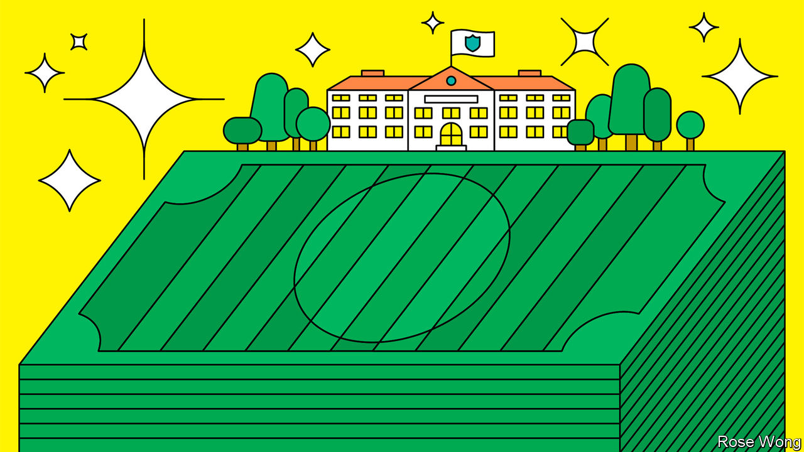
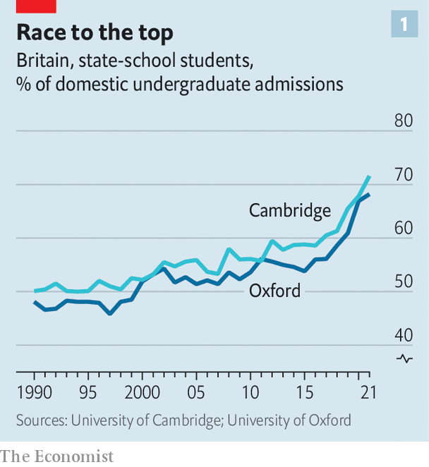
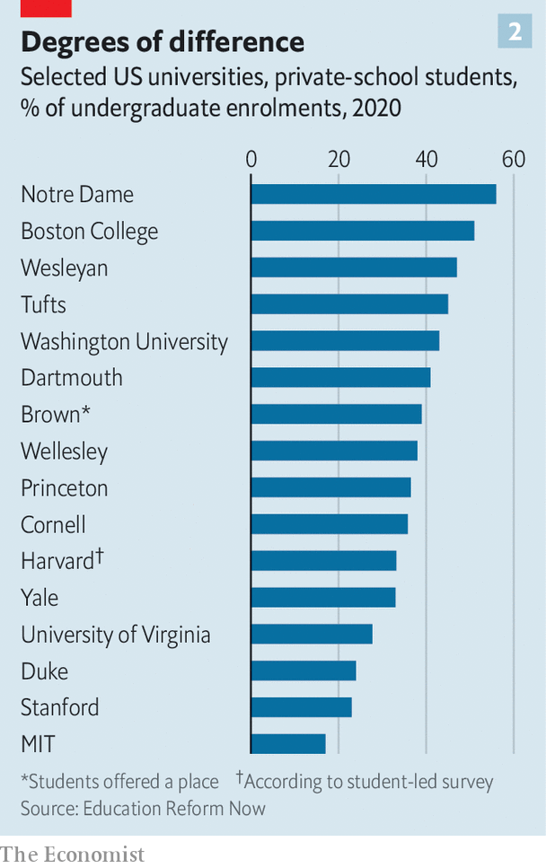

###### Studying for success

# Should you send your children to private school? 

##### As shortcuts to elite universities, American schools work better than British ones 

 

> Jun 8th 2023 

ETON COLLEGE can boast of educating more than a third of Britain’s 57 prime ministers over its 583 years. Less impressive is the fact that the number of its pupils winning places at the universities of Oxford or Cambridge fell by more than half between 2014 and the 2021-2022 school year. Some parents pick private schools in the hope that their kids will benefit from more attention or less bullying. Others bet that these institutions will lead to a better education, higher grades and a place at a venerable university. But soaring costs and changing university admissions policies are prompting discussion of whether the crests and crenellations are worth it. 

In many rich countries, traditional private schooling is in decline. Across 30-odd members of the OECD, a club of mostly wealthy countries, the share of children in schools that get less than half their funding from government fell from about 8% in 2000 to some 5% in 2018. Private schools in Britain and America have fared better, and the debate over them remains particularly politically charged in both countries. 

Recent evidence suggests that for most privately schooled children in Britain and those who attend elite private institutions in America, the advantages of an expensive education remain robust. The benefits are probably bigger in America than they are in Britain, at least for pupils sitting in the swankiest private classrooms. That is because their alumni continue to enjoy access to the best universities at rates which would cause a furore in the old country. That might surprise anyone who assumes that American society is less ridden by class than British society. 

Private schools in Britain serve around 6.5% of kids, about the same share as they did in the 1960s. (Hockey sticks and rice pudding appeal across the ages.) America’s ones teach about 9% of children, a share that had held steady for a decade by the time of the covid-19 pandemic. In America about 75% of private-schoolers go to institutions with religious affiliations (a big chunk of which operate on fees that are similar to, or less than, per-pupil funding in government schools). But that country also has an exclusive subset of schools, often called “independent” schools, which most closely mimic fee-paying ones in Britain. These educate less than 2% of American youngsters.

Costs in Britain are among the highest in the world. A family there can expect to cough up more than £16,000 ($20,000) a year to put one child through a private day school. That is three times what they were paying in the 1980s; it is around half the median household income in Britain, whereas it was once one-fifth. Fees in America are lower on average, but also rocketed by 60% in the first decade of this century, according to the most recent good government data. The most snooty schools bill parents on average $28,000 each year for a day pupil.

Measuring what benefits flow from these outlays matters both to critics of private schooling—who accuse posh schools of perpetuating elites—and to those who pay for it. At first glance, the pay-offs are clear: all around the rich world privately educated pupils do better in exams, go to better universities and end up with better-paid jobs. But some of that success derives from advantages outside the classroom, such as having wealthy, encouraging or intelligent parents. Understanding the boost from private education involves comparing pupils’ fortunes with those of otherwise similar peers in government schools. Good research of this sort is easiest to find in Britain. 

Getting the abacus out

By the time they turn 25 Britons with private education earn 17% more than other workers from similar homes, according to a study from 2015. The pay premium widens by the age of 42, according to earlier research, to around 21% for women and 35% for men. In part this is because privately schooled people are more likely to enter high-earning professions, such as finance. Alumni networks may help in this, but peer pressure and parental expectations probably play a big role, too. 

A larger reason for higher incomes is because private-schoolers get more and better academic qualifications than they otherwise would. They enjoy a “modest” boost in test scores when compared with children from similar homes who enroll in government classrooms, reckons Francis Green at University College London. This advantage accumulates with every additional year they spend in private schooling. One study finds that the edge they enjoy by the time they are 18 is roughly the equivalent of moving from grades of AAB to AAA (school-leavers on England’s academic track commonly take nationally standardised exams in three subjects).

The critical point is that even a modest boost in results can have a big effect on the size of additional earnings. That is because better grades might secure a pupil a slot at a more prestigious university than they would have gone to otherwise, or a slot at a university at all. In 2021 more than half of privately educated pupils who started a degree in Britain attended one of the 24 “Russell Group” universities (a club that includes most of the best ones). Such pupils are more likely to spend their last years at school studying the tough, traditional subjects that very selective universities most want to see on applications. They are also more likely to get extra help so as to ace interviews and admissions tests.

Private-schoolers no longer nab quite such unfair shares of top university places as they once did. They comprise around 18% of all pupils aged 16-19 in England, as well as about 25% of all those with top grades in school-leavers’ exams. Last year they were 20% of new undergraduates at Russell Group universities.

 


In 2016 about 6% of all private-schoolers who began a degree in Britain won places at the universities of Oxford or Cambridge; that share has since fallen to about 4% (it is around 2% for those from government schools). Last year private-schoolers made up 32% and 27% of the pair’s new British undergraduates, down from 43% and 39% a decade before. This shift has rocked the handful of elite private schools which once sent hordes of pupils to the two universities.

Picking apart the benefits of private education in America is difficult, because its schools are a more motley bunch than Britain’s. Since religion is banned from government schools, many pious parents pick private classes for reasons other than academic performance alone. Overall, evidence to suggest that America’s private-schoolers learn more than they would if they went to government schools is less secure than it is in Britain. 

A study published in 2018 by two academics at the University of Virginia, Robert Pianta and Arya Ansari, analysed the test scores of 1,000 children who were born in the 1990s. It found that by age 15 the ones who attended American private schools were getting no better grades, after adjusting for their backgrounds. There is not much good research, however, singling out the extra benefits rich children gain from attending America’s subset of “independent” schools. But it is reasonable to think that they boost a child’s prospects by at least as much as their British cousins.

 


America’s universities welcome those from grand schools with open arms. In 2021 James Murphy of Education Reform Now, a think-tank in Washington, DC, collected data from 35 of America’s highest-ranked universities and liberal-arts colleges. He found that on average about 34% of their new undergraduates were educated in private high schools (see chart). That is astonishing given that the private sector educates just 8.5% of American high-schoolers. Pupils from “independent” schools do brilliantly. The most recently published data suggest they made up about one-third of new undergraduates at Dartmouth and more than a quarter at Princeton. “Legacy” preference, whereby the relatives of alumni get a leg-up in admissions, may explain some of this. Nothing so brazenly unfair happens at British universities.

Green lawns and greenbacks

Money helps, too. Whereas English universities charge every domestic student the same tuition fees (though those from abroad pay more), America’s best universities vary the cost according to means. This allows exceptional pupils from poor backgrounds to study for little or nothing. But it also gives universities good reason to keep in with dependable “feeder” schools, full of clever pupils with ample wealth.

It follows that Britain’s private schools are pointing more of their leavers overseas. Last year about 6% of those who went to university chose to study abroad, up from 4% in 2016. America is the most popular destination. Its universities demand top grades, says Barnaby Lenon of the Independent School Council, which represents British private schools. But he adds that they also value non-academic achievements, such as those obtained through extra-curricular activities of a kind that private schools try hard to provide.

The edge enjoyed by private-schoolers is much less discussed in America than it is in Britain, in part because questions of race, rather than class, tend to take centre stage in debates about university admissions. Political battles that have broken out over the teaching of race, sex and history are benefiting private providers, in part because states are choosing to put money into private “school-choice” programmes. These involve local governments paying for some private-school places (commonly only for poor children and usually in the cheapest kinds of private institutions).

America may be on the verge of change, however. Imminent rulings from its Supreme Court could ban the use of affirmative action in university admissions. And if colleges and universities can no longer boost applicants from underrepresented minority groups, the advantages enjoyed by posh pupils may receive greater scrutiny. Private schools in Britain face a bumpy ride, too. The Labour Party, which looks likely to win power at elections due in the next 18 months, talks of abolishing private schools’ charitable status and stripping them of tax breaks. That could cause tuition fees to jump. Meanwhile, the paths to Oxford and Cambridge will keep narrowing. Expect a growing gang of Brits to head across the Atlantic. ■

