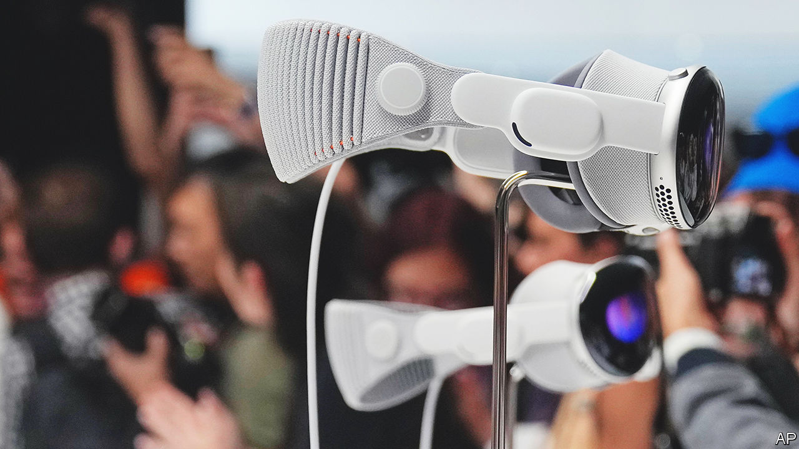

###### Mind-goggling

# Apple’s Vision Pro is an incredible machine. Now to find out what it is for 

##### The meaning of “spatial computing” 

 

> Jun 6th 2023 

No one shows off a new gadget quite like Apple.  on June 5th was billed as something more significant. The Vision Pro, a pair of sleek glass goggles, represents “an entirely new spatial-computing platform”, said Apple’s boss, comparing its launch to that of the Macintosh and the iPhone. Apple’s message is clear: after desktop and mobile computing, the  will be spatial computing—also known as augmented reality—in which computer graphics are overlaid on the world around the user.

The presentation was both jaw-droppingly impressive and oddly underwhelming. The Vision is stuffed with innovations that eclipse every other headset on the market. Clunky joysticks are out, hand gestures and eyeball tracking are in. Instead of legless avatars, users get photorealistic likenesses, whose eyes also appear on the outside of the glasses to make wearing them less antisocial. The product is dusted with Apple’s user-friendly design magic.

Yet the company had strangely uninspiring suggestions for what to do with its miraculous device. Look at your photos—but bigger! Use Microsoft Teams—but on a virtual screen! Make FaceTime video calls—but with your friend’s window in space, not the palm of your hand! Apple’s vision mainly seemed to involve taking 2D apps and projecting them onto virtual screens (while charging $3,499 for the privilege). Is that it?

Patience. Mr Cook is right that spatial computing is a new platform, but it will take time to exploit. Consider the iPhone’s launch, 16 years ago. Like the Vision, its technology sparkled, but its dull initial uses were inherited from earlier platforms: make calls, write emails, browse the web, listen to music. It was years before developers found mobile computing’s killer use-cases: group chats, ride-hailing, short video, casual gaming, mobile payments and all the other things that today persuade people to spend $1,000 or more on an iPhone (whose $499 launch price in 2007 was considered shocking).

Other platforms have taken just as long to reach their potential. Television producers began by filming people appearing on stage. Internet pioneers started off by sharing files, before spinning the web and much more. Apple’s own smartwatch was a damp squib until consumers decided that it was a health and fitness device. It now sells 50m watches a year.

No one yet knows what spatial computing’s killer use-case might be—or if it even has one, though that seems likely. It could be commercial (surgeons, engineers and architects have dabbled in the tech) or educational (Apple previewed a “planetarium” in its demo) or in entertainment (Disney made a cameo with ideas for immersive cinema and sports coverage). Vision Pros could even become high-end porn goggles, if Apple relaxes its ban on such things. Artificial intelligence will allow programmers to make eerily realistic content in all these categories, and .

The way to speed up this process is to get the hardware into the hands of developers—and that is the real purpose of the Vision. Apple will not sell many of the expensive first-generation units, and doesn’t care. Its aim is to get the product to the people who will work out what spatial computing can do. It is uniquely well placed. Meta, its chief rival in the headset game, lacks Apple’s links with developers, who like making software for Apple’s best-in-class hardware (and its richest-in-class consumers).

The flawed but extraordinary Vision shows that the technological struggle to make spatial computing a reality is being won. The next race is to discover what it is for. Apple has just fired the starting gun. ■

