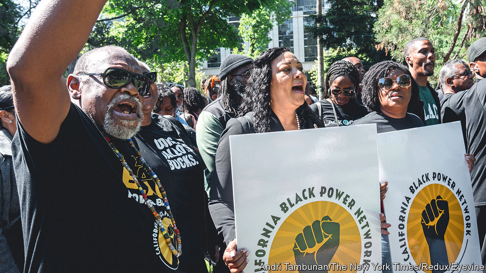

###### History meets accountancy

# California’s reparations scheme is bad policy and worse politics 

##### Democrats should ditch it in favour of ideas that Americans actually support 

 

> Jun 8th 2023 

Since at least 1865, when Congress voted to set up the Freedmen’s Bureau, Americans have debated how and whether to compensate former slaves. In 2020, when Donald Trump had reawoken the left and , an unarmed African-American man, was murdered by a policeman, the idea of —paying money to the descendants of slaves—became almost mainstream. Some Democratic politicians, under pressure from activists and eager to be on the right side of history, agreed to set up commissions to study the idea. A few years later, those commissions are coming back with recommendations.

Cash reparations for slavery are . Only 30% of Americans support the policy. Most of those alive today played no role in Jim Crow; none can reasonably be blamed for slavery. Nor are black Americans the only disadvantaged group: try telling an unemployed Appalachian coalminer why finite tax dollars should go on reparations rather than, say, better schools or public health. Still, unpopular policies are sometimes right. Are cash reparations for African-Americans one such case?

Not long after slavery ended, the Freedmen’s Bureau collapsed. Few freedmen received compensation and many ended up working as sharecroppers for their former masters in something close to indentured servitude. Emancipation was followed by the creation of a two-tier version of citizenship that lasted for a century. Until the 1960s, many black Americans lived in fear of terrorism, were shut out of many neighbourhoods and could not vote. Many were also excluded from supposedly universal programmes like the GI Bill. Plenty of the people who suffered directly from this system are still alive today. And in many cases their children and grandchildren have inherited disadvantages that have their roots in state-sanctioned discrimination. How much present racial inequality is due to that inheritance is impossible to quantify. But it is not zero and it is not 100%.

The moral sentiment about reparations rests on these centuries of unfairness. Yet the cruelty of history is not the main argument. If the past were the same but there were no present-day racial gaps in income or life expectancy, the case for reparations would be weak. The main policy question, then, is how to help those who have been left behind. California shows how, in practice, it is impossible to create an actuarial table of injustice that can be consulted to determine how much cash is owed and to whom.

California outlawed slavery when it joined the union in 1850, so its commission concentrated on making amends for current racial disparities. These are considerable, as they are nationwide. African-Americans die four years earlier than white Americans on average. (Perhaps less noticed is that black Americans have enjoyed the fastest gains in life expectancy over the past 20 years.) For the purpose of its calculations, the commission assumed that a life is worth $10m and, speciously, that all racial disparities in outcomes are due to racism, current or historical. It then calculated how much African-American Californians are owed. The maximum payout per person came to $1.2m. San Francisco, naturally, created its own commission, which put the figure higher, at $5m. 

The bill for the statewide scheme could exceed $800bn, though the commission deems even that sum to be merely a down payment. This comes as California faces a $32bn budget shortfall on an overall annual budget of $300bn. Then there is the difficulty of determining who is eligible for reparations. America, happily, is more racially fluid than when the Jim Crow era ended, which makes that hard. The commission’s answer is to set up another body to determine individual claims, which is just to pose the question again.

If the aim of the policy is to ease disadvantage, that can be done with race-neutral anti-poverty programmes. The expanded child-tax credit, which was part of Congress’s response to covid-19, cut child poverty nationwide. It did the most for African-American children, narrowing disparities, and was popular. This is a route to the same end that is achievable. 

For Democrats, whose task is to build as big a coalition as possible to defeat Mr Trump’s movement, it is hard to think of a policy better designed to set different groups of supporters against each other than cash reparations. Or one easier to lampoon in attack ads: “Californian liberals vote to give Hollywood star $1m!” Gavin Newsom, the governor, appears to be looking for ways to quietly ignore the state commission. London Breed, San Francisco’s mayor, has not endorsed the city council’s proposal. Both should say clearly that they oppose cash reparations, and then propose policies to narrow disparities which most Americans would happily support. ■

