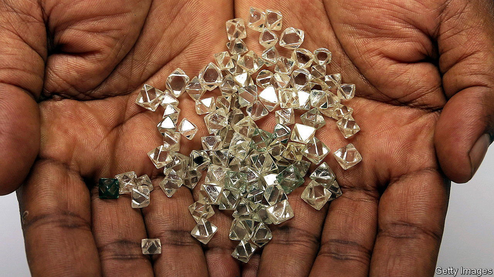
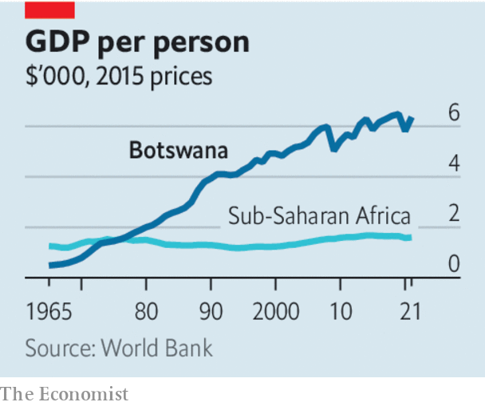

###### Africa’s diamond geyser

# How to get rich from commodities 

##### Tips from Botswana on how to avoid the resource curse 

 

> Jun 8th 2023 

Africa’s soil is studded with buried treasure. Half the world’s diamonds are mined there. The largest producers of , manganese and uranium are all African countries. Since 2000 more big petroleum discoveries have been made in sub-Saharan Africa than in any other region. Yet Africans are not wrong when they talk of a “resource curse”. The continent’s political elite have squandered or stolen much of the bounty, often aided by unscrupulous private firms. The World Bank predicts that by 2030, 62% of the world’s very poor people will live in resource-rich sub-Saharan countries, up from 12% in 2000. Resource-rich states are more likely to suffer dictatorship or .

Managing resources better is crucial to the future of Africa. The world is hungry for its hydrocarbons. Its minerals are needed for cleaner energy. Sadly African politicians risk wasting the moment. Few pursue the right policies. One African country, however, has been a glittering exception, at least until recently—.

At independence in 1966 Botswana was one of the poorest countries in the world. It sold beef but little else. It was home to just 22 university graduates. Over the next four decades its economic-growth rate rivalled that of China, Singapore and South Korea; today it is one of the richest countries in Africa. A necessary condition for its rise was the discovery in 1967 of diamonds by De Beers, a mining giant. But that was not sufficient: the transformation of Botswana also required the right policies.

 


Several stand out. Botswana has long offered secure property rights and a stable, clear tax regime. Today De Beers reckons that Botswana keeps four-fifths of the revenues from Debswana, their joint mining venture, through taxes, royalties and dividends. Elsewhere in Africa firms are reluctant to invest huge sums when mines can be seized or tax rates are volatile. Neighbouring South Africa is among the world’s ten least attractive countries for investors in mines, according to the Fraser Institute, a think-tank. Between 2009 and 2018 Africa attracted just 14% of the industry’s total spending on exploration, despite containing perhaps 30% of the planet’s mineral wealth. 

Botswana has minimised “Dutch disease”, whereby resource exports cause the local currency to rise, making other exports less competitive. It has managed the value of the pula and set up a sovereign-wealth fund. Too many African countries have spent the proceeds of resource booms before they arrive. In Botswana a stabilisation fund helps smooth boom-and-bust cycles.

Like many African countries, Botswana has struggled to diversify its exports and foster manufacturing. Both unemployment (25%) and income inequality (among the worst in the world) are high. Diamonds still make up more than 80% of export revenues. Yet whereas petrostates such as Nigeria and Angola have ploughed money into industrial white elephants, Botswana has invested in future sources of wealth, including education and infrastructure. As new technology makes it possible to do more cutting and polishing in Botswana, rather than in India, the traditional hub, past investments in a skilled workforce will give it a chance to reap the rewards. Better to have industrial strategies that build on existing strengths than try to conjure up new ones.

Copying Botswana is not straightforward. Diamonds are not a typical commodity and it is not a typical African country. Thanks to a trio of astute chiefs who petitioned Britain more than a century ago, the then Bechuanaland became a protectorate, not a colony. It thus avoided some of the traumas of imperialism. (“I do object to being beaten by three canting natives,” harrumphed Cecil Rhodes at the time.) Its modern government was built on relatively pluralistic traditional institutions.

Worryingly, under Ian Khama, the previous president, and Mokgweetsi Masisi, the current one, Botswana has shown signs of forgetting the secrets of its own success. Economic populism, protectionism and abuses of power are creeping in. Yet its history shows that getting the basics right goes a long way. Diamonds may not be for ever, but the benefits of sound policy can be. ■

