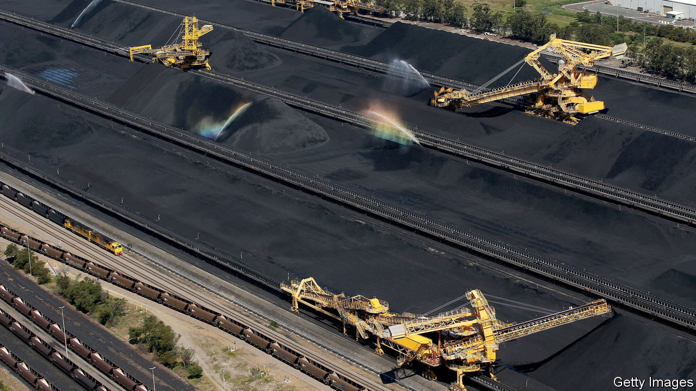
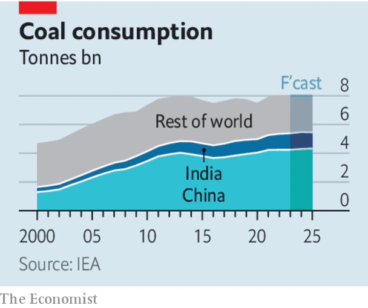

###### Climate finance

# The struggle to kill King Coal 

##### Financial tools alone cannot stamp out the world’s dirtiest fuel 

 

> Jun 8th 2023 

In november 2021, at a un summit in Glasgow, the world’s leaders declared to much fanfare that they were consigning . Governments promised to stop building coal-fired power plants, and financiers pledged to stop financing coal mines. Eighteen months on, however, the world’s dirtiest fuel is . Russia’s invasion of Ukraine set off a scramble for fossil fuels, pushing coal consumption to record levels in 2022. Even though the energy shock has faded, global coal demand is still set to rise a little this year. If the increase in the world’s temperature is  to 1.5°C, coal production must fall by more than two-thirds over the course of this decade. Instead it is projected to fall by less than a fifth. 

One reason for the hopeful prediction of 2021 was the spate of commitments made by the world’s biggest banks and other lenders and investors. More than 200 mainly Western financiers have announced policies restricting investments in coal mining or coal-fired power plants. Lenders representing fully two-fifths of global banking assets have signed up to the Net-Zero Banking Alliance, which pledges to align portfolios with achieving net-zero emissions by 2050. The hope was that reducing the finance available for fossil fuels would help the world decarbonise by raising the cost of capital for projects, deterring investment and ultimately choking off supply. But the coal boom is exposing the flaws in this approach. 

What is going wrong? For a start, the banks’ promises come with small print. Many pledges do not come into force until later in the decade; others cover only new customers or new mines, or exclude miners deriving only a portion of their revenues from coal. As a result, 60 large banks helped channel $13bn towards the world’s largest coal producers last year. 

 


There are also limits to what a club of financial firms can achieve. Faced with criticism from Republican state lawmakers in America, who are threatening antitrust action against members of such clubs, many financial firms are becoming warier. Last month Allianz, axa and scor, three insurers, left the Net-Zero Insurance Alliance. Some had warned the club against toughening up its rules. 

In any case, Western firms are not monopoly providers of finance. In the areas where they are lending less, such as for new mines, other providers of capital are rushing in. Banks in China and India, both big burners of coal, have no qualms about financing its extraction. Nor do those in producing countries such as Indonesia. Many are state-owned and happy to help secure energy supply. None has signed up to the Net-Zero alliance.

Another source of capital comes from private investors around the world. Some big oil and mining firms are disposing of their coal assets, but instead of being wound down these are being snapped up, and often expanded, by private funds. Britain’s first deep coal mine to be dug in decades, which received approval last year, is ultimately owned by private-equity investors. From Miami to Chicago, investors are expanding their coal holdings. Teck, a Canadian miner seeking to spin off its business supplying coal for steelmaking, this week said that it had received lots of interest from potential buyers. 

Stuck in the coal hole

All this points to a fundamental problem of relying on finance to limit fossil fuels: it does not target the demand for them. For as long as demand is high, people can make a profit from investing in coal—and someone, somewhere will seek to do so. No one can say whether coal production would have been higher still, had Western banks not made their pledges. But it is also possible that such promises, by engendering a false sense of security, have prevented companies and—more importantly—governments from taking further action to bring down coal consumption. 

Just as the simplest way to discourage smoking is to make it harder and costlier to buy cigarettes, rather than cutting off finance for big tobacco, so too the most effective way to kill coal is to curb demand for it. Making greener sources of energy cheaper, and encouraging investment in nuclear energy, would blunt coal’s appeal when the next energy shock hits. Properly pricing carbon, even if only in the West, would reduce global demand for fossil fuels; a carefully designed carbon border tariff, which taxed imports that use dirtier forms of energy, could encourage manufacturers around the world to clean up production. 

Politicians have long looked for alternatives to such policies, which raise costs for consumers and so are likely to be unpopular. Some governments, outrageously, still subsidise the burning of coal. Instead, to kill King Coal, they must first make it more expensive. The time to start is now. ■


