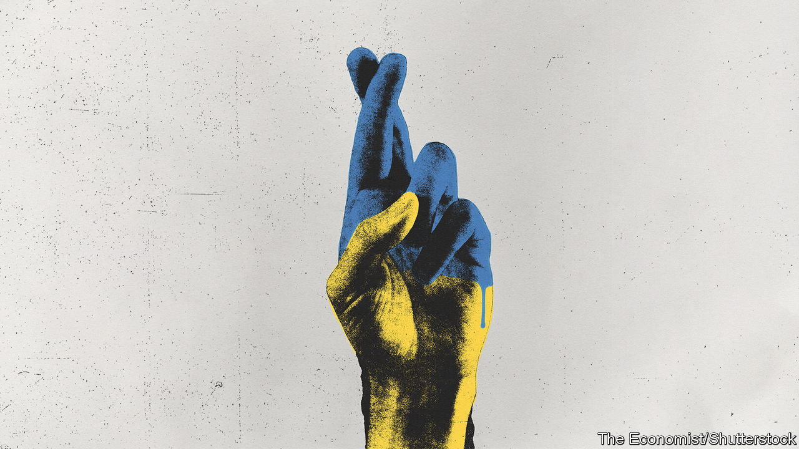

###### Taking back what is theirs

# Ukraine strikes back 

##### The counter-offensive is getting under way. The next few weeks will be critical 

 

> Jun 8th 2023 


Trailed ten days early with a blood-stirring video in which Ukrainian troops asked God to bless their “sacred revenge”, Ukraine’s counter-offensive is . For weeks its armed forces have conducted probing and shaping operations along the 1,000km front line, looking for weaknesses and confusing the Russians. Now Ukraine is testing enemy defences with an intensity not seen for months, with attacks against the occupiers in a series of positions in the east and south. The apparent demolition of the  on June 6th, if it was indeed Russian sabotage as Western military sources believe, would be clear evidence that they are already .

. The main force has yet to be sent into battle. The operation will last well into the summer. However, what happens in these next weeks will shape the future not just of Ukraine itself, but of the whole . The point of decision has arrived.

The task for Ukraine, bluntly, is to show Vladimir Putin, his henchmen, his compatriots and the wider watching world that Russia cannot win; that this invasion has been misconceived from the outset; that Russia cannot outlast Ukraine and its Western backers; and that the Kremlin’s best option is to give up before Russia suffers yet more losses and humiliation.

That is no easy task, and the risk of failure is real. But thanks to Ukraine’s astonishing determination, and the strong and unexpectedly united backing of the West, success is possible. It requires, right now, the strongest diplomatic and military support, and the clearest commitment from the West that it will stand by Ukraine for many years to come. Mr Putin must no longer be able to lie to himself or his people about the foolishness of the direction he has chosen.

This is why this moment is so critical. The Russians are well dug in and reinforced after months of a mobilisation drive that has replenished the supply of cannon-fodder. Imagine the worst case: that Ukraine’s counter-offensive peters out, its troops spread too thin, or used too sparingly, to make an impact. 

If that happens, it would be a damaging failure. Despite the Russian army’s woeful performance in the months-long fight to take the city of Bakhmut, it would nonetheless start to seem well matched against Ukraine’s. The voices urging Ukraine to stop fighting and start talking would grow louder, even though a ceasefire would leave Russia in possession of almost 20% of Ukraine and Russian promises of peace would be worthless. 

This would be a win for Mr Putin—not the total victory he once dreamed of, but success in his backup objective, to cripple Ukraine if it cannot be returned to the Russian imperium. There would be recriminations within NATO and the European Union. In America, as it heads towards a divisive presidential election, the pressure to cut back funds that Republican critics already claim are being wasted would grow. In Europe the backsliders would slide further. 

But the fighting may also go differently. Imagine that the invaders break, their troops running back to Mother Russia in fear of encirclement, as they did from Kharkiv last September. That would be a grave setback for Mr Putin. He has lost more than 100,000 dead and wounded, expended tens of billions of dollars’-worth of military hardware, and shattered his economic relationships with Europe and America: and it would be all for nothing. He would struggle to survive the humiliation. Although Russia might suffer deep and dangerous instability, many in the West would be glad to see the back of him. 

The most likely outcome lies in between. As the summer wears on, Ukraine is likely to push back the Russians in two main areas, gaining territory but not precipitating a full-scale collapse. The first, and the one where most of the new activity is so far going on, is in Donbas. One clear Ukrainian objective is to reverse Russian gains there. If Mr Putin starts losing even the territory he has held since his first incursion, in 2014, as well as what he has seized since last February, it will be apparent to him, his generals and the Russian people what a blunder he has made.

The other objective will surely be a push south. Ukraine will seek to break the “land bridge” that connects Russia to Crimea. If it can do that, everything changes. Crimea would become isolated, hard to resupply and protect. The collapse of the dam has already threatened its water supply. Large numbers of Russian troops might be cut off and captured. Ukraine would get back some of its coast on the Sea of Azov. Even if it cannot reach the coast, advancing far enough to put the east-west roads and railways that supply Crimea in range of its guns would be an important step.

Yet neither Ukraine nor Europe will be safe while Mr Putin believes he can launch another invasion later. So the West should understand its commitment must last for years. While Russia remains a threat, Ukraine will need enough weaponry to hold the line, wherever it settles.

What that means in practice needs to be agreed on now—as a further signal to Russia of the folly of dreaming that this war could one day turn out well. NATO members are split on whether Ukraine should become a member, and in any case it cannot happen while the war still rages. So willing Western powers must immediately craft a set of security guarantees for Ukraine that will have credibility, unlike the empty words of the past. 

Make Ukraine Putin-proof—and Trump-proof

Short of an explicit treaty that will be hard, but not impossible. America, for instance, has legal commitments that oblige it to provide Israel and Taiwan with the arms they need to defend themselves. The guarantees should cover weapons systems, ammunition, training and support to beef up Ukraine’s own defence industries. The more countries that sign up to them, the more convincing they would become—and the harder they would be to overturn if a Ukraine-sceptic like Donald Trump were elected. After the fighting stops, Western “tripwire” forces could be stationed on Ukrainian soil.

Ukraine’s fear, and Mr Putin’s hope, is that the West will lose focus. Only a successful counter-offensive and credible security pledges can get Russians to realise that Mr Putin’s war is futile—that he will never succeed, but can only fail, or fall. ■


