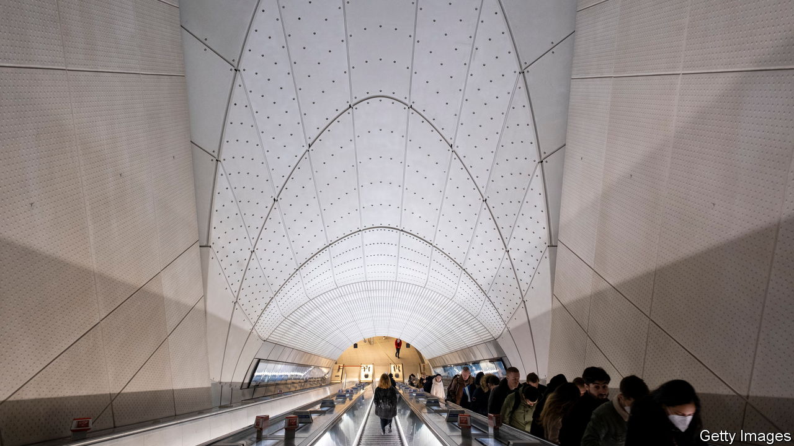

###### On illegal drugs, data privacy, place names, Sudan, London’s Elizabeth line

# Letters to the editor 

##### A selection of correspondence 

 

> Jun 8th 2023 


The demand side of drugs

Your article on fentanyl impressively explored the deadly 21st-century drug epidemic (“”, May 13th). However, it missed the mark in the most fundamental way. Fentanyl, which now comes to America mostly from China and Mexico, can be easily synthesised anywhere, including in America itself. Worse yet, fentanyl is not unique. There are endless additional synthetic opioid analogues with similar toxicity and attractiveness to drug users. Stop Mexico and China and other drug suppliers will quickly fill in the gap.

The driver of this tragic epidemic is the $150bn spent annually on illicit drugs by Americans; there is no end to the foreign and domestic drug suppliers who will collect that cash. Without reducing drug users’ money, no supply-side effort can have sustained success. Yes, this is a supply-side problem. But it is driven by demand. 

There is a studied effort to ignore the central role of drug users in the overdose epidemic because it is so difficult to get them to stop using drugs. Drug users are well aware of fatal overdoses. This knowledge does not stop their drug use or induce safer ways to use drugs.

Robert DuPont

White House drug chief, 1973-77


 


Enforcing privacy laws

You told only half the story about the large fines imposed on big American tech companies for transferring users’ data to America in breach of European privacy rules (“”, May 27th). The rules were introduced following Edward Snowden’s revelations of mass surveillance by government agencies and were designed “to give citizens back control over their data”. However, governments seem to be immune to the kind of enforcement faced by firms. 

On May 24th the Belgian data-protection authority concluded that transfers of EU citizens’ data to America under FATCA, America’s notorious tax-compliance law, breaches basic GDPR principles and should stop. And yet, the Belgian data protection authority stopped short of imposing a fine. This was only two days after the €1.2bn ($1.3bn) penalty imposed on Meta.

The lack of meaningful enforcement of the European privacy rules against governments in this area shows a degree of hypocrisy. A fine for you and a big fat zero for me. 

Filippo Noseda

Partner

Mishcon de Reya


 


Chicken Keev?

Beyond its measure of self-conscious empathy, the “Keev” syndrome of hyper-correcting foreign place names never rings true with native speakers (, May 13th). A classic case is Beijing. The name is largely unrecognisable to local residents. Journalists fail to address the tonal character of standard Chinese and routinely render the second consonant as though it were unaccountably French, like the “g” in . 

Incidentally, the French themselves invariably pronounce foreign cities, politicians, artists, and so on as though these were purely French words. They also make no attempt to use cuddly phonetic neologisms. So Kyiv is still Kiev, and the accepted French name for the Chinese capital remains . Anglo hipsters may think it embarrassing that anyone still talks about “Peking”, but the former English name derives fairly accurately from the Cantonese reading, Pak-king. This is still the vernacular pronunciation in Hong Kong and much of southern China.

B.T. Lafayette


As Geoff Lindsey, a British linguist, described it in 1990, Americans tend to pronounce markedly foreign words using a system of five tense vowels adapted from Spanish, regardless of where the word actually comes from. That’s why Americans say the first vowel of mantra with a long “a”. And we use the same “o” for baroque, shalom, mocha and Costa Rica. The British have a less rigid system, using different “a”s for taco and sake (the Japanese drink). Britons are also more likely to nativise foreign words, pronouncing them as if they were English. Some names are still fluctuating here too, like Iraq and Iran, pronounced by some as if English sentences (“I rack, I ran”), and by others according to the Spanish-derived rule. 

Mark Lundy


Should you translate place names into your own language? When living in Spain, I was amused to note the locals refer to Newcastle as . New York was , Cape Town  and St John’s in Newfoundland the delightful . Curiously, the reverse process seems less common, as we all go to Las Vegas rather than to The Meadows and Buenos Aires rather than Fair Winds.

David Scott


 


Sudan’s peace process

Many Sudanese felt excluded from the transition to democracy in Sudan (“”, May 13th). Young Sudanese civilians are willing and capable first responders, service providers and interlocutors. They are resilient, shifting from political activism to organising the distribution of basic goods, co-ordinating medical care, planning evacuations and contributing to solutions to the conflict.

Civilians can be brought into the peace process. Engaging with local leaders and networks is the heart of the Carter Centre’s approach to building peace in Sudan. Since 2020 we have supported a Youth Citizen Observer Network in the country. Together with advisory bodies it promotes civilian voices and informs efforts to tackle the crisis, and could help distribute aid and monitor ceasefires. Western countries and the Sudanese leadership have not engaged with local bodies effectively. They should take note of the Youth Citizen Observer Network’s presence and capability.

Paige Alexander

Chief executive

Carter Centre


 


The first Tube map

Engineers building the first London Underground lines in the late 19th century had a different problem to worry about than the engineers who built the Elizabeth line today (“”, May 13th). The low literacy rates at the time meant that many passengers would not know what station they were at and when to get off. This was simply solved by using a different bold pattern of wall tiles for each station, which are still visible to this day. 

Chris Drake


I think you were unfair to John Betjeman, a champion of Victorian engineering and architecture. “Slough”, his despairing poem published in 1937, was aimed at the trading estate, a former dump site for army vehicles, and not the town. He later regretted it.

Jean-Marc Barsam


Spiffy the new trains are, but as an older person, who is not that well padded, I find the seats on the Elizabeth line to be rock hard. I have no idea how anyone could sit on them all the way into London from Maidenhead. 

Jarek Garlinski


