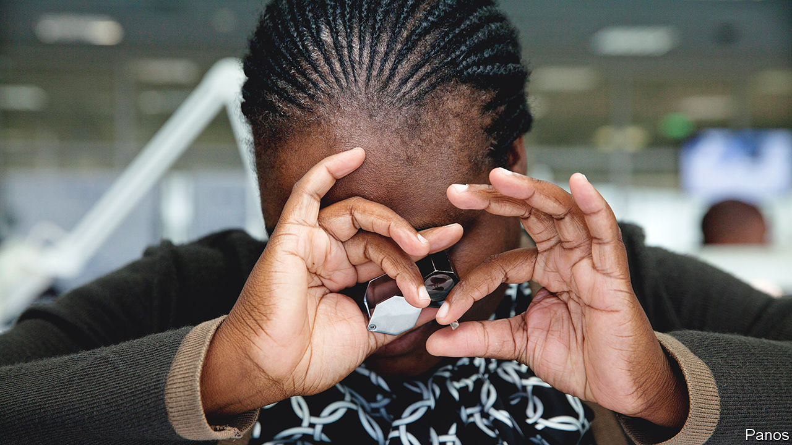
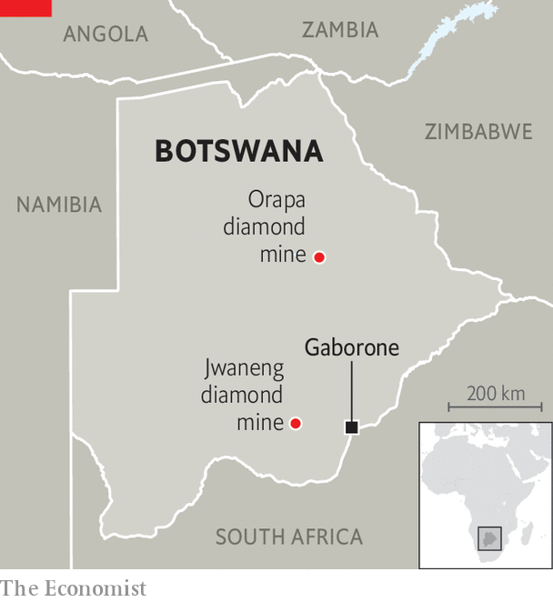
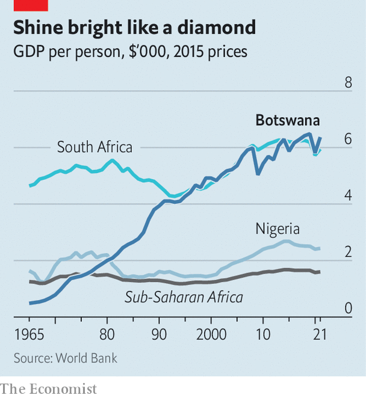

###### Carats and sticks

# Botswana, an African success story, looks ever less exceptional 

##### Wrangling over its diamond deal with De Beers shows why 

 

> Jun 8th 2023 

In 1966 Botswana’s future looked grim. On the eve of its independence from Britain the country had 12km of paved roads, a hundred secondary-school graduates and a gdp per person that was half the average in sub-Saharan Africa. Today it has the highest average income on the African mainland, save for the odd petrostate. And it has always been a democracy. 

This success would have been impossible without diamonds. In 1967 De Beers, which then had a near-monopoly of global production and today remains the largest miner by value, discovered what would become Orapa, the world’s biggest open-pit diamond mine. Whereas such windfalls have been squandered across Africa, Botswana’s first few leaders forged a productive partnership with the firm. They used the proceeds from diamond mining to keep public debt low and create rainy-day funds, all the while improving health care, education and infrastructure.

But Mokgweetsi Masisi, Botswana’s current president, is questioning the relationship ahead of a deadline of June 30th to renew ties. “Clearly, our agreement with De Beers is very limiting for us and we must either get a better deal or walk away completely. We must refuse to be enslaved,” he told a rally of the ruling Botswana Democratic Party last month. The rhetoric partly reflects campaigning ahead of next year’s elections and partly a common desire among African states to get more from their raw commodities. But it alarms those worried that Botswana is becoming more volatile, nationalist and populist—no longer such a rare gem. 

 


Between Botswana and De Beers there are multiple deals. Each party owns half of Debswana, which mines 95% of the diamonds in Botswana, the second biggest producer after Russia. The Diamond Trading Company Botswana, which sorts the offtake, is also evenly split. A quarter of the rough stones go to the state-owned Okavango Diamond Corporation (odc), which sells its share at auction. The government also owns 15% of De Beers. If you add taxes, royalties and dividends, around 80 cents out of every dollar Debswana earns in Botswana goes to the state, estimates the firm. Diamonds account for over 80% of exports and roughly a third of gdp.

Though he has never put forward detailed complaints, Mr Masisi argues that Botswana still gets stiffed. He wants more than a quarter of the rough stones to go to odc. He also thinks Botswana should do more of the “downstream” business, such as cutting and polishing. 

To that end, he said in March his government would buy a 24% stake in HB Antwerp, a Belgium-based diamond firm, a move that is being watched by other African governments keen to move beyond the exporting of raw commodities. At a new facility in Gaborone, Botswana’s capital, hb says it will soon cut diamonds produced by Lucara, a Canadian miner known for big stones. The plan is for the firm to start doing the same for odc’s diamonds. 

Yet the proposal has caused consternation. Neither the cost nor the terms of the deal have been publicly revealed. Even technocrats in the finance ministry are unsure of the details. Western governments worry that any tie-up would bring Mr Masisi closer to Felix Tshisekedi, the Congolese president, who is close to one of hb’s co-founders and who runs a country not known for wise management of resources. 

Whether hb might one day be part of a genuine alternative to De Beers is unclear. Botswana has long pledged to do more “beneficiation” but has never put in place the right policies, argues Sheila Khama, formerly of De Beers. A landlocked country of 2.6m people with no real domestic market for diamonds is at an inherent disadvantage compared with places specialising in specific parts of the value chain. The Indian city of Surat has more people employed in the diamond industry than there are formal workers in Botswana.

 


De Beers argues it has tried to help develop downstream industries, for instance by bringing its global sales meetings to the country since 2013. It believes, as does hb, that new technology will make it more cost-effective to do more manufacturing in Botswana, especially if tracing technology makes it easier to prove the origins of diamonds, since consumers may be happy to pay more for traceable Botswanan stones than those from war-mongering Russia. De Beers says that last year around $1bn of its $6bn-worth of rough-diamond sales globally were to 31 Botswana-based cutting and polishing factories.

Mr Masisi’s language worries Botswana’s Western champions. He also has protectionist instincts. He banned the import of some vegetables from South Africa and he has limited foreign ownership of businesses in certain sectors. He says he has a “wonderful relationship” with Emmerson Mnangagwa, Zimbabwe’s ruthless president. Journalists talk of intimidation. 

Then there is the feud between Ian Khama, the former president, and his hand-picked successor, Mr Masisi. The former accuses the current president of having “the character of a typical dictator”. Mr Khama says he has been the target of three attempted poisonings. The Botswanan authorities have accused Mr Khama of trying to launch a coup; those charges have been dropped but Mr Khama, who lives in exile in Johannesburg, is wanted in Gaborone on firearms and other charges. He says he is committed to “regime change” at the next election. Each man seems determined to bring down the other, no matter the damage to Botswana’s reputation. 

Most analysts would bet a few carats on Botswana and De Beers cutting a deal. Both sides have few alternatives. Botswana is De Beers’s largest source of supply. Other miners may not offer better terms. One of De Beers’s rivals, Alrosa, is under American sanctions and therefore an unattractive partner, given that American consumers purchase about half of all finished-diamonds. One might describe the relationship between Botswana and De Beers as one of mutually assured production. 

As technology that makes it possible to trace the origin of every stone improves, Botswana has a big opportunity. A relatively stable African country, where the proceeds are still largely well spent, it can pitch its diamonds to consumers worried about buying Russian stones or funding warlords. Yet to command a premium, it has to keep the sparkle in its own brand. ■

