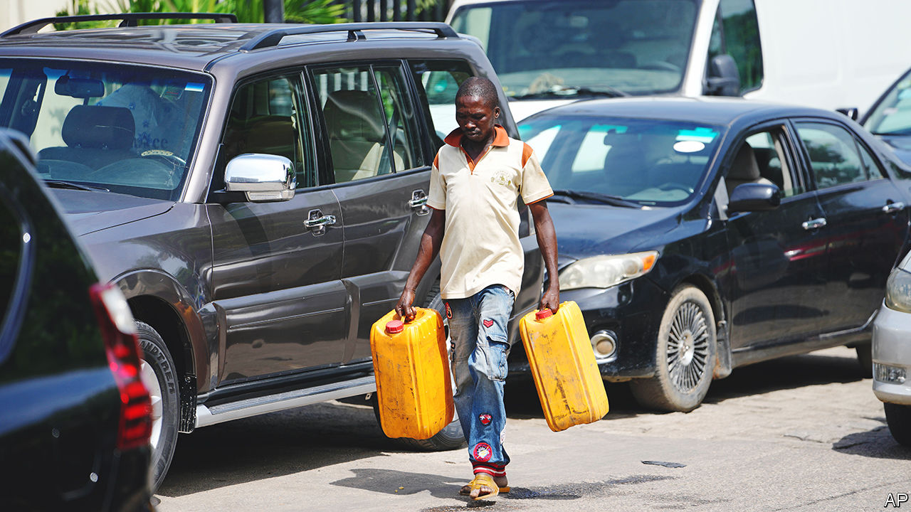

###### Bye-bye to bungs

# Nigeria’s new president scraps the fuel subsidy 

##### The move is necessary but confusion reigns 

 

> Jun 8th 2023 

Normally when presidents ad-lib in an inauguration speech it is to stress their folksy charm. But the off-script remarks of Nigeria’s new president, Bola Tinubu, sent his compatriots rushing to the petrol stations. “Fuel subsidy is gone,” he declared during his swearing-in on May 29th in Abuja, the capital. Before he had even finished his address, queues began to stretch at the pumps, as drivers raced to nab a last cheap drop of fuel. 

Nigeria has spent a fortune subsidising petrol since the 1970s. It was supposed to be a temporary measure, but the cost has swelled, while the mechanics have become opaque. The state oil firm, the Nigerian National Petroleum Corporation (nnpc), does a fiddly set of transactions, swapping some of the crude oil it pumps for refined fuels on global markets, which it then resells at a discount to Nigerians. Any cash left over is remitted to the government. The effective subsidy hit $10bn last year, and the burden of that meant nnpc paid nothing to the government, despite Nigeria usually being Africa’s biggest oil producer. That depressed overall government revenues, 96% of which were gobbled up by servicing debt last year. Mr Tinubu says the bung simply had to go. Angola, a big oil producer where a litre of petrol is cheaper than a bottle of water, faces similar fiscal strife. Last week its government also slashed the subsidy. 

Several Nigerian presidents have promised to end the subsidy—against the opposition of many of the country’s 220m people. In 2012 trade unions brought the place to a standstill before the government backed down. Though the subsidy does little to help the 33% of Nigerians living on less than $2.15 a day, many Nigerians feel that cheap petrol is the only benefit they get from their country’s vast oil wealth. 

Since Mr Tinubu’s declaration, prices at the pump have soared, even though the subsidy is supposedly in place until the end of this month. In some areas the NNPC has nearly tripled the price of petrol to 557 naira ($1.17), up from 189 naira. This will push up inflation, already running at 22%. Taxi fares in many cities doubled overnight. Sarah Bature has doubled the price of the cabbages that she sells at a market in Abuja. They are trucked in each day. “What else can I do?” she demands. Others are struggling to keep track. Hassy, who drives a cab in Abuja, laments that he now has to argue over prices with his customers.

Scrapping the subsidy should, however, free up desperately needed funds for schools and clinics. For years the World Bank has pleaded with governments to bin it. Yet announcing it off the cuff meant that measures to soften the blow were not yet in place. As a result, the jump in inflation will be all the more painful. Ferocious calls to reinstate the subsidy are sure to ensue. 

The unions promptly announced that they would strike in protest from June 7th but suspended their plan after the government obtained a court injunction to stop it, pending a further hearing. The unions at least seem willing to negotiate. They want other measures to soften the crunch, such as a rise in the minimum wage. 

Mr Tinubu’s move in the right direction on another issue was similarly messy. In his inauguration speech he also promised to unify Nigeria’s elaborate multiple exchange rates, which are meant to keep the naira strong. But he provided few details. The central bank was soon forced to deny a report that went viral after a newspaper claimed the currency had been devalued from 465 naira to the dollar to 630. Traders are pricing in a fall of about 20% in the next three months and 30% in the year ahead.

Mr Tinubu won the election in only a third of Nigeria’s states. The overall turnout was a dismal 27%. His victory is still being disputed in court by his rivals. He faces a dire security situation with separatists in the south-east, clashes between herders and farmers in the centre, a jihadist insurgency in the north-east and rampant kidnapping gangs in the north-west. To make headway on security he must also rescue the economy. Removing the fuel subsidy is a good step. But he needed to avoid creating chaos in the process. ■

