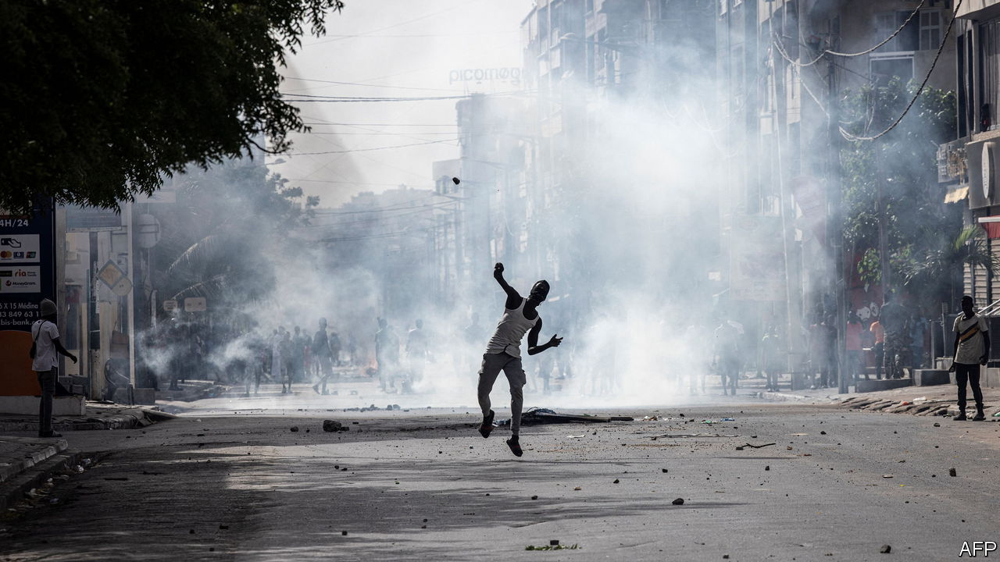
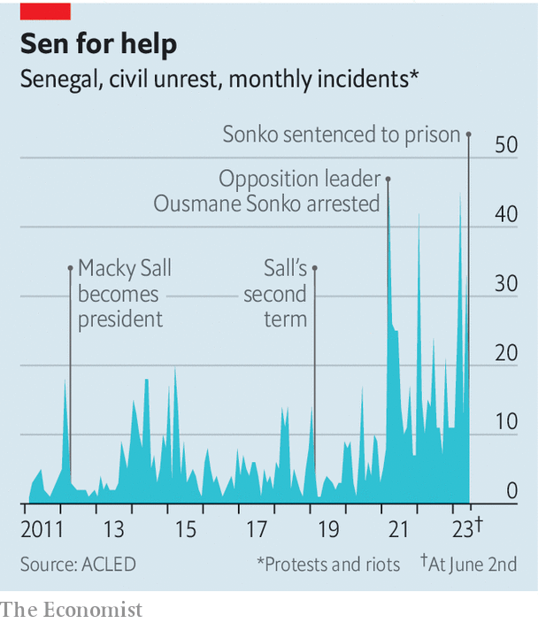

###### An African beacon of stability begins to flare up

# Tension in Senegal is set to persist 

##### Street protests turn violent, while the authorities blackout the internet 

 

> Jun 8th 2023 

The streets of Dakar, the capital of Senegal, usually mix the chatter of busy traders, the aroma of grilled meat and the occasional glimpse of the sparkling Atlantic Ocean. Yet recently smoke from burnt-out buses darkens the view, the stench of tear-gas stings the eyes and chatter has been replaced by the crash of rocks into riot shields, the thud of baton on flesh, and the boom of police weapons. Witnesses say security forces have used live ammunition. “We are living a nightmare,” says Alioune Tine of Afrikajom Centre, a think-tank in Dakar. 

At least 23 people have been killed across the country since violence erupted on June 1st, says Amnesty International, a rights group, making the protests the bloodiest in decades. Some 400 have been injured. The government sent the army onto the streets and detained more than 500 people (including one hauled away from a television interview by a balaclava-clad gendarme.) It first blocked social media and messaging apps, then shut down almost all mobile internet in the capital. 

The trouble began when a court sentenced Ousmane Sonko, a leading opposition figure, to two years in prison for “corruption of youth,” defined as immoral behaviour with someone under the age of 21. The victim is Adji Sarr, a masseuse who was 20 at the time. Mr Sonko was acquitted of charges of raping her and making death threats. Still, the sentence almost certainly rules him out of the presidential poll next February. Mr Sonko decries the case as politically motivated, says the investigation was riddled with malpractice, and refused to attend the trial. Many protesters also believe that President Macky Sall wants to run for a constitution-bending third term. 

 


Senegal has long enjoyed a reputation as a beacon of stability and democracy in a region beset by coups and overstaying presidents. This has made it a favoured partner of the West. France maintains hundreds of soldiers in Dakar, while Spain has patrol boats there to stop migrants in  setting off for the Canary Islands (part of Spain and thus the EU). Several American presidents have visited to laud and reward a stable African democracy. 

Yet Senegal has been losing its sheen. In early 2021, when Mr Sonko was first accused of rape, protests flared. Some 14 people were killed, 12 of them shot dead by the security forces. Opposition figures have been arrested for fuzzy crimes such as “insulting state institutions”. Senegal’s ranking in press freedom has plummeted from 47th in 2020 to 104th, says Reporters Without Borders, an international watchdog. The latest heavy-handed response to protests is not a surprising blip but a sharp plunge in an ongoing descent. 

Mr Sonko is a populist former tax inspector who denounces corruption among the elite and rails against the influence of France, the former colonial power. Though Mr Sall has presided over robust growth, many of Mr Sonko’s supporters feel left out and battered by inflation. And he is not the first opposition leader to run into legal trouble. In the election of 2019 two other prominent candidates were barred from running after convictions for alleged corruption—and are still ineligible. 

Mr Sonko makes an uncomfortable martyr for liberal Senegalese. In a recent livestreamed speech he made an ugly attempt to discredit the trial by declaring, among other things: “Even if I had to rape, I would not rape someone who looks like a monkey that has had a stroke.” 

As we went to press, a precarious calm had descended on the country, in part because Senegal’s influential Muslim brotherhoods have urged restraint. It may not last. Mr Sonko, who has not been seen or heard from since May 28th, is said to be in his house, surrounded by police. The justice minister, Ismaila Madior Fall, says he could be arrested “at any time”. That could prompt attacks on the homes of people linked to the government and even more violent crackdowns by soldiers and police, worries Ousmane Diallo, who is based in Senegal for Amnesty. 

That would not be the end of the affair, anyway. If Mr Sall intends to run again, he will have to start gathering signatures by the end of August to support his candidacy. Should he do so, many Senegalese will feel deeply betrayed. He came to power in 2012 by harnessing a wave of opposition to the last president’s attempt to run for a constitutionally dubious third term.

Yet in March he claimed he is legally permitted to run again, even though he has served two terms under a constitution that states that two consecutive ones mark the limit. Running again would rely on the thin argument that because the constitution was tweaked during his second term (to reduce the length of a presidential term from seven to five years), the clock on term limits was somehow reset. 

Perhaps Mr Sall will soon announce he will step down at the election. If he had declared as much in 2021 and again in the past week, much bloodshed could have been avoided. He has not done so. The worst could be still to come. ■

