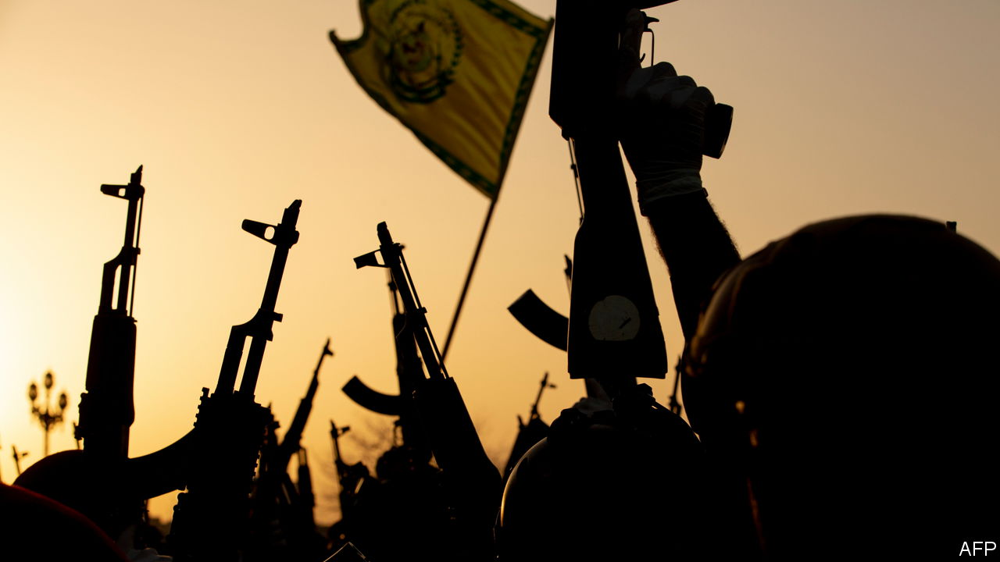
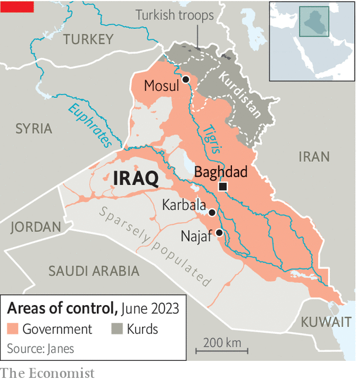

###### Iraq’s real new bosses

# The Iraqi militias are copying their overmighty cousins in Iran 

##### Democracy is being undermined by gunmen attached to political parties 

 

> Jun 8th 2023 

Agaggle of Western tourists sun themselves on a crowded café pavement in the heart of Baghdad. Hotel lobbies bustle with businessmen from China. Spectators pack the reopened horse racecourse. After a 20-year hiatus, cranes are in action building malls and housing estates. Normality, or at least a version of it, is returning to Iraq. What is less normal is that many of the bulldozers and tractors bear the rifle-and-bullet insignia of the Hashd al-Shaabi, an umbrella group of government-funded, Iran-backed Shia militias. 

In 2014 Iraq’s government of the day launched the Hashd, or people’s mobilisation force, to counter Islamic State (IS), a movement of Sunni jihadists who had conquered Mosul, the country’s main northern city, and were sweeping menacingly south towards Baghdad. But after IS was defeated and a modicum of calm returned, the Hashd found a new role. Though the political coalition it backed came sixth in last year’s general election, the Hashd has managed to wrest control of government, parliament and Iraq’s finances.

The Hashd’s economic arm is spearheading Iraq’s reconstruction—and is beginning to look eerily like the Islamic Revolutionary Guard Corps (IRGC), the praetorian guard that is the power behind the state of Shia Iran. The Arabic word Hashd, meaning mobilisation, echoes Baseej, the Persian name for the IRGC’s paramilitary youth wing. “We’re cloning the IRGC and handing Iraq to it,” says an Iraqi security man worried about Iranian influence.

 


Many Iraqis are glad of the stability that comes when one side finally wins a civil war. Iraq’s Sunni Muslim minority seems to have abandoned the struggle for the supremacy it once enjoyed. Iraq’s Kurds have edged back from their bid for independence. And the Hashd’s prime opponent among Shias, , a hot-headed cleric who appeals to Iraq’s poor, has been hobbled. Though Mr Sadr won last year’s election, the Hashd’s allies in the courts ruled that he needed a two-thirds majority to form a government, which he failed to get. In a fit of pique Mr Sadr withdrew his people from parliament, letting the Hashd pick its own prime minister, Muhammad al-Sudani. The Hashd readied itself for a backlash from Mr Sadr’s fans in the slums. So far it has not happened. The few Shia ayatollahs who once backed Mr Sadr have washed their hands of him, perhaps under pressure from Iran.

Flush with funds from high oil prices, Mr Sudani’s government drafted a record budget of $152bn, fattening an already obese public sector. The Hashd is one of its chief beneficiaries. Mr Sudani has given it an annual budget worth $2.7bn and helped it to add another 116,000 men to its ranks, bringing its total to more than 230,000. Mr Sudani has approved the launch of a Hashd-run building company named after Abu Mahdi al-Muhandis, the Hashd commander assassinated by an American drone in 2020. Its charter gives it preferential access to government tenders. Mr Sudani has also awarded the al-Muhandis company tracts of strategic land ranging from Baghdad to Iraq’s borders. Another swathe, half the size of Lebanon, stretches along the border with Jordan and Saudi Arabia. Critics say these zones may host militia bases that could connive in the smuggling of drugs, guns and contraband.

Other Shia allies of Mr Sudani are gathering economic clout. Shrine foundations are growing into financial conglomerates, bolstered by alms-giving, subsidies from the Shia department of religious endowments and the tax-free charitable status they enjoy. A foundation in the shrine city of Karbala headed by Ali al-Sistani, the grandest of Iraq’s ayatollahs, runs poultry farms, hospitals and fish farms. Another imports electronics from China. Their earnings run into billions of dollars, says a banker. “They are states within states.”

Mr Sudani has purged the ranks of pro-American intelligence men around his predecessor, Mustafa al-Kadhimi. In parliament Hashd supporters have manipulated the electoral law to keep out independents. Free speech is being curbed. Social-media influencers have been jailed for immorality. Under threats from pro-Iranian militias, some Western academics and journalists have had to leave. One MP’s office was shut down after he questioned the size of the Hashd’s budget. 

Some hope the Hashd’s new business interests may temper its militant tendencies. Better that its commanders consort with businessmen rather than global guerrillas, says an adviser to Mr Sudani. His officials distinguish between units under the Hashd umbrella that seek business deals and respectability, and those who still want to clobber their opponents. 

Mr Sudani sends mixed signals about his relationship with the Hashd. The IMF recently reckoned that Iraq needs to sell oil at $96 a barrel, a lot more than the present rate, if it is to balance the books. So Mr Sudani may soon have to tell Iraqis to tighten their belts. If their standard of living were to fall, he might need the Hashd’s guns to survive. “The rope that saved Iraq”, says Hayder al-Khoei, an Iraqi analyst, referring to the Hashd’s role in defeating IS, “can be the noose that hangs around its neck.” ■

