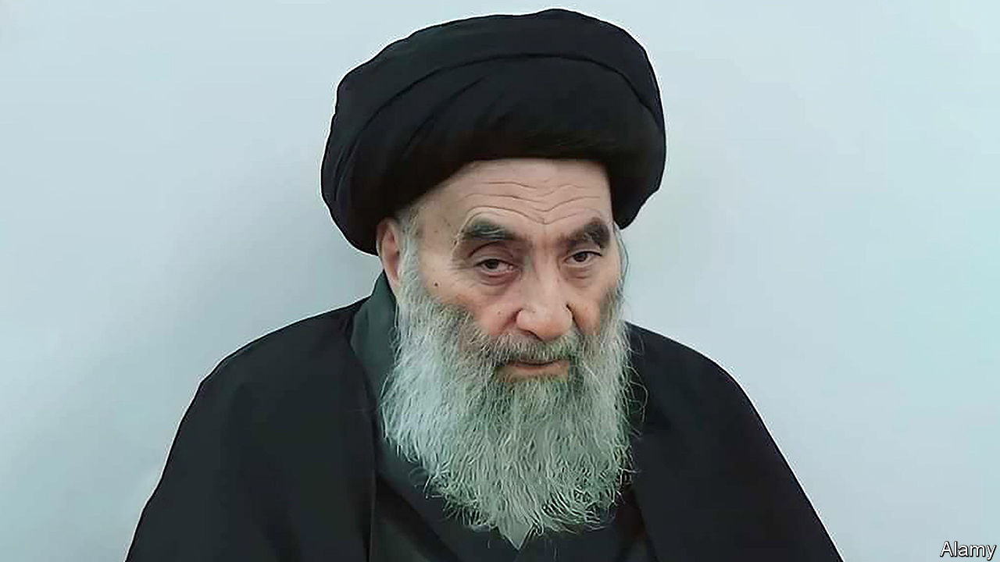

###### Bye-atollah

# Who will succeed Shia Islam’s top man? 

##### Grand Ayatollah Ali al-Sistani, a huge influence in Iraq, may be fading 

 

> Jun 8th 2023 

“Allah yatawal omru: May God grant him a long life” has long been an Arabic mark of respect for the elderly. But seminarians in Iraq’s shrine city of Najaf have begun reciting it almost obsessively. Ali al-Sistani, the grand ayatollah who is the senior religious figure for the world’s 200m Shias, is 92 and fading.

No one has done more over the years to keep Iraq from collapse or from turning it into an Iranian-style theocracy, though he has used his influence to veto any Iraqi leader of whom he strongly disapproves. Despite his humble way of life, he heads a multinational network worth billions of dollars and presides over the holiest of Shia shrines, visited by millions every year. Seeing no obvious successor, many Shias fear a struggle that could, as an insider puts it, be “messy, complicated and rife with division”.

In theory his fellow clerics could and should decide. Two other grand ayatollahs, one from Pakistan, the other from Afghanistan, head the list but may be too old: the first is in his 80s, the second is 93. Three other younger scholars may bid, though one, from Bahrain, is said to have fallen out of favour with Mr Sistani for jumping the gun. All five front-runners suffer from their relatively lowly lineage; none descends from the Prophet Muhammad, a status that Shias venerate. 

This time the job may go to someone not born in Iran—a rarity for over a century. That would rattle the clergy who rule the country: they would love to impose one of their own to replace Mr Sistani, who was born in Iran. Ayatollah Ali Khamenei, Iran’s supreme leader, tried sending his old teacher to Najaf to win over seminarians there. Several Persian-speakers have been seen moving into houses in Mr Sistani’s alleyway.

Less pious claimants could also bid for the post. Muhammad Sadiq al-Sadr, a bold activist Iraqi cleric, challenged Mr Sistani’s quietist leadership before he was assassinated by Saddam Hussein in 1999. His firebrand son, Muqtada al-Sadr, has inherited his populism, if not his scholarship, and can claim to have the biggest following among Iraq’s poor. Some of his fans even hail him as the mahdi, the anointed one, who Shias say will emerge at the end of days. Another feisty Sadrist, Qais Khazali, who is setting up a beefy militia cum political party, may also be planning a takeover. He recently moved from Baghdad to Najaf and is building a vast mosque there. However spiritual the job, guns and money may still help. ■

