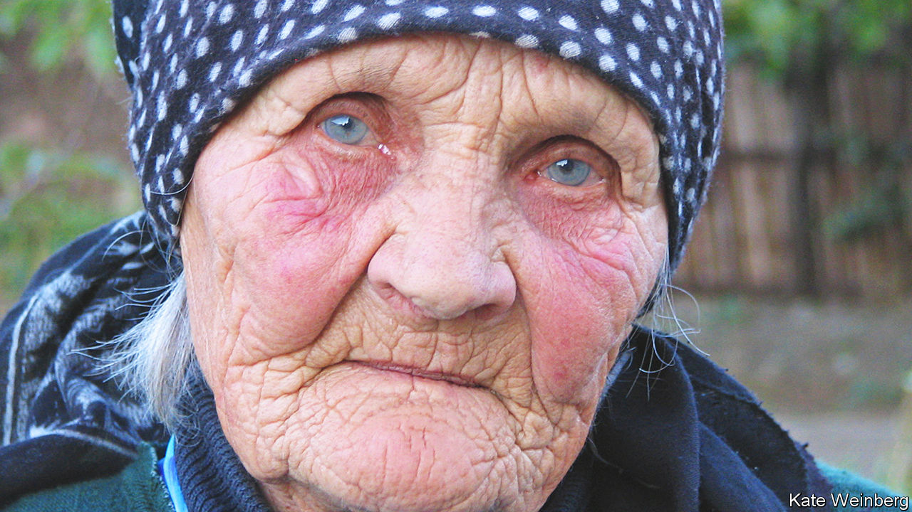

###### Her special child

# Vera Putina claimed to be Vladimir Putin’s real mother 

##### The resident of dirt-poor Mekheti, in Georgia, died on May 31st, aged 97 

 

> Jun 8th 2023 

AFTER SCRAPING flour from her hands with a large, sharp knife, Vera Putina went through the photographs. A very small child with a velvet cravat and smart strap shoes. A boy equipped for winter, in a balaclava and scarf, and for summer, with just a pair of shorts. A pupil in the back row at the Metekhi village school, the brightest in his class. All had the same blond hair, weak chin and sulky bottom lip; all had pale eyes, Russian eyes, like hers. Most also had the wary, sidelong look of an unhappy child. Yes, Vladimir Putin had been unhappy. And it was partly her fault. But there was no mistaking him when, in 1999, he left the shadows to become the president of Russia. What mother would not recognise her own son? Besides, he walked as he always had: like a duck. 

The photos were only copies now. Soon after she made her claim, the KGB came to her house, took the originals away and told her not to talk. But this was the most exciting happening in the village for years. Metekhi was a dirt-poor farming place at the foot of the Caucasus in Georgia, on the Kura river. The houses were shoddy brick and patched cement, with rusty fences. The roads, though grandly named after Stalin, were mostly dirt. Vera’s own house was peeling everywhere, though she kept it nice with lace curtains and had a bower of green vines for a garden. She was Russian, not Georgian, but with her hearty laugh and can-do attitude she was popular; and soon everyone, even the boys plucking frogs out of the river, knew that Vera was the mother of “the king of Russia”.

She was 73 when she came forward, having seen him on her new television on the news. Until then, she had kept quiet. But she was convinced that Vladimir Putin, “Vova” as she called him, was her lost, special child. He was the result of a college affair, a mad fling after a dance with another student, Platon Privalov. When she later learned Platon was married, she broke it off the next day. But by then she was pregnant with Vova. She kept him for the moment, and when she met Giorgi Osepashvili, a Georgian soldier, in Tashkent and married him, Vova was part of the arrangement. 

The marriage lasted, but it didn’t go well. They argued all the time. Giorgi said he had money, but his parents’ house in Metekhi, where he took her, was a half-ruined hut. He made a peasant out of her. And then Vova set them fighting. Not because he was a nuisance; he liked fishing and reading, especially Russian fables, and did beautiful calligraphy. True, he could get furious when he wrestled, refusing to lose, and he tormented the neighbours’ chickens with his catapult, which she still kept. But he was mostly a quiet boy. Giorgi never beat him, just cut him dead, and talked loudly of kicking the “bastard” out. In the end, when Vova was nine, Vera sent him to her parents. But they were too ill to cope with him, and sent him to a military boarding school. After that she lost touch until she heard, somehow, that he was in the KGB. 

This, of course, was not the origin-story Vladimir Putin told. The president’s parents were given in his autobiography, “First Person”, as Vladimir Putin senior and Maria Putina, who lived in Leningrad. During the siege of the city in 1941-44 their two infant sons died of starvation; Vladimir’s father found his mother laid out with the corpses, but rescued her. Vladimir was born in 1952, exactly two years after the day, October 7th, when Vova was born to Vera. That was the president’s story. Vera’s was that Vova had to repeat first grade in his Leningrad school, because his Russian was not good enough; that accounted for the birth-year discrepancy. But Vladimir and Maria were only “foster-parents”. 

That idea did not fly in Russia, where the president ignored it and it sounded like Georgians making mischief. But beyond, and abroad, journalists were intrigued. They noted that Mr Putin gave almost no details of his childhood up to the age of ten. It was likely, too, that he would hide any Georgian connection, which made him half-foreign and invoked Stalin’s ghost. Some facts stacked up: in 2008 the  found that a Vladimir Putin had indeed attended Metekhi school for three years. Other events raised suspicions. In 2000 two journalists investigating Vera’s story, a Chechen and an Italian, were killed in separate “accidents”. At one point strangers, two men and two women, came to Vera’s house and took blood for a DNA test. She never heard the result. 

For as long as she could, until her daughters stopped her, she kept the story going. In 2003, when she was 77, she opened her house and her heart to a Dutch film-maker, Ineke Smits. In “Putin’s Mama” she showed the rigours of her life in Metekhi, which after 52 years she had never really taken to. In Russia, she had sung and danced. Now, scarf tight on her head, boots laced on her legs, she trudged through mud, chopped firewood with a vigorous axe, fired piles of straw in an orchard, hoed the weeds from Giorgi’s railed-off grave. (“Hi, how’s things?” she casually asked him.) She drank bright red local wine, filtering it past her toothless gums. 

As she laboured, she also mused about Vova. She wondered why the “foster parents”, both of whom died in the 1990s, had never publicly talked of him. Presumably they too had been told not to. Then again, men who joined the KGB were supposed to forget their families. Well, Vova had certainly forgotten her. 

She had not forgotten him. There were times, especially when he invaded Georgia in 2008, when she felt ashamed of him. But in general she felt more ashamed of herself. She wished he would make just one visit to Metekhi, when she would tell him she was sorry for sending him away, and explain that it wasn’t her fault. Sometimes she actually dreamed that Vova came; but he never spoke to her, and then he would be called away. She thought those dreams occurred because she lit candles for him in church. 

When the KGB had come to take the photos they left one behind. It showed a child of three in a short belted tunic. His fringe barely cleared his eyes and his eyes were gleaming, as if he had just stopped crying. He was not instantly recognisable as Vladimir Putin, as the others had been. The whole set-up looked much older. But what she recognised, Vera said, was that gleam in his eyes. Plausibly or not, he was Russia’s ruthless president to her. ■

