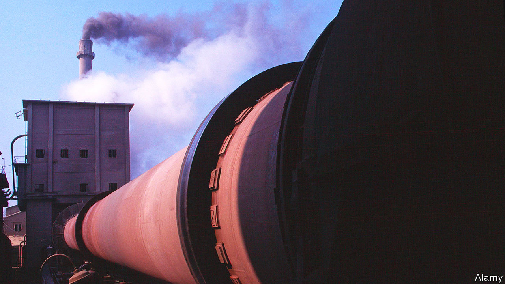

###### Some like it hot

# A Finnish firm thinks it can cut industrial carbon emissions by a third 

##### Running a turbine backwards can produce green heat 

 

> Jun 7th 2023 

Fossil fUELLED power stations can be replaced by solar panels or nuclear reactors. Petrol-powered cars can be replaced with ones that use zero-carbon electricity to charge batteries. But not every part of an economy is so easy to decarbonise, even in principle. Three heavy industries—cement, chemicals and steelmaking—are particularly tricky to clean up. One reason is that all rely on chemical processes that need very high temperatures. 

Extracting iron from its ore, for instance, is the first step in steelmaking. Temperatures inside the furnaces used to do that can exceed 1,600°C. Cement kilns, which convert limestone into clinker, one of cement’s raw ingredients, can reach 1,400°C. Because it is tricky or impossible to produce such temperatures for some industrial processes using electricity alone, firms rely on fossil fuels.

Green-minded businesses have been exploring alternatives. Hydrogen, for instance, can be produced by splitting water into its component elements. If that is done with clean energy, the gas can be burned as a zero-carbon fuel. Another option might be to stick with fossil fuels, but to capture and bury the carbon dioxide they generate, an idea known as carbon capture and storage. But both technologies are nascent, and would require the building of a great deal of new infrastructure that does not yet exist. 

At the Brightlands Campus, a state- and industry-backed innovation centre near Maastricht, in the Netherlands, a Finnish engineering firm called Coolbrook is hoping to change that. Its “RotoDynamic” system is designed to supply just the sorts of super-high temperatures needed by heavy industry—and to do so while being powered solely by electricity. 

Spinning up

The easiest way to think about Coolbrook’s system is as a gas turbine in reverse. A conventional gas turbine—as used in power stations or jet engines—burns fossil fuel to create a hot, high-pressure gas that spins rotor blades. That rotational energy can be used to run a thrust-generating fan (as in jet aircraft) or converted to electricity in a generator (as in a power station). 

The new system begins instead with an electric motor. The motor spins the turbine’s rotors. Gas or liquid is then fed to the turbine. Once inside, the rotors accelerate the stuff to supersonic speeds, and then rapidly slow it again. The sudden deceleration transforms the kinetic energy contained in the accelerated gas or fluid into heat. If the motor is powered by green electricity, then no carbon dioxide is produced.

The first test of the pilot plant at Brightlands will involve steam cracking, one of the most energy-intensive processes in petrochemical plants. Conventional crackers decompose naphtha, one component of crude oil, into smaller molecules. As the name suggests, this is done by diluting the naphtha with steam then blasting it, in the absence of oxygen, in a furnace.

Coolbrook’s pilot plant will instead inject a mix of naphtha and steam into the rotating turbine, which will heat it to around 1,000°C. That should break the naphtha into substances such as propylene and ethylene, which are used for making plastics. The hope is to prove that not only is it possible to crack naphtha in an electric reactor, but that it is better. Laboratory trials have shown that yields from the electrified process could be significantly higher than what can be obtained with fossil fuels. 

Assuming that everything goes according to plan, the firm will try producing heat for several other industrial processes. Joonas Rauramo, Coolbrook’s boss, reckons the heater should be able to hit temperatures of up to 1,700°C. That would make it suitable for a number of energy-intensive applications, including the production of steel, cement, glass and ceramics. Several big firms have signed on as partners for the pilot project. They include Shell, a British oil firm, Braskem, a Brazil-based chemicals producer, and CEMEX, one of the world’s biggest cement-makers. 

Electric heat will not be enough to entirely eliminate carbon emissions from heavy industry. That is because a good fraction of the sector’s emissions comes not from burning fossil fuels, but from the chemistry of the processes they are powering. In cement-making, for instance, roughly half the carbon dioxide comes from heating the kiln with fossil fuels. The other half comes from calcination, the chemical reaction that transforms limestone into clinker.

It is a similar story with steelmaking, where iron is chemically liberated from ores that hold it as iron oxide. This is done by reacting the ore at high temperature with a mixture of carbon monoxide and hydrogen. That strips the oxygen atoms away, leaving pure iron. The oxygen, meanwhile, combines with the carbon to produce carbon dioxide.

That means that, even if the heat to drive those reactions was supplied by zero-carbon electricity, the rest of the emissions would still have to be dealt with somehow. Firms are working on modifying the chemistry in  , but no approach is yet ready for market.

But a technology does not need to solve a problem completely to be useful. Mr Rauramo reckons his firm’s technology could eliminate perhaps 30% of heavy-industrial emissions. And, he says, it can do so without needing to invent anything fundamentally new. “It is a known science,” says Mr Rauramo. “It has just not been applied in exactly the way we are doing it.” ■


