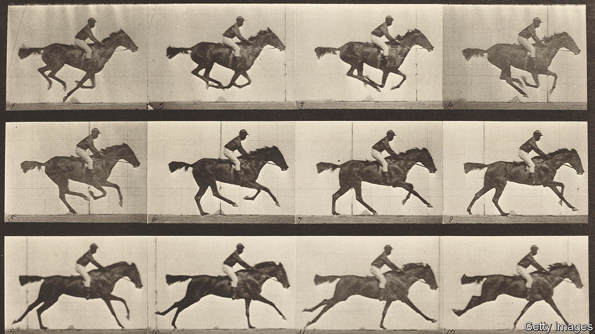

###### Maybe she’s barn with it

# A new study asks whether racehorses have hit their genetic peak 

##### But the breeders trying to improve them may be missing a trick 

 

> Jun 7th 2023 

For decades there was an apparent paradox in horse-racing. The sport is lucrative (Mage, the winner of this year’s Kentucky Derby, earned his owner $1.9m) and simple—the fastest horse wins. Horses with good results and a good pedigree are used as breeding stock for the next generation. Horse-breeders were armed with plenty of data, a single trait to optimise, and strong incentives to do so. Yet several studies suggested that, despite their efforts, race times were not improving.

The most common explanation was that, physiologically speaking, it was increasingly difficult to breed a horse that ran faster than existing horses already do. The modern thoroughbred racing horse dates back at least three centuries. Perhaps the years of selective breeding had already discovered and exploited almost all of the breed’s genetic potential. 

That did not make sense to Patrick Sharman, a racing enthusiast and geneticist at the University of Exeter, in England. After all, cattle breeding has been going on for hundreds of years, yet continues to create cows that produce more milk. Artificial selection applied to chickens is still raising plumper birds. It would be odd, he thought, if racehorses were the one domesticated animal that humans could no longer improve. So, along with Alastair Wilson, who had once been his PhD supervisor, he started digging.

Their first paper was published in 2015, and examined a dataset of British races going back to the 1800s, much larger than in other papers. It found that, contrary to accepted wisdom, horses have indeed been getting faster. In sprint races—those run over five to seven furlongs (1-1.4km)—the average speed needed to win has increased by about 0.1% each year since 1997. Their latest paper, published on May 27th in , tries to assess how much of that improvement is attributable to genetics. In other words, is the time-, energy-, and money-intensive profession of horse breeding worth the faff? 

The answer appears to be yes—though less so than breeders might like. By linking a large performance database, containing nearly 700,000 race times recorded in Britain between 1995 and 2014, to a family tree of more than 76,000 horses, they found that speed is heritable, albeit weakly, and that breeding is improving it, but slowly. 

The boost is most pronounced for sprints and middle-distance races (8–12 furlongs). Drs Sharman and Wilson conclude that around 12% of the variation in the speed of horses at these distances comes down to genetics. (This is about the same heritability as neuroticism or lifespan is in humans.) And they found that improvements to those genetics accounted for more than half of the increase in speed seen over that time period. The rest, says Dr Sharman, is probably down to hard to measure, non-genetic factors such as better nutrition and veterinary care or improved jockeying technique.

When it comes to longer-distance races, it is not clear that times are improving. One reason, says Dr Sharman, may be that the genes that are good for sprinting do not necessarily make for good endurance athletes. Breeders seem to be selecting for sprint performance because it offers quicker commercial returns. Sprinters tend to start running at around two years old, long-distance horses at three.

Horse-breeders may face other trade-offs, too. Selecting solely for speed may increase the risk of injury. (Churchill Downs racecourse, where the Kentucky Derby is run, suspended racing for a month from June 7th, after more than a dozen horses had died following injuries over the past six weeks.) Temperament matters, too—a fast horse is of little use if it is unrideable. 

Despite the difficulties, there is also evidence that breeders might be leaving some horsepower in the genetic tank. At least in Britain, says Dr Sharman, breeders still rely, to some degree, on their professional judgment when assessing horses. Less intuitive, more objective statistical techniques have transformed other sports, most famously baseball, over the past couple of decades. Horse-racing too may be ripe for its “Moneyball” moment.■


