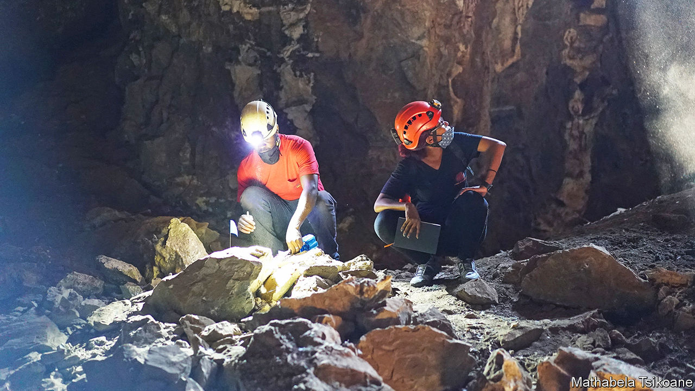

###### Homo naledi

# A tiny, ancient hominin may have been surprisingly clever 

##### Small brains seem to be no barrier to culture and art 

 

> Jun 8th 2023 

“The March of progress”, created by Rudolph Zallinger in 1965, is an image that has launched a thousand T-shirts. It shows a line-up of six figures. The first is hunched and ape-like. The rest become gradually taller and straighter until eventually a neatly shaven  strides into the future. 

The picture captures a conviction still prevalent among anthropologists. This is that the evolution of intelligence in humans and their ancestors was driven by ever-larger brains enabling more complex behaviours, such as better designs for stone tools, or abstract ideas expressed through culture and art.

Three papers published online this week undermine that idea. Written by a team led by Lee Berger, a palaeoanthropologist at the University of Witwatersrand, and due for publication in the next few months in the journal , they provide evidence that —a small-brained species of hominin that lived at a similar time to early humans—left behind rock engravings and buried its dead deliberately and with ceremony. 

 has been puzzling scientists since it was discovered. In 2013 around 1,500 bones from at least 15 individuals were found in the Rising Star cave system in South Africa, 25km north of Johannesburg. It was obvious that this was a new species of hominin. But placing it in the genus , to which modern humans belong, was controversial.   was a mosaic. It was short—around 145cm tall—with human-like hands and feet. But its hips and shoulders look more like those of , a more ape-like genus ancestral to .

Its brain looked equally chimerical. The general shape of ’s skull is characteristic of . Modelling of its braincase suggests that it had a highly developed frontal cortex, like other members of the genus, which includes both modern humans and Neanderthals. Despite that, ‘s brain as a whole was remarkably small, even controlling for its stature. It was about half the size of a typical human brain relative to the size of its body. That looks more like something you would find in a member of .

All that led to rows over whether  was an early member of  or a late member of . It was assumed that it was probably 2m-3m years old, since that was roughly the window of time in which the two overlapped. But when the rocks in the chamber were analysed, they revealed another surprise. was still roaming the planet sometime between 235,000 and 335,000 years ago. That would have made it a rough contemporary of the earliest humans.

The minds of the dead

The latest papers concern not ’s physical features, but attempts to deduce how its mind worked. In the first, Dr Berger and colleagues report bone fragments in what appear to be the remains of shallow graves. The depressions cut across the rock layers of the cave floor and do not follow its natural slope, suggesting they are artificial. The bones are also arranged in a way that suggests the bodies rotted while covered over with soil, rather than being left exposed to the air. Dr Berger reckons that adds up to compelling evidence that  went to some trouble to bury its dead. 

Ceremonial burial is reckoned to be a big deal by palaeontologists, indicating the ability to reason about abstract ideas such as mortality and identity. After all, Rising Star cave is not a convenient spot to bury bodies. The hominins would have had to carry the body over treacherous terrain in the dark, probably using fire to light the way (there is already evidence that  used fire to cook). “I was sceptical that a hominin with a small brain could be capable of the deliberate disposal of its dead,” says Chris Stringer, an expert on human evolution at the Natural History Museum in London who was not involved in the research. “But this evidence is impressive.”

 


The second paper reports the discovery of abstract geometric patterns carved into three panels on the walls of two different chambers within the cave. The engravings take the form of nearly 50 lines etched deep into the rock, which intersect to form squares, triangles and crosses. 

The rock upon which they were etched seems to have been chosen deliberately, says Dr Berger. “You can see the surface has been prepared [with tools],” he says. And the depth of the carvings, he argues, means the markings were unlikely to have been made idly. If the engravings really are deliberate art, then,  would join Neanderthals and , both of which had much bigger brains, as the only hominins with an artistic bent. 

The final paper discusses how to interpret these findings. Scientists generally believe that ceremonial burial indicates a sophisticated culture comfortable with abstract ideas. Art, meanwhile, is an example of the sort of symbolic thinking that some believe to be a precursor to language and high-level cognition. If a species with a tiny brain really was thinking along such lines, it suggests the story of human evolution is in need of a rethink. 

It also sets the stage for something of a crisis in the field. A few decades ago, the hominin fossil record appeared quite straightforward, suggesting that there was, in general, only one species in a given place at a given time. That made it simple to marry up material evidence such as stone tools, cave art and evidence of fire with what the fossils showed. If there was only one hominin around, it must have been responsible for whatever was found. 

These days, the picture looks much more complicated.  is the fifth new hominin discovered in the past 20 years alone. And if  was as clever as Dr Berger suggests, it would make things more tangled still. Tools or cave art, or any other evidence of sophisticated behaviour, could plausibly come from many more of the figures in “The March of Progress” than scientists had thought possible. Human history, it seems, is even more crowded than scientists had thought. ■


