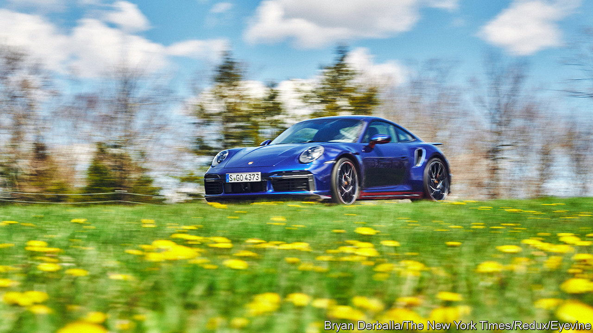

###### Green energy

# Sucking a carbon-neutral fuel out of thin air 

##### To power future cars and planes 

 

> Jun 7th 2023 

When in March the European Union approved a law requiring all new cars to have zero carbon emissions from 2035, Germany managed to wangle an exemption for vehicles running on “e-fuels”. Some saw it as a charter for producers to continue flogging internal-combustion engined cars to petrol-heads. While it does, indeed, mean some petrol-powered sports cars are likely to remain in production in the future, the hope is they can be powered without overheating the planet.

E-fuels get their name because they are made synthetically, using electricity. The process involves combining hydrogen with carbon to produce various hydrocarbon fuels, such as diesel, petrol or jet fuel. 

The hydrogen can be made by using electrolysis to split water into its constituent elements. The carbon comes from carbon dioxide, perhaps captured from an industrial chimney-stack, or even sucked directly out of the atmosphere via so-called direct-air capture systems. Provided both processes are powered by zero-carbon electricity, e-fuels are carbon neutral. After all, the carbon released back into the air when the fuels are burned is the same that was used to make them in the first place. 

Although a handful of big plants already make e-fuels for aviation, most obtain their carbon from old cooking oil, animal fat and biomass. Some aim to use direct-air capture, although the technology is still largely at the prototype stage. One such plant is in southern Chile. It is run by a group of companies that includes Porsche, part of the German Volkswagen group. Chile is a windy place, so the factory is powered by a wind turbine. Until its direct-air capture system is ready, the plant is getting carbon dioxide from a brewery, where yeast produces it during fermentation. 

For Porsche, cars powered by e-fuels will be a sideline rather than its main business. The firm aims to have more than 80% of its vehicles running on batteries by 2030. Karl Dums, the firm’s head of e-fuels, readily agrees that an electric car will always be inherently more efficient than one that runs with e-fuels. (This is because of the extra steps involved in turning electricity into synthetic fuel, rather than just charging a battery directly.) But, he says, there will still be plenty of internal-combustion vehicles on the road after 2030. These could be made greener by filling them with e-fuels.

Dr Dums reckons economies of scale could make e-fuels competitive with fossil ones, perhaps by the end of the decade. And, he says, they offer a convenient way to store surplus renewable energy, or to make it suitable for export. Chile has the potential to produce huge amounts of renewable power. But the wind and the sun are unpredictable, and on some days could produce more electricity than necessary. Chile lacks the long-range grids to transmit that surplus elsewhere. If it were turned into a liquid, though, it could be shipped abroad using existing infrastructure designed for fossil fuels. 

“In the end,” says Dr Dums, Porsche’s business is “fulfilling dreams for our customers.” Although electric cars are both smooth and nippy, some of those customers might miss the growl and thunder of a petrol-powered engine. If you do fancy a petrol-powered 911 in the future, e-fuels might allow Porsche to sell you one. ■


