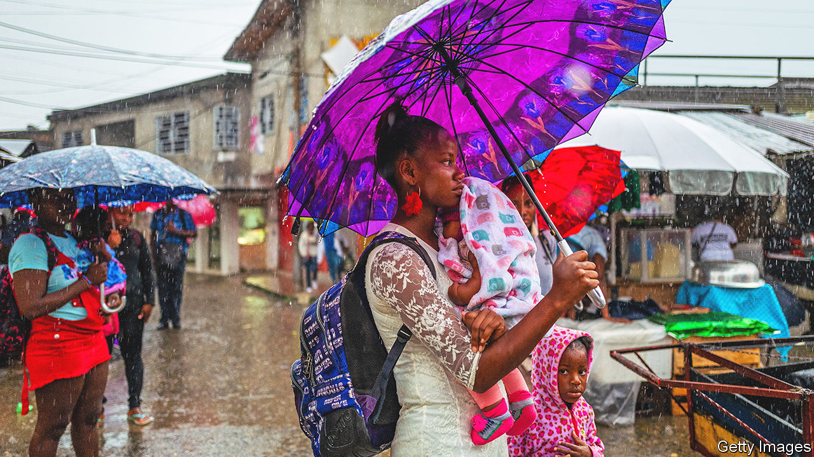
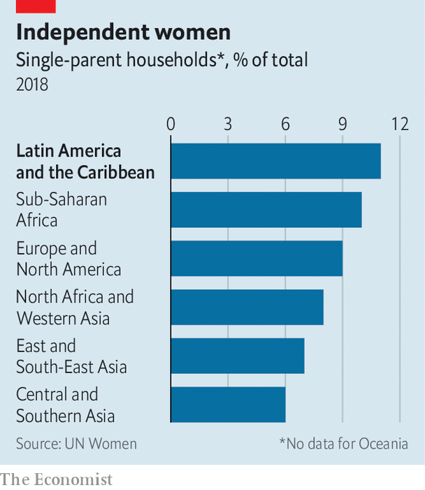

###### All the single ladies, and their kids

# Latin America’s single mothers are being left behind 

##### Helping them enter the workforce would go someway to boosting productivity 

 

> Jun 8th 2023 

When Vanessa, a 22-year-old, finished school her goal was to get a job and move out of the  of Rio de Janeiro. Those plans were derailed three years ago when she got pregnant. Vanessa and her boyfriend broke up soon after and she found herself raising her daughter alone. She has found it tricky to get a full-time job without child care. For now, she runs a beauty salon from her front room. 

 


In Latin America and the Caribbean stories like Vanessa’s are common. Some 11% of households are led by a single parent, almost always a mother, according to estimates by the UN. That is above the global average of 8% (see chart). Even in sub-Saharan Africa—which does worse on other indicators, such as poverty and access to contraception—single-parent households make up 10% of the total. On average almost a third of Latin American women can expect to have a baby before the age of 20. 

The preponderance of single mothers is a reflection of how Latin America is stuck in a developmental limbo. No country within the region falls within the World Bank’s definition of low-income. Female enrolment in secondary school is near 100%. Despite being home to a third of the world’s Roman Catholics, attitudes to sex can be liberal in parts of the region. Asked how justifiable it is to have sex before marriage, around a fifth of respondents in Argentina, Brazil and Chile say it is “always justifiable”, according to the World Values Survey, a poll. Just 5% of people say the same in Ethiopia and Nigeria. 

Even so, religious attitudes still shape access to contraception in parts of the region. Over 80% of women of reproductive age in Latin America live in countries where the Centre for Reproductive Rights, an advocacy group, describes abortion laws as “restrictive”. In some countries sex education focuses on abstinence.  does not help. Diana Rodríguez Franco, secretary for women’s affairs in the mayor’s office in Bogotá, the capital of Colombia, describes a common pattern there: “A woman has a child, she is abandoned by the father, she has another child with another man, she is abandoned again.” 

The latest data from the World Bank suggest 78% of single mothers in Latin America and the Caribbean are in the workforce, either working or actively looking for work, above the average of 73% for all adults. Yet the unemployment rate among single mothers, at 9.2%, is higher than for any other group, including single childless women and single fathers. Even when they do find jobs, lone mothers earn far less than other adults. Often the only work that offers the flexibility required to juggle child care is in the informal sector. 

This has wider effects on the economy. The UN reckons that because women’s labour-force participation rate is lower, the gender gap will drag GDP per person down 14% in Latin America and the Caribbean between 2020 and 2050. According to the World Bank’s Human Capital Index, which measures expected productivity based on health and education, a girl born today in Brazil will accumulate more human capital by the age of 18 than a boy. Girls are more likely to finish school and less likely to get involved in gangs. But assuming nothing much changes in Brazilian society, this girl will not put that talent to use. Accounting for current labour-force participation rates, a woman in the labour market will probably put a third of her talent to use, while a man would utilise two-fifths. 

Governments are trying to address the problem. Argentina, Colombia and Mexico have decriminalised abortion in recent years. Cash-transfer programmes target poor women. During the pandemic Brazil’s government offered single mothers double benefits. In Bogotá the mayor’s office has built 18 , or “care blocks”, where women can get free vocational training, sexual-health services and help applying for government support. 

More could be done. In many countries the law obliges fathers to pay child support. But enforcement is weak, says Laura Cuesta at Rutgers University in New Jersey. The share of single-mother households receiving child support ranges from 15% in Guatemala to 50% in Chile. Franco Parisi, who ran in Chile’s presidential election in 2021, did not campaign in the country. One local difficulty was a judicial order against him for 207m pesos ($260,000) in child support owed to his ex-wife. (His lawyer denied the allegations, but Mr Parisi later reached an out-of-court settlement.) Even so, Mr Parisi still won 13% of the vote. 

Single mothers have to lean on their family for support, instead. Fully 43% of Peruvian mothers live with at least one other adult who is not their spouse or partner. Until governments and fathers start to provide support,  (grandmothers) will have to fill the gap. ■

