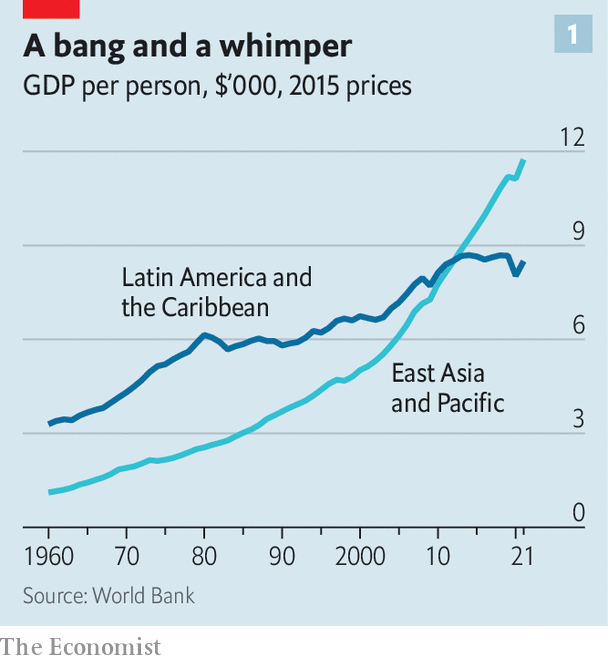
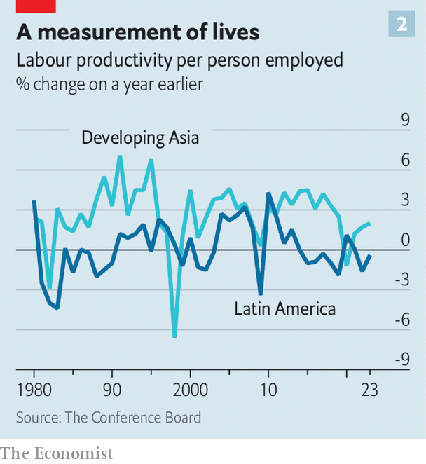

###### A land of useless workers

# Why are Latin American workers so strikingly unproductive? 

##### Blame education, corruption and a huge shadow economy 

 

> Jun 8th 2023 

For half a century economies in Latin America have disappointed policymakers. For just as long, wonks have invented slogans to describe the source of the region’s abysmal growth. First economists lamented a “lost decade” in the 1980s, during which a chain of fiscal crises sent 16 governments in the region into default. The 1990s were spent in the “middle-income trap”, in which, the theory goes, the tricky leap from low- to high-tech industry stops countries from developing fully. Even when, in the late 2000s, commodity prices picked up, muttering began about the “resource curse”, which strikes when energy and mining bonanzas discourage investment in manufacturing.

 


In 1962 Latin America’s income per person was three times that of East Asia. By 2012 both regions had the same level. By 2022 East Asia’s was roughly 40% higher than Latin America’s (see chart 1). When the differences in purchasing power are taken into account, Latin Americans’ GDP per person has been stuck at little more than a quarter of that of their neighbours in the United States for the last three decades. According to the World Bank, between 2010 and 2020 Latin America was the world’s slowest-growing regional economy.

Now things are set to get even worse. Growth is expected to be 1.9% in 2023 and stay below 2% for 2024, compared with over 4% on average in other emerging markets. The World Bank also predicts that Latin America will remain at the bottom of the pack in terms of economic growth per person until 2030. The pandemic hit Latin America hard: it had the highest number of excess deaths of any region between March 2020 and October 2021. Since then, economic recovery has stalled.

Why are Latin American economies in such bad shape? The region is not short of workers, one reason often given for a sluggish economy. Latin America’s population growth has been among the strongest in the world. Some of the places with the slowest-growing economies, such as Brazil and Mexico, have had the biggest population spurts. Over the past 30 years the working age population of the region has more than doubled. The ratio of workers to dependents continues to rise and is not expected to peak until 2030. By contrast China hit its peak in 2011.

Instead, the problem appears to be that those workers are not terribly productive. Economists find productivity fiendishly difficult to measure, but most of their attempts show Latin America lacking. The World Bank’s effort places Latin American workers as the second-least productive in the world, behind the Middle East. Mexico is consistently the least productive in the OECD, a club mostly of rich countries. Annual productivity growth in the region has languished between 0.2% and 0.5% since 2000, according to the World Bank. By contrast East Asia’s productivity has increased by more than 2% every year. 

Weak investment is one possible cause of low productivity. If policymakers and firms do not plough capital into new technology, infrastructure and education, workers lag behind their competitors. Latin America invests the equivalent of just 20% of its regional GDP, compared with 25% of GDP for the average emerging market. Yet even in countries where investment has been high, GDP is still languishing. Mexico’s annual domestic investment is worth 22% of its GDP. Between 2017 and 2021 it attracted annual foreign direct investment worth on average another 2.8% of GDP. Even so, at the end of this period its economy was no larger than it was at the start (the pandemic did not help). 

In any case the IMF thinks that blaming investment for slow growth mixes up cause with effect. According to its analysis, it is Latin America’s low growth that has caused its low investment. Domestic investment relies on household savings, which the region’s workers have relatively little of due to their low wages. And foreign capital is scarce because investors think putting their money elsewhere will yield a better return.

Instead, several long-term trends contribute to Latin America’s productivity problem. One is education. Before covid-19 Latin American 15-year-olds were, on average, three years behind their peers in the OECD on science, maths and English tests. This gap is likely to be worse now: according to UNICEF, the UN’s children’s fund, schools in Latin America and the Caribbean had some of the longest lockdowns, remaining fully closed for 158 days from March 2020 to February 2021, compared with the global average of 95 days.

Working 9 to when? 

Options are limited for those wanting the best education, as the region has few world-class universities. The OECD reckons less than half of Latin Americans have the ability to perform basic tasks with a computer. That is likely to send firms which are looking for cheaper IT workers to Asia and Africa instead. American tech companies recruiting from Guatemala and Chile complained at a summit last year that they could not find workers to fill the jobs they were offering. 

A second problem is that the region has lots of oligopolies. In Chile the 50 biggest firms account for more than 70% of GDP. In Colombia state-owned conglomerates account for 25% of the revenue of the largest 100 businesses. Latin American firms enjoy bigger markups than those in the rest of the OECD. Governments make the problem worse, often cordoning off industries from potential new entrants or pushing up costs with red tape. In the absence of disruption, which takes away pressure to innovate, old, unproductive firms survive. Over the last three decades Latin American countries have, on average, got far less diverse in terms of what they produce, with exports coming from less-productive industries, according to Shannon O’Neil, of the Council on Foreign Relations, an American think-tank. Competition laws are scarce, while corruption does not help. In too many parts of the region dodgy deals between businesses and governments are allowed to thrive.

The biggest problem, however, is a huge informal sector. In Brazil and Peru more than half the potential workforce is employed informally. In Bolivia the proportion is 82%, according to the International Labour Organisation. By one estimate Latin America has the fastest-growing shadow economy in the world, in terms of GDP per person. Informal workers are less productive. To fly under the radar, firms stay small. That means they cannot scale up production, which would lower their costs. The financial system also takes a hit when lots of value is tied up with informal firms and workers that do not use conventional banks. Credit creation is stifled, meaning fewer firms get loans. 

 


Informality shows that an economy is sick, but “it is not the disease”, says Santiago Levy, a fellow at the Brookings Institute, a think-tank. Much like slow growth, illegal economies do not get big by themselves. In much of the region the high costs of hiring people—in the form of bureaucracy, social-security contributions and minimum wages—put off small- and medium-sized businesses from employing people formally. In some places, such as Argentina, strict labour laws make it nearly impossible to fire employees. According to the World Bank the minimum wage in Colombia is higher than in most OECD countries, relative to median income levels.

Corruption within formal sectors—as when a customs official asks for a bribe, or a police officer turns a blind eye to criminality—also lowers the cost of going into the informal sector. , who owing to traditional gender norms often look after the children alongside work, tend to favour the flexibility and quick turnover of these jobs.

Mr Levy, who used to be the chief economist of the Inter-American Development Bank, a regional outfit, also thinks that the structure of some welfare states, such as Brazil’s Bolsa Família, can make operating informally more attractive. These offer health care to informal workers, which may be considered better value than that available to people in full-time employment. They also do not require firms to pay employee health contributions. 

Tackling most of these problems is unpalatable for politicians. Around 300m people across the continent have come to rely on social-spending handouts for their income, health care or their children’s education. The risk of losing their votes will prevent any drastic changes being made to these policies anytime soon. Meanwhile clamping down on oligopolies could potentially jeopardise a source of political-campaign finance. Making industries more competitive would also squeeze profits. Progress on education is likely to be slow, not least as the region has several powerful teachers’ unions.

Money for nothing

Latin America needs an economic-policy rethink. As the United States detangles an ever-expanding list of industries and technologies from China, its southern neighbours risk being cut off, too. Most of President Joe Biden’s industrial-policy bonanza will go on bringing industry back home. But what few prizes the region, particularly Mexico, stands to gain from “friend-shoring” or from China’s re-opening are at risk if Latin America cannot find workers and innovative firms to fill demand. 

The green transition holds a similar combination of promise and peril. On the one hand, Latin America’s riches of copper, rare-earth minerals and lithium have sparked interest from multinationals. The trick will be getting these big companies to convert their interest from the region’s resources to its industries. Latin American governments want to force companies that come for their minerals to refine them in the region, and then build batteries and electric vehicles there. 

But doing so will require shrewd policymaking and a better business environment to make companies stay. A smaller informal sector and more competition would go a long way towards achieving that goal. If they do not grasp these opportunities now, policymakers are at risk of ushering in a new decade of sluggish growth—and yet another slogan to describe it. ■

