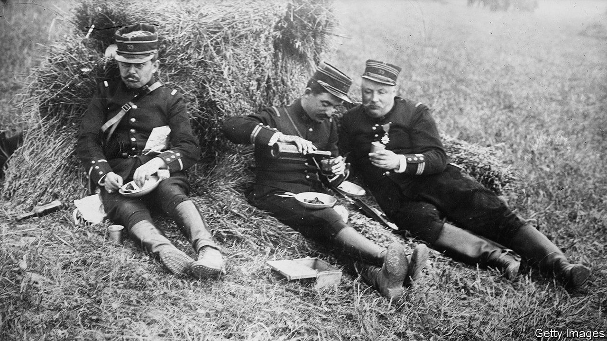

###### The Economist explains

# How drugs and alcohol have fuelled soldiers for centuries 

##### Russians in Ukraine seem to rely on copious amounts of liquor and, in some cases, hard drugs 

 

> Jun 8th 2023 

UKRAINIAN FORCES have often attributed the poor performance of Russian soldiers since the invasion last year to drunkenness. Armies reflect their societies and alcoholism caused by excessive vodka consumption has long been a reason for the  of Russian men (about 64). But there is nothing unusual about soldiers hitting the booze—or even something stronger. Since ancient times, when Greek hoplites and Roman legionaries went into battle fuelled by wine, alcohol has been both the soldier’s best friend and sometimes his mortal enemy. 

As Lukasz Kamiensky argues in his wide-ranging “Shooting Up: A History of Drugs in Warfare”, front-line soldiers experience a degree of stress that is almost unimaginable to civilians. They are expected to cope with the fear of their own demise, the horror of death around them and the obligation to kill.

Throughout history, armies have found that alcohol taken in reasonable quantities helps soldiers manage this stress and, for a short while, boosts their confidence and lessens their inhibitions, which can be invaluable in combat. English soldiers fighting the Netherlands in the 17th century put the fighting spirit of their foe down to “Dutch courage”, which came from a few tots of gin. In 1875 the British armed forces knocked back 5.4m gallons of rum. Sailors were issued with half a pint of the stuff every day. 

But too much alcohol leads to carelessness and indiscipline. The Romans learned how to debilitate their formidable Teutonic adversaries by positioning huge vats of beer in the forest for them to get drunk on before being slaughtered. Vodka consumed in massive quantities could well have contributed to Russia’s defeat at the hands of Japan in the war of 1904-05. The commander of the fortress at Port Arthur surrendered when instead of supplies of ammunition he received 10,000 crates of vodka. Russian soldiers at the Battle of Mukden were so plastered that, according to a Russian journalist, the Japanese were able to bayonet thousands of them “like so many pigs”. 

Drugs have also been used by fighters for centuries. Greek warriors used opium to prepare for battle. The fanaticism of the 12th-century assassins of the Arab world was supposedly fed by hashish. Tribes in Siberia and the famous Viking berserkers are said to have used the psychoactive alkaloid found in  mushrooms to strike terror into their enemies. Mesoamerican fighters found courage in the coca leaf. 

The second world war saw the production and distribution of amphetamines by all sides on an industrial scale. But no army could beat the Wehrmacht when it came to pill-popping. As the medical historian Nicolas Rasmussen observed: “The German Blitzkrieg was powered by amphetamines as much as it was powered by machine.” The blitz, particularly the relentlessly fast-moving panzer divisions, would have been nothing like as effective if German “tankers” had not been dosed up to the eyeballs with Pervitin, a methamphetamine. Mr Kamiensky says that the drug boosts self-confidence and risk-taking, sharpens concentration and reduces hunger, thirst, sensitivity to pain and, above all, the need for sleep. Between April and July 1940, when the Nazis were sweeping all before them, their soldiers were issued with more than 35m Pervitin tablets. 

Russia appears to have taken a leaf out of the German book. A recent report by Royal United Services Institute, a think-tank in London, drew attention to its forces’ . Wretched “disposable soldiers”—men from the occupied “people’s republics” of Luhansk and Donetsk and almost untrained mobilised civilians—are given amphetamines and other narcotics in liquid form before being sent on what are, in effect, suicide missions. Their job is to advance towards Ukrainian positions, drawing fire so those positions can be accurately located and targeted by Russian artillery. If they retreat, they are likely to be shot by their own side. No wonder they need to be drugged. Ukrainian soldiers, defending their homeland, require no such motivation. But it would be highly unusual if drugs and drink were not helping at least some of them through their terrible ordeal. ■

